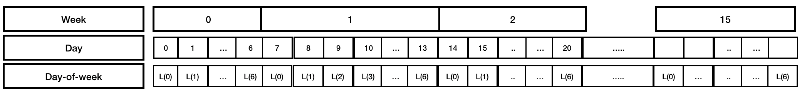
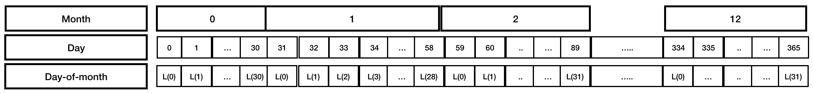
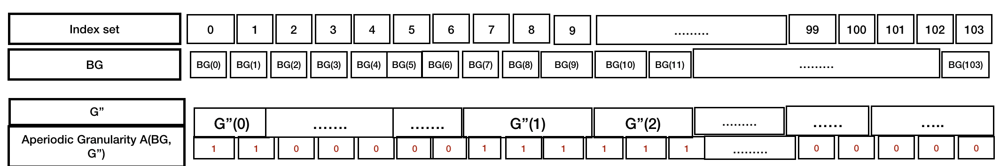

# Groups-periodically

The concept already existed in the literature. This is an attempt to demistify the notations using the linear granularities day and month.


The grouping (day, month) has a period of 1 year. Ignoring leap years, this would mean that the behavior of days within months repeat every 365 days. That is, each month would consist of the same number of days in every year. We assume there are D linear granularity "day" and M linear granularity "month" in total.

\begin{equation}\label{eq:eq1}
\begin{split}
month(0) & = day(0)\bigcup day(1)\dots\bigcup day(30)\\
month(1) & = day(31)\bigcup day(32)\dots\bigcup day(58)\\
month(2) & = day(59)\bigcup day(60)\dots\bigcup day(89)\\
\dots\\
month(11) & = day(334)\dots day(363)\bigcup day(364)\\
\end{split}
\end{equation}


If we know the composition of each of the months in terms of days for one year, we can find the composition of any month beyond 1 year since the "pattern" repeats itself along the time domain due to the periodic property. 

In other words,  if 
\begin{equation}\label{eq:eq2}
month(j) = day(a_1)\bigcup day(a_2)\dots\bigcup day(a_k) \quad for \quad j \in {0,1, 2, \dots, 11}
\end{equation}
then,  
\begin{equation}
month(j + R) = day(a_1 + P)\bigcup day(a_2 + P)\dots\bigcup day(a_k + P) \quad for \quad j + R \leq M
\end{equation}

Here, P = 365 and R = 12 will have the meaning of the period of the grouping (day, month) and the number of months in each of these periods.

Generalizing it to any two linear granularities G and H , the formal way of defining the property "groups periodically into" would like the following:

\newtheorem{definition}{Definition}
\begin{definition}\label{def:periodical}
A granularity H is periodical with respect to a granularity G if
(1) $G \trianglelefteq H$, and
(2) there exist $R,P \epsilon Z+$, where R is less than the number of granules of H, such
that for all $j \epsilon Z$, if $H(j) = \bigcup_{i \in S}G(i)$ and $H (j + R) \neq \phi$ then
$H (j + R) = \bigcup_{i \in S} G(i + P)$.
\end{definition}

Another way to represent \autoref{eq:eq1}

\begin{equation}\label{eq:eq3}
\begin{split}
month(0) & = \bigcup_{i \in S_0}day(i), \quad S_0 = {0, 1, 2, \dots, 30}\\
month(1) & = \bigcup_{i \in S_1}day(i), \quad S_1 = {31, 32, \dots, 58}\\
month(2) & = \bigcup_{i \in S_2}day(i), \quad S_2 = {59, 60, \dots, 89}\\
\vdots\\
month(11) &  = \bigcup_{i \in S_{11}}day(i), \quad S_{11} = {334, 335, \dots, 364}\\
\end{split}
\end{equation}


Here, ${S_0,...,S_{11}}$ are the sets of indexes of G describing $month(0), . . . , month(11)$. Then from Definition \autoref{def:periodical}, it also follows that if $H$ is periodical with respect to $G$, then

\begin{equation}\label{eq:eq4}
H(j) = \bigcup_{i \in S_j \mod R}G(P*\lfloor j/R \rfloor + i)
\end{equation}, 

where ${S_0,...,S_{R-1}}$ are the sets of indexes of G describing $H (0), . . . , H (R - 1)$ respectively. Here $j \mod R$ represents the index among those in ${0, 1, \dots, R-1}$ that must be shifted to obtain $H(j)$. The number of periods each granule of G composing $H(j \mod R)$ should be shifted is given by $\lfloor j/R\rfloor$.


Thus,  to obtain $month(13)$ in terms of days we can either use \autoref{def:periodical} or \autoref{eq:eq4}
\begin{equation}
\begin{split}
month(13) & =  month (1 + 12)\\
 & = \bigcup_{i \in S_1} day(i + 365) \quad since \quad month(1) =  \bigcup_{i \in S_1}day(i), \quad S_1 = {31, 32, \dots, 58}\\
 & = day(31 + 365)\bigcup day(32 + 365)\bigcup day(58 + 365)\\
\end{split}
\end{equation}


\begin{equation}
\begin{split}
month(13) & = \bigcup_{i \in S_{13 \mod 12}}day(365*\lfloor 13/12 \rfloor + i)\\
 & = \bigcup_{i \in S_1}day(365*1 + i)\\
 & = day(31 + 365)\bigcup day(32 + 365)\bigcup day(58 + 365)\\
\end{split}
\end{equation}


# Circular (Periodic linear granularities + regular mapping)

A **circular** granularity can be defined using modular arithmetic due to its irregular mapping with the bottom granularity. They are formed with linear granularities, one of which "groups periodically into" the other.

\begin{definition}\label{def:circular}
A circular granularity C(B, G) relates a linear granularity G to the bottom granularity B, if

\begin{equation} \label{eq:eq2}
C_{B, G}(z) = {L}(z\mod k(B,G)) \quad \forall z \in \mathbb{Z}^+
\end{equation}
where,
z denotes the index set,
B denotes a full-integer labelled bottom granularity which groups periodically into linear granularity G with regular mapping, 
{L} is a label mapping that defines an unique label for each index $l \in {0,1,\dots, (k-1)}$,
and k(B,G) is the number of granules of B in each granule of G.
\end{definition}


In general, the set of labels will be a set of strings that is more descriptive than the index and used to identify a categorization of the circular granularity. However, the labels can coincide with indexes in which case integers are directly used to refer to categorizations of the circular granularity. Note that each
circular granularity can use different label mappings. In \autoref{fig:day-of-week}, the label mapping L can be defined as $L: ({0,1,2, \dots, 6}) \longmapsto\ ({Sun, Mon, \dots, Sat)}$ or $L: ({0,1,2, \dots, 6}) \longmapsto\ ({Sunday, Monday, \dots, Saturday)}$ or $L: ({0,1,2, \dots, 6}) \longmapsto\ ({0, 1, \dots, 6)}$
depending on the context.

```{r day-of-week,echo=FALSE,out.width = "100%",fig.cap="Circular granularity day-of-week"}

```


# Quasi-circular (Periodic linear granularities + irregular mapping)

A **quasi-circular** granularity can not be defined using modular arithmetic due to its irregular mapping with the bottom granularity. However, they are still formed with linear granularities, one of which "groups periodically into" the other. We will take the example of days and months to illustrate the notion of "groups periodically into" and "quasi-circular" granularities.


Till now, we saw how the formal definitions of "groups periodically into" can be seen through the example of (day, month). Now, we shall discuss how some quasi-circular granularity can be obtained. \autoref{fig:quasi-circular-explain} shows that index set 34 should correspond to L(3) which is "4th-day-of-month", that of 60 should correspond to L(1), which is "2nd-day-of-month" and 334 should correspond to L(0), which is "1st-day-of-month". Now, quasi-circular granularities can be defined as follows to obtain these labels:


```{r quasi-circular-explain,echo=FALSE,out.width = "100%",fig.cap="Quasi-circular granularity day-of-month"}

```

<!-- quad number \quad of \quad days \quad till \quad month(11-1) -->

<!-- Now, $35 \in month(1)$ and hence $N_k = 31$.  -->

<!-- Thus, $Q_{day, month}(35) = 35 - 31 =  L(4)$  -->

<!-- Similarly, $Q_{day, month}(60) = 60 - (31+28) =  L(1)$, $60 \in month(2)$ and N_k is number of days in month(0) and month(1). -->


\begin{definition}\label{quasicircular}
A quasi-circular granularity $Q_{B, G'}$ that relates linear granularities $G'$ and bottom granularity $B$, if

\begin{equation}\label{eq:eq3}
Q_{B, G'}(z) = L(z - \sum_{w=0}^{k-1}\vert T_{w \mod R'} \vert), \quad z \in T_k
\end{equation}

where,  
$z$ denotes the index set,
$B$ denotes a full-integer labelled bottom granularity which groups periodically into linear granularity $G'$ with irregular mapping, {L} is a label mapping that defines an unique label for each index $l \in {0,1,\dots, (k-1)}$, $T_w$ are the sets of indices of B describing $G'(w)$ such that 
\begin{equation}
G'(w) = \bigcup_{z \in T_w}B(z),\\
\end{equation}
$T_w = 0 \quad for \quad w\epsilon Z_{<0}$ and $\vert T_w \vert$ is the cardinality of set $T_w$.
\end{definition}

Here, $\vert T_w \vert$ = $\vert T_{w\mod R'} \vert$ since every $w^{th}$ and $(w+R)^{th}$ granule will have the same number of granules of B. $T_w$ are the sets of indexes of $B$ describing $G'(0), . . . , G'(R'- 1)$. The term $\sum_{w=0}^{k-1}\vert T_{w \mod R'}\vert$ denotes the number of granules of $B$ till the $(k-1)^{th}$ granule of $G'$.


\begin{equation}
\begin{split}
Q_{day, month}(34) & = L(35 - 31) \quad since \quad 35 \in \quad month(1)\\
Q_{day, month}(60) & = L(60 - 31 - 28), \quad since\quad 60 \in \quad month(2)\\
Q_{day, month}(334) & = L(334 - 334) \quad since \quad 334 \in \quad month(11)\\
\end{split}
\end{equation}.

# Aperiodic (Aperiodic linear granularities)

\begin{definition}\label{aperiodic}
An aperiodic granularity $A_{B, G''}$ that relates linear granularities G and bottom granularity $B$, with $G''$ being aperiodical with respect to $B$, is given by

\begin{equation}\label{eq:eq4}
\begin{split}
A_{B, G''}(z) & = L(1), z \in T_q\\
     & = L(0), z \not\in T_q\\
\end{split}
\end{equation}
where,  
$z$ denotes the index set (index of $B$),
$T_q$ are the sets of indices of $B$ describing $G''(q)$ such that $G''(q) = \bigcup_{z \in T_q}BG(z)$,$T_q = 0$ for $q \epsilon Z_{<0}$.
\end{definition}

Discussion: Aperiodic time granularities map a time index to a categorical variable containing binary values. It takes the value 1 whenever the time index coincides with the events in context (e.g. public or school holiday) and 0 when it does not. Here, 1 and 0 are proxies to denote the binary categorization and can be replaced with a logical vector. An example of aperiodic granularity can be one that relates a bottom granularity ($BG$) and linear granularity ($G''$) such that $BG \trianglelefteq G''$, $BG \not\preceq G$ and $BG$ is not periodic or quasi-periodic with respect to $G''$, as shown in \autoref{fig:aperiodic}.


```{r aperiodic, echo=FALSE,out.width = "100%",fig.cap="Relating aperiodic granularity and bottom linear granularity "}



