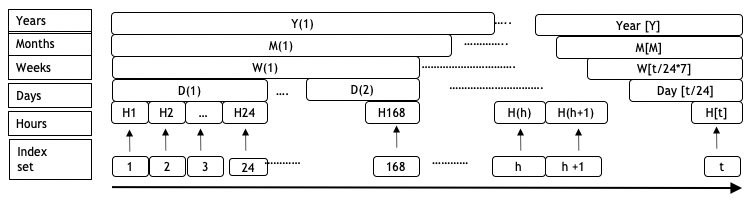
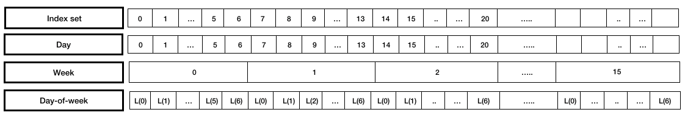
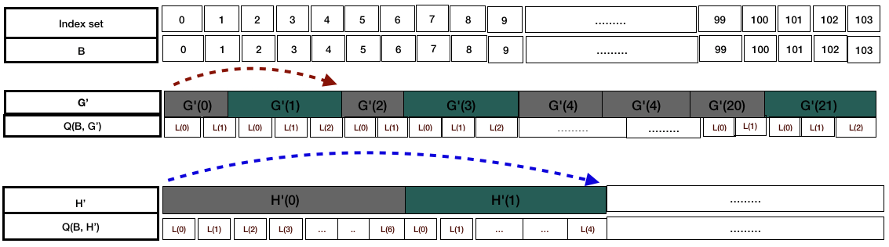
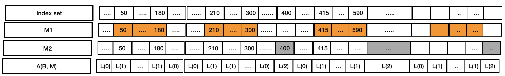

```{r initial, echo = FALSE, cache = FALSE, include = FALSE}
options("knitr.graphics.auto_pdf" = TRUE)
library(knitr)
library(tidyverse)
library(lubridate)
library(lvplot)
library(ggridges)
library(tsibble)
library(gravitas)
library(tsibble)
opts_chunk$set(
  echo = FALSE, warning = FALSE, message = FALSE, comment = "#>",
  fig.path = "figure/", fig.align = "center", fig.show = "hold",
  cache = TRUE, cache.path = "cache/",
  out.width = ifelse(is_html_output(), "100%", "\\textwidth")
)
knitr::opts_knit$set(root.dir = here::here())
```

```{r external, include = FALSE}
# read_chunk('scripts/main.R')
```

```{r load}

```

# Introduction

<!--temporal granularities and why should we care -->

<!-- problem of analyzing data with such finer scales and classical ways to deal with it -->

Temporal data are available at various resolutions depending on the context. Social and economic data like GDP is often collected and reported at coarse temporal scales such as monthly, quarterly or annually. With recent advancement in technology, more and more data are recorded at much finer temporal scales. Energy consumption may be collected every half an hour, energy supply may be collected every minute, and web search data might be recorded every second. As the frequency of data increases, the number of questions about the periodicity of the observed variable also increases. For example, data collected at an hourly scale can be analyzed using coarser temporal scales such as days, months or quarters. This approach requires deconstructing time in various possible ways called time granularities [@aigner2011visualization].

It is important to be able to navigate through all of these temporal granularities to have multiple perspectives on the periodicity of the observed data. This idea aligns with the notion of EDA [@Tukey1977-jx] which emphasizes the use of multiple perspectives on data to help formulate hypotheses before proceeding to hypothesis testing. Visualizing probability distributions conditional on one or more granularities is a potentially useful approach for exploration. Analysts are expected to iteratively explore many possible choices of time granularities for comprehending possible periodicities in the data. But too many choices and a lack of a systematic approach to do so might become overwhelming.

<!-- # existing ways and challenges -->

Calendar-based graphics [@wang2018calendar] are useful in visualizing patterns in the weekly and monthly structure, and are helpful when checking for the effects of weekends or special days. Any temporal data at sub-daily resolution can also be displayed using this type of faceting [@Wickham2009pk] with days of the week, month of the year, or another sub-daily deconstruction of time. But calendar effects are not restricted to conventional day-of-week or month-of-year deconstructions. There can be many different time deconstructions, based on the calendar or on categorizations of time granularities.

Linear time granularities respect the linear progression of time such as hours, days, weeks and months, and non-repeating. One of the first attempts to characterize these granularities is due to @Bettini1998-ed. However, the definitions and rules defined are inadequate for describing nonlinear or repeating granularities. Hence, there is a need to define some new nonlinear time granularities, that can be useful in visualizations. Nonlinear time granularities can be circular, quasi-circular or aperiodic. Examples of circular granularities are hour of the day and day of the week; an examples of a quasi-circular granularty is day of the month; examples of aperiodic granularities are public holidays and school holidays.

Time deconstructions can also be based on the hierarchical structure of time. For example, hours are nested within days, days within weeks, weeks within months, and so on. Hence, it is possible to construct single-order-up granularities such as second of the minute, or multiple-order-up granularities such as second of the hour. The lubridate package [@G_Grolemund2011-vm] provides tools to access and manipulate common date-time objects. But most of its accessor functions are limited to single-order-up granularities.

<!--motivation -->

The motivation for this work stems from the desire to provide methods to better understand large quantities of measurements on energy usage reported by smart meters in households across Australia, and indeed many parts of the world. Smart meters currently provide half-hourly use in kWh for each household, from the time that they were installed, some as early as 2012. Households are distributed geographically and have different demographic properties such as the existence of solar panels, central heating or air conditioning. The behavioral patterns in households vary substantially, for example, some families use a dryer for their clothes while others hang them on a line, and some households might consist of night owls, while others are morning larks. It is common to see aggregates [see @2012-la] of usage across households, such as half-hourly total usage by state, because energy companies need to plan for maximum loads on the network. But studying overall energy use hides the distributions of usage at finer scales, and makes it more difficult to find solutions to improve energy efficiency. We propose that the analysis of smart meter data will benefit from systematically exploring energy consumption by visualizing the probability distributions across different deconstructions of time to find regular patterns/anomalies. Although, the motivation came through the smart meter example, this is a problem that is relevant to any temporal data observed more than once per year.

<!-- at finer or coarser scales can be benefited from the approach of Exploratory Data Analysis (EDA). EDA calls for utilizing visualization and transformation to explore data systematically. It is a process of generating hypothesis, testing them and consequently refining them through investigations. -->

<!--existing closely related work and how ours relate -->
 <!-- This paper utilizes the nestedness of time granularities to obtain multiple-order-up granularities from single-order-up ones. -->

<!--actions on multiple order up - usage -->

<!-- Finally, visualizing data across single/multiple order-up granularities help us to understand periodicities, pattern and anomalies in the data. Because of the large volume of data available, using displays of probability distributions conditional on one or more granularities is a potentially useful approach. However, this approach can lead to a myriad of choices all of which are not useful. Analysts are expected to iteratively visualize these choices for exploring possible patterns in the data. But too many choices might leave him bewildered.  -->

<!-- challenges and how you are dealing wih it -->
This work provides tools for systematically exploring bivariate granularities within the tidy workflow. In particular, we

  * provide a formal characterization of nonlinear granularities;
  * facilitate manipulation of single- and multiple-order-up time granularities through cyclic calendar algebra;
  * develop an approach to check the feasibility of creating plots or drawing inferences for any two nonlinear granularities;
  * recommend prospective probability distributions for exploring distributions of a univariate dependent variable across pair of granularities.

<!-- Pairs of granularities can be categorized as either a *harmony* or *clash*, where harmonies are pairs of granularities that aid exploratory data analysis, and clashes are pairs that are incompatible with each other for exploratory analysis. -->

The remainder of the paper is organized as follows: Section \ref{sec:linear-time} provide some background material on linear granularities and introduces calendar algebra for computing different linear granularities. Section \ref{sec:cyclic-gran} formally characterizes different nonlinear time granularities by extending the framework of linear time granularities. Section \ref{sec:cyclic-calendar} introduces calendar algebra for computing nonlinear time granularities. Section \ref{sec:data-structure} discusses the data structure for exploring the conditional distributions of the associated time series across pairs of nonlinear time granularities. Section \ref{sec:visualization} discusses the role of different factors in constructing an informative and trustworthy visualization. Section \ref{sec:application} examines how systematic exploration can be carried out for a temporal and non-temporal application. Section \ref{sec:discussion} summarizes this paper and discusses possible future direction.

# Linear time granularities {#sec:linear-time}

<!-- general calendar categorization -->
<!-- Often we partition time into months, weeks or days to relate it to data. Such discrete abstractions of time can be thought of as time granularities [@aigner2011visualization]. Examples of time abstractions may also include day-of-week, time-of-day, week-of-year, day-of-month, month-of-year, working day/non-working day, etc which are useful to represent different periodicities in the data. Classes of time abstractions may be based on arrangement or hierarchical order of time, discussed in further details in \autoref{sec:arrangement} and \autoref{sec:order}. -->

Often we partition time into months, weeks or days to relate it to data. Such discrete abstractions of time can be thought of as time granularities [@aigner2011visualization]. Time granularities are **linear** if they respect the linear progression of time. Examples include hours, days, weeks and months.

## Definitions and relationships

<!-- Arrangement: Linear vs. Circular vs. aperiodic {#sec:arrangement} -->

<!-- The arrangement of the time domain can result in deconstructing time in linear, circular or aperiodic (nearly circular) ways.  -->

 There has been several attempts to provide the framework for formally characterizing time-granularities. One of the first attempts occur in @Bettini1998-ed with the help of the following definitions:

<!-- <!-- Representation with tsibble -->
<!-- Suppose we have a tsibble with a time index in one column and keys and variables in other columns. A time domain, as defined by [@Bettini1998-ed], is essentially a mapping of row numbers (the index set) to the time index. A linear granularity is a mapping of row numbers to subsets of the time domain. For example, if the time index is days, then a linear granularity might be weeks, months or years. -->

<!-- <!-- What is calendar categorization -->
<!-- What we need to add to this are additional categorizations of time that are not linear granularities and are useful to represent periodicity. Examples include day-of-week, time-of-day, week-of-year, day-of-month, month-of-year, working day/non-working day, etc. Many of these are circular, such as day-of-week, time-of-day. Some are nearly circular such as day-of-month. Some are irregular such as working day/non-working day. Let's call all of these "calendar categorizations". Anything that maps a time index to a categorical variable can be considered a **calendar categorization**.  -->

<!-- What is circular granularity and some examples -->
<!-- We specify the circular categorizations using modular arithmetic and call these **circular granularities**. The number of categories is essentially the periodicity of a circular time granularity. For example, suppose the time index is in minutes, and let $n_i$ be the number of categories created by the circular granularity $C_i$. Then the following categorizations can be computed. -->

<!-- In the following sections, we provide a formalism to all of these abstractions and identify their relationships and symbolic representations.  -->

<!-- ### Linear {#sec:linear-gran-def} -->

\newtheorem{definition}{Definition}

\begin{definition}\label{def:definition}
(time domain): A time domain is a pair $(T; \le)$ where $T$ is a non-empty set of time instants and $\le$ is a total order on $T$.
\end{definition}

A time domain can be **discrete** (if there is unique predecessor and successor for every element except for the first and last one in the time domain), or it can be **dense** (if it is an infinite set). A time domain is assumed to be discrete for the purpose of our discussion.

\begin{definition}\label{def:linear}
(linear granularity): A linear granularity is a mapping $G$ from the integers (the index set) to subsets of the time domain such that:

  (1) if $i < j$ and $G(i)$ and $G(j)$ are non-empty, then each element of $G(i)$ is less
than all elements of $G(j)$, and
  (2) if $i < k < j$ and $G(i)$ and $G(j)$ are non-empty, then $G(k)$ is non-empty.
\end{definition}

\begin{definition}\label{def:granule}
(granule) Each non-empty subset $G(i)$ is called a granule, where $i$ is one of the indexes and $G$ is a linear granularity.
\end{definition}

**Discussion:** The first condition in Definition \ref{def:linear} implies that the granules in a linear granularity are non-overlapping and their index order is same as time order.
\autoref{fig:linear-time} shows the implication of this condition. It shows the linear granularities hours, days, weeks, months and years, each of which are unidirectional in nature and arranged from past to future. If we consider the chronon (see @aigner2011visualization) as hourly, the time domain with T hours will have $\lfloor T/24\rfloor$ days, $\lfloor T/(24*7)\rfloor$ weeks and so on. Each granule of the linear granularities shown are represented through a box.

```{r linear-time,echo=FALSE,out.width = "100%",fig.cap="The time domain distributed as linear granularities"}

```

[@Bettini1998-ed] talks about the relationships of linear time granularities and structure of a calendar and also relates them to the notion of periodicity in time.

\begin{definition}\label{def:finerthan}
(finer than): A linear granularity G is finer than a  linear granularity H, denoted $G \preceq H$, if
for each index i, there exists an index j such that $G(i) \subset H(j)$.
\end{definition}.

\begin{definition}\label{def:groupsinto}
(groups into): A linear granularity G groups into a linear granularity H, denoted
$G \trianglelefteq H$,
if for each index j there exists a (possibly infinite) subset S of the integers such
that
\begin{equation}
H(j) = \bigcup_{i \in S}G(i)
\end{equation}
\end{definition}

**Discussion:** $G \trianglelefteq H$ if each granule H(j) is the union of some granules of G.  $G \preceq H$ if every granule in G is a subset of some granule in H. In \autoref{fig:groups-finer}, both $day \trianglelefteq week$ and $day \preceq week$ hold true. However, weekends are finer than weeks but do not group into weeks. And weekends neither groups into or finer than public holidays. Consider another example where $day \trianglelefteq month$. This relationship is not fully described until we associate it with periodicity. Each month is a grouping of the same number of days over years, hence the period of the grouping (day, month) is one year, if leap years are ignored. The period becomes 400 years with the inclusion of leap years and all their exceptions, .

```{r groups-finer,echo=FALSE,out.width = "100%",fig.cap="Illustrations of groups into and finer than relationships. Weekends are finer than weeks but do not group into weeks. And weekends neither groups into or finer than public holidays"}
knitr::include_graphics("Figs/groupsandfiner.png")
```

\begin{definition}\label{def:periodical}
(groups periodically): A granularity H is periodical with respect to a granularity G if
(1) $G \trianglelefteq H$, and
(2) there exist $R,P \epsilon Z+$, where R is less than the number of granules of H, such
that for all $i \epsilon Z$, if $H(i) = \bigcup_{j \in S}G(j)$ and $H (i + R) \neq \phi$ then
$H (i + R) = \bigcup_{j \in S} G(j + P)$.
\end{definition}

**Discussion:** A granularity H which is periodical with respect to G is specified by:
(i) the R sets of indexes of G, ${S_0,...,S_{R-1}}$ describing the granules of H within one period;
(ii) the value of P;
(iii) the indexes of first and last granules in H, if their value is not infinite.
Then, if ${S_0,...,S_{R-1}}$ are the sets of indexes of G describing
$H (0), . . . , H (R - 1)$, respectively, then the description of an arbitrary granule H(j) is given by: $\bigcup_{i \in S_j \mod R}G(P*\lfloor j/R \rfloor + i)$. Also, granularities can be periodical with respect to other granularities, except for a finite number of spans of time where they behave in an anomalous way [@Bettini2000-vy].

\begin{definition}\label{def:quasi}
(groups quasi-periodically): A granularity H is quasi-periodical with respect to a granularity G if
(1) $G \trianglelefteq H$, and
(2) there exist a set of intervals E1,...,Ez (the granularity exceptions) and positive
integers R,P, where R is less than the minimum of the number of granules of H
between any 2 exceptions, such that for all $i \epsilon Z$, if $H(i) = \bigcup_{k \in [0,k]} G(j_r)$  and $H (i + R) \neq \phi$ and $i + R < min(E)$, where E is the closest existing exception after $H (i)^2$, then $H (i + R) = \bigcup_{k \in [0,k]} G(j_r + P )$.
\end{definition}

**Discussion:** Intuitively, the definition requires that all granules of H within the span of time between two exceptions have the same periodical behavior, characterized by $R$ and $P$.

\begin{definition}\label{def:B}
(bottom granularity): Given a granularity order relationship g-rel and a set of granularities having the same time domain, a granularity B in the set is a bottom granularity with respect to g-rel, if B g-rel H for each granularity H in the set.
\end{definition}

**Discussion:** Given the set of all granularities defined over the time domain $(Z; <)$, and the granularity relationship $\trianglelefteq$ (groups into), the granularity mapping each index into the corresponding instant (same integer number as the index) is a bottom granularity with respect to $\trianglelefteq$.

<!-- Most practical problems seem to require only a granularity system containing a set of time granularities which are all periodical (or quasi-periodical) with respect to a basic granularity. The assumption is there should be one bottom granularity and all the other granularities are generated from the bottom granularity by calendar algebraic operations. -->

## Computation through calendar algebra

Linear time granularities are computed through an algebraic representation for time granularities, which is referred to as calendar algebra [@Ning2002-tf]. It is assumed that there exists a “bottom” granularity and calendar algebra operations are designed to generate
new granularities from the bottom one or recursively, from those already generated.
The calendar algebra consists of two kinds of operations: grouping-oriented and
granule-oriented operations. The grouping-oriented operations combine certain granules of a granularity together to form the granules of the new granularity. Example can be to consider a calendar with only two linear granularities "minute" and "hour" and "hour" is generated by grouping every $60$ "minutes". The granule-oriented operations do not change the granules of a granularity, but rather make choices of which granules should remain in the new granularity. For example, one can choose to look at the granularity "Monday" and hence select only "Monday" from linear granularity "day".

Some relevant grouping oriented operations are discussed, which will be used in Section \ref{sec:cyclic-gran} to define circular and aperiodic granularities.

- **The grouping operation** : Let $G1$ be a full-integer labeled granularity, and $m$ a positive integer. The grouping operation $Group_m(G)$ generates a new granularity $G2$, by partitioning the granules of $G$ into m-granule groups and making each group a granule of the resulting granularity.
More precisely, $G2 = Group_m(G1)$ is the full-integer labeled granularity such that for
each integer $i$, $G2(i) = \bigcup\limits_{j = (i-1)m+1}^{im} G1(j)$.

**Examples** :

  - $minute = Group_{60}(second)$
  - $hour = Group_{60}(minute)$,
  - $day = Group_{24}(hour)$,
  - $week = Group_{7}(day)$,

where, second(1) would start a minute and likewise.

- **The altering-tick operation** : Let G1, G2 be full-integer labeled granularities, and $l$, $k$, $m$ integers, where G2 partitions G1, and $1 \leq l \leq m$. The altering-tick operation $Alter^{m}_{l,k} (G2, G1)$ generates a new full-integer labeled granularity by periodically expanding or shrinking granules of G1 in terms of granules of G2. The altering-tick operation modifies the granules of G1 so that the $l$th granule of each group has $|k|$ additional (or fewer when k < 0) granules of G2.

**Example** :

\begin{equation*}
\begin{split}
pseudomonth = Alter^{12}_{11,-1}(day, Alter^{12}_{9,-1}(day, \\
  Alter^{12}_{6,-1}(day, Alter^{12}_{4,-1)}(day, \\
  Alter^{12}_{(2,-3)}(day, Group_{31}(day))))))
\end{split}
\end{equation*}

, where the granularity pseudomonth is generated by grouping 31 days, and then shrink April (4), June (6), September (9) and November (11) by 1 day, and shrink February (2) by 3 days. [@Ning2002-tf]

For more variations of grouping operations and granule oriented operations, the readers are recommended to see @Ning2002-tf.

# Cyclic time granularities {#sec:cyclic-gran}

<!-- sub: regular and irregular mapping leads to circular and quasi-circular granularities -->

We propose a formalism of cyclic time granularities through the tsibble [@wang2019tsibble] framework of organizing temporal data. A tsibble consists of an index, key and measured variables. An index is a variable with inherent ordering from past to present and key is a set of variables that define observational units over time. In a tsibble each observation should be uniquely identified by index and key.

A time domain, as defined by @Bettini1998-ed, is essentially a mapping of the index set to the time index of a tsibble. A linear granularity is a mapping of the index set to subsets of the time domain. For example, if the time index of a tsibble is days, then a linear granularity might be weeks, months or years. A bottom granularity is represented by the index of the tsibble. Lining up with the the assumption in @Bettini2000-vy, that all linear granularities can be generated from the bottom granularity by calendar algebraic operations, we assume that a bottom granularity exists. In a cyclic organization of time, the domain is composed of a set of recurring time values, where any time value can be preceded and succeeded by another time value (for e.g Monday comes before Wednesday but Monday also succeeds Wednesday). Hence intuitively, cyclic granularities are additional abstractions of time which are not linear and hence the index order of linear granularities needs to be manipulated so that it leads to repetitive categorization of time.

Cyclic time granularities which accommodate for periodicities can be constructed by relating two linear granularities. The mappings between these linear granularities can be regular or irregular. For example, a regular mapping exists between minutes and hours, where 60 minutes always add up to 1 hour. On contrary, an irregular mapping exists between days and months, since one might have days ranging from 28 to 31. To elaborate more, mappings will be regular if, for example, linear granularities are formed by grouping operation. Grouping operations combine fixed granules of a linear granularity to form a new granule of the resulting linear granularity. However, if granularities are formed by the altering-tick operation, for example, granules of the resulting granularity is composed of different number of granules of the root granularity. Cyclic time granularities are referred to as **circular** if mappings between linear time granularities are regular and **quasi-circular** if the same is irregular. Examples of common circular granularities include hour of the day, and day of the week, whereas examples for quasi-circular granularities can be day of the month or week of the month. The formalism would differ for circular and quasi-circular granularities although both accommodate for periodicities in data.

<!--sub:How to relate linear granularities to tsibble and manipulation of indices required for circular and quasi-circular granularities -->

## Circular {#sec:circular-gran-def}

\begin{definition}\label{def:circular}
(circular granularity): A circular granularity $C_{B, G}$ relates a linear granularity $G$ to the bottom granularity B, if

\begin{equation} \label{eq:circular-gran}
\begin{split}
C_{B, G}(z) & = {L}(z\mod P(B, G)) \quad \forall z \in \mathbb{Z}_{\geq 0} \\
\end{split}
\end{equation}
where
z denotes the index set,
B denotes a full-integer labelled bottom granularity which groups periodically into linear granularity $G$ with regular mapping,
$P \equiv P(B, G)$ is the number of granules of $B$ in each granule of $G$,
and ${L}$ is a label mapping that defines an unique label for each index $l \in \{ 0,1,\dots, (P-1)\}$.

\end{definition}

**Example**:  Example showing circular granularity relating two linear granularities "day" and "week" is visually depicted in a series of slots in the \autoref{fig:circular-dow}. Each granule is represented by a box. The diagram also illustrates that the granules that overlap share elements from the underlying time domain. The first slot in the diagram shows the index set. The bottom granularity, represented by the index of the tsibble considered is "day". "day" and "week" are two linear granularities with $P =  7$. The circular granularity $C_{day, week}$ representing day-of-week will thus consist of pattern {L(0), L(1), L(2), L(3), L(4), L(5), L(6)} which repeats itself after each period length.

**Discussion**: Note that each circular granularity can use different label mappings. In general, the set of labels will be a set of strings that is more descriptive than the index and used to identify a categorization of the circular granularity. However, the labels can coincide with indexes in which case integers are directly used to refer to categorizations of the circular granularity. Hence, the label mapping $L$ in \autoref{fig:circular-dow} can be defined as $L: ({0,1,2, \dots, 6}) \longmapsto\ ({Sun, Mon, \dots, Sat)}$ or $L: \{0,1,2, \dots, 6\} \longmapsto\ \{Sunday, Monday, \dots, Saturday\}$ or $L: \{0,1,2, \dots, 6\} \longmapsto\ \{0, 1, \dots, 6\}$ depending on the context.

<!-- # ```{r circular-gran, echo=FALSE,out.width = "100%",fig.cap="Relating circular granularities and bottom linear granularity "} -->
<!-- # knitr::include_graphics("Figs/circular-gran-diagram.png") -->
<!-- # ``` -->

```{r circular-dow,echo=FALSE,out.width = "100%",fig.cap="Circular granularity day-of-week"}

```

<!-- All circular granularities can be expressed in terms of the bottom linear granularity with equation \autoref{eq:eq2}. -->

In general, any circular granularity relating two linear granularity, none of which are bottom granularity can be expressed as $C_{(G, H)}(z) = L(\lfloor z/P(B,G) \rfloor\mod P(G,H))$, where linear granularity H is periodic with respect to linear granularity G with regular mapping such that the number of granules of G in each granule of H is $P(G,H)$. Table \ref{tab:definitions} shows representation of circular granularities $C_i$ relating two linear granularities with $P_i$ being the number of granules of the finer granularity in each granule of the coarser granularity and $L_i$ is the associated label mapping. It is possible that none of the two linear granularities are bottom granularities. But the representation of the resultant circular granularity will be a function of the index set. The bottom granularity is assumed to be minutes.

\begin{table}[ht]
\begin{center}
\begin{tabular}{lr@{~}lr@{~}r}
\toprule
minute-of-hour: & $C_1$ & $= L_1(z \mod 60)$ & $P_1 =$&$60$ \\
minute-of-day: & $C_2$ & $= L_2(z \mod 60*24)$ & $P_2=$&$`r 60*24`$\\
hour-of-day: & $C_3$ & $= L_3(\lfloor z/60\rfloor\mod 24)$  & $P_3 =$&$24$ \\
hour-of-week: & $C_4$ & $= L_4(\lfloor z/60\rfloor\mod 24*7)$  & $P_4=$&$`r 24*7`$\\
day-of-week: & $C_5$ & $= L_5(\lfloor z/24*60\rfloor \mod 7)$ & $P_5=$&$7$\\
\bottomrule
\end{tabular}
\end{center}
\caption{Illustrative circular granularities with time index in minutes}
\label{tab:definitions}
\end{table}

## Quasi-circular {#sec:quasi-circular-gran-def}

A **quasi-circular** granularity can not be defined using modular arithmetic since they are formed using two linear granularities with irregular mapping. However, they are still formed with linear granularities, one of which "groups periodically into" the other. \autoref{tab:quasi} shows some example of quasi-circular granularities ($Q_i$) with ($P_i$) denoting the plausible choices of number of granules of the finer granularity inside each granule of the coarser one.

\begin{table}[ht]
\begin{center}
\begin{tabular}{lr@{~}lr@{~}r}
\toprule

day-of-month: & $Q_1$ && $P_1 = 31, 30, 29, 28$\\
hour-of-month: & $Q_2$ && $P_2 = 24*31, 24*30, 24*29, 24*28$\\
day-of-year: & $Q_3$ && $P_3 = 366, 365$\\
week-of-month: & $Q_4$ && $P_4 = 5, 4$\\
\bottomrule
\end{tabular}
\end{center}
\caption{Illustrative quasi-circular granularities with potential period lengths}
\label{tab:quasi}
\end{table}

\begin{definition}\label{def:quasicircular}
(quasi-circular granularity): A quasi-circular granularity $Q_{B, G'}$ that relates linear granularities $G'$ and bottom granularity $B$, if

\begin{equation}\label{eq:quasi}
Q_{B, G'}(z) = L(z - \sum_{w=0}^{k-1}\vert T_{w \mod R'} \vert), \quad z \in T_k
\end{equation}

where
$z \in \mathbb{Z}_{\geq 0}$ denotes the index set,
$B$ denotes a full-integer labelled bottom granularity which groups periodically into linear granularity $G'$ with irregular mapping, $P'$ and $R'$ denote the period of the grouping $(B, G')$ and the number of granules of $G'$ in each of these periods, ${L}$ is a label mapping that defines an unique label for each index $l \in \{0,1,\dots, (\lceil P'/R' \rceil-1)\}$, $T_w$ are the sets of indices of $B$ describing $G'(w)$ such that  $G'(w) = \bigcup_{z \in T_w}B(z)$ and $\vert T_w \vert$ is the cardinality of set $T_w$.
\end{definition}

**Example**: Example showing quasi-circular granularities relating two linear granularities each with bottom granularities are visually depicted in a series of slots in \autoref{fig:quasi-circular-example}. Each granule is represented by a box. Two linear granularities $G' = Alter^{2}_{(1,-1)}(BG, Group_3(B))$ and $H' = Alter^{2}_{(1,-2)}(BG, Group_7(B))$ are considered. This implies that $G'$ is made up by shrinking every 1st granule of $Group_3(B)$ by $1$ granule and $H'$ is made up of shrinking every 1st granule of $Group_3(B)$ by $2$ granules. Number of granules of $G'$ and $H'$ in each period of $B$ is 2 but the number of granules of $B$ in each of those granules are different. $Q_{B, G'}$ and $Q_{B, H'}$ are repetitive categorization of time, similar to circular granularities, except that the number of granules of $B$ is not necessarily the same across different granules of $G'$ or $H'$. For $G'$, $T_0 = \{0,1\}$ and $T_1 = \{2, 3, 4\}$. For $H'$, $T_0 = \{0, 1, 2, 3, 4, 5, 6\}$ and $T_1 = \{7, 8, 9, 10, 11\}$, then we will have \autoref{eq:eq4} and  \autoref{eq:circular-gran}.

\begin{equation} \label{eq:eq4}
\begin{split}
Q_{B,G'}(8) & = L(8 - \sum_{w=0}^{3-1}\vert T_{w \mod 2}\vert) ,\quad since \quad 8 \in T_{3} \\
  & = L(8 - \sum_{w=0}^{2}\vert T_{w\mod 2}\vert) \\
  & = L(8 - \vert T_{0 \mod 2}\vert - \vert T_{1 \mod 2}\vert - \vert T_{2 \mod 2}\vert) \\
  & = L(8 - 2*\vert T_{0}\vert - \vert T_{1}\vert) \\
  & = L(8 - 2*2 - 3) \\
  & = L(1) \\
\end{split}
\end{equation}

\begin{equation} \label{eq:eq5}
\begin{split}
Q_{B,H'}(10) & = L(10 - \sum_{w=0}^{1-1}\vert T_{w \mod 2}\vert) ,\quad since \quad  10 \in T_{1}  \\
  & = L(10 - \sum_{w=0}^{0}\vert T_{w\mod 2}\vert) \\
  & = L(10 - \vert T_{0 \mod 2}\vert) \\
  & = L(10 - \vert T_{0}\vert) \\
  & = L(10 - 7) \\
  & = L(3) \\
\end{split}
\end{equation}

**Discussion**: If linear granularity $G'$ is periodical with respect to $B$ with irregular mapping, then the following holds true:

- $B \trianglelefteq G'$
- there exist $R', P' \epsilon Z_+$ such that if $G'(w) = \bigcup_{z \in T_w}B(z)$ then $$G'(w) = \bigcup_{z \in T_w \mod R'}B(P'*\lfloor w/R' \rfloor + z)$$

from definition \ref{def:periodical}

and,  number of granules of $B$ in each granule of $G'$ is not a constant (irregular mapping)

Here $w \mod R'$ represents the index that must be shifted to obtain $G'(w)$. The idea here is if we know the composition of each of the granules of $G'$ in terms of granules of $B$ for one period, we can find the composition of any granule of $G'$ beyond a period since the "pattern" repeats itself along the time domain due to the periodic property. The periodic property also ensures that $\vert T_w \vert = \vert T_{w\mod R'} \vert$ since every $w^{th}$ and $(w+R')^{th}$ granule of $G'$ will have the same number of granules of $B$. The term $\sum_{w=0}^{k-1}\vert T_{w}\vert$ denotes the number of granules of $B$ till the $(k-1)^{th}$ granule of $G'$. Since $\vert T_w \vert = \vert T_{w\mod R'} \vert$, the number of granules of $B$ till the $(k-1)^{th}$ granule of $G'$ becomes $\sum_{w=0}^{k-1}\vert T_{w \mod R'}\vert$ in Definition \autoref{def:quasicircular}.

```{r quasi-circular-example, echo = FALSE, out.width = "100%",fig.cap="Quasi-circular granularities $Q(B, G')$ and $Q(B, H')$ relating bottom granularity $B$ and linear granularities $G'$ and $H'$ respectively."}

```

<!-- If we ignore leap years and all its exception, the periodicity of the grouping (days, months), P' = 365, R' = 12, since each month would be defined as the grouping of the same number of days (31, 28, or 30, depending on the month) every year. Considering leap years and all their exceptions, period is 400 years and hence $P' = (3*365 + 366)$, $R' = 12*400$.  \autoref{eq:eq3} can be useful to find the aperiodic granularity day-of-month in both of these cases, since the grouping is periodic is both cases.  -->

<!-- Then $f(x, y)$ can be  computed using modular arithmetic as follows: -->

<!-- $$f(x, y) = \lfloor z/c(z,x) \rfloor\mod c(x,y)$$ -->

<!-- The constant c(x,y) is for granularities for groups into periodically, for granualrities which group into each other in a quasi-periodic way, no such constants exist and no such close form solution can be obtained. -->

<!-- It is easy to note here that due to unequal length of some linear granularities like months or years, these formulae can not be used for computing week-of-month or day-of-year. Thus, we start with the definition of circular granularity and then move on to computing aperiodic granularities.  -->

<!-- Formal definition of circular granularity -->

<!-- **Definition: Equivalence class** Let $m \in N \backslash{0}$. For any $a \in Z$ (set of integers), $[a]$ is defined as the equivalence class to which a belongs if $[a]$ = {$b \in Z | a \equiv (b \mod m)$}. -->

<!-- The set of all equivalence classes of the integers for a modulus $m$ is called the ring of integers modulo $m$, denoted by $Z_m$. Thus $Z_m = \{[0], [1], ..., [m-1]\}$. However, we often write $Z_m = \{0, 1, ..., (m-1)\}$, which is the set of integers modulo $m$. -->

<!-- **Definition:** A **circular granularity** $C$, joining two linear granularity with a modular period m is defined to be a mapping from the integers $Z$ (Index Set) to $Z_m$, such that -->

<!-- $C(s) = (s\mod m)$ for $s \in Z$. -->

<!-- For example, suppose $C$ is a circular granularity denoting hour-of-day and we have hourly data for 100 hours. The modular period $m = 24$, since each day consists of 24 hours and $C$ is a mapping from ${1,2,\dots, 100}$ to ${0,1,2, \dots, 23}$ such that  $C(s)= s \mod 24$ for $s \in {1,2,\dots, 100}$. -->

<!-- **Definition:** A **cycle** is defined as the progression of each circular granularity with modular period m through {$1,2,\dots,(m-1),0$} once. -->

<!-- **Definition:** A **circular granule** represents an equivalence class inside each cycle. -->

<!-- ### Aperiodic {#aperiodic-gran-def} -->
<!-- Formal definition of aperiodic circular granularity -->

 <!-- Why we need single order up and multiple order up granularities -->
<!-- A time series which is characterized by being composed of repeating cycles. -->

<!-- Identifying repeating (periodic/aperiodic) patterns are necessary in revealing patterns and future trends of a temporal data. Often there is a need for periodicity detection to find whether and how frequent a periodic/aperiodic pattern is repeated within the series. -->

<!-- The linear granularities G, H, AG and AH considered in the definitions of circular and aperiodic granularities are all periodic with respect to the bottom granularity. The only difference is G, H have regular mapping, whereas, G1 and G2 have irregular mapping with respect to BG.  -->

It can be noted here that if a linear granularity $G'$ is quasi-periodic (Definition \autoref{def:quasi}) with respect to $B$, then \autoref{eq:quasi} can be modified as follows to account for exceptions $E = [e_{begin}, e_{end}]$ (by Definition \autoref{def:quasi}).

\begin{equation}\label{eq6}
A_{B, G'}(z) = L(z - \sum_{w=0}^{k-1}\vert T_{w \mod R'} \vert - \sum_{u=0}^{e_k}\vert E_{u} \vert)
\end{equation}

for $z \in T_k$ and $e_k$ is the number of exceptions in $\bigcup\limits_{w = 0}^{k} T_w$ and $E_{u} = [e_{begin}(u), e_{end}(u)]$.

## Aperiodic {#sec:aperiodic-gran-def}

Periodic and Quasi-periodic behavior can be defined by a repeating pattern, except for a finite number of granules that can be seen as discontinuity points in the granularity in case of quasi-periodic behavior. Aperiodic time granularities are the ones which can not be specified as a periodic repetition of a pattern of granules. Most public holidays repeat every year, but there is no finite (or reasonably small) period within which their behavior remains constant. A classic example can be that of Easter, whose dates repeat only after 5,700,000 years. U.S labour day is the first Monday in September and U.S. Memorial Day is the last day in May. In Australia, if a standard public holiday falls on a weekend, a substitute public holiday will sometimes be observed on the first non-weekend day (usually Monday) after the weekend. Examples of aperiodic granularity may also include school holidays or a scheduling event that might cover the first and third Monday of the month between June and October, except for state holidays. All of these are recurring events, but with non-periodic patterns. As such, plausible $P_i$ from \autoref{tab:quasi} could be possibly infinite for aperiodic granularities.

Aperiodic cyclic granularities are defined using aperiodic linear granularities. Consider n aperiodic linear granularities $M_i$  $\forall \{i\in{1, 2, \dots, n\}}$, that is, none of them can be expressed as periodic or quasi-periodic with respect to the bottom granularity. Further assume that $B \trianglelefteq M_i$ $\forall \{i\in{1, 2, \dots, n\}}$. Then according to \autoref{def:groupsinto}, for each index $j$ there exists a (possibly infinite) subset $T_{\{i_j\}}$ of the integers such that
\begin{equation*}
M_{i}(j) = \bigcup_{z \in T_{i_j}}B(z)
\end{equation*}
and suppose $M = \bigcup_{i=1}^{n}M_{i}$ is formed by collecting the granules of $\{M_1, M_2, \dots, M_n\}$. Here, index ${\{i_j\}}$ stands for the $j^{th}$ granule of the $i^{th}$ linear aperiodic granularity.

\begin{definition}\label{aperiodic}
(aperiodic cyclic granularity): An aperiodic cyclic granularity $A_{B, M}$ relates aperiodic linear granularity $M$ and bottom granularity $B$, if

\begin{equation}\label{eq:aperiodic}
\begin{split}
A_{B, M}(z) & = L(i), \quad z \in T_{i_j} \quad and \quad \forall i \in {1, 2, \dots, n}\\
     & = L(0), \quad otherwise
\end{split}
\end{equation}
where,
$z \in \mathbb{Z}_{\geq 0}$ denotes the index set,
$T_{i_j}$ are the sets of indices of $B$ describing aperiodic linear granularities $M_{i}(j)$ such that $M_{i}(j) = \bigcup_{z \in T_{i_j}}B(z)$, $M = \bigcup_{i=1}^{n}M_{i}$.
\end{definition}

**Example**: \autoref{fig:aperiodic-example} shows two aperiodic linear granularity $M_1$ and $M_2$. Each granule is represented by a box. The diagram also illustrates that the granules that overlap share elements from the underlying time domain. The first slot in the diagram shows the index set and $A_{B, M}$ consists of three categories, $L(1)$ corresponding to the first aperiodic event $M_1$, $L(2)$ corresponding to aperiodic event $M_2$ and the $L(0)$ corresponding to no event/aperiodic linear granularity.

**Discussion**: Here, $M_1$ can be an aperiodic linear granularity denoting block leaves during Christmas, $M_2$ can be the one denoting Easter, $M_n$ can be Labour day and M can be conceived as the aperiodic linear granularity denoting any holidays. The number of categories obtained coincides with the number of aperiodic linear granularities considered and an additional category representing no event.

<!-- map a time index to a categorical variable containing binary values. It takes the value 1 whenever the time index coincides with the events in context (e.g. public or school holiday) and 0 when it does not. Here, 1 and 0 are proxies to denote the binary categorization and can be replaced with a logical vector. -->

```{r aperiodic-example, echo=FALSE,out.width = "100%",fig.cap="Aperiodic cyclic granularity $A(B, M1)$ relating aperiodic linear granularity $M1$ and bottom granularity $B$"}

```

<!-- To consider the exhaustive set of temporal regularities that might exist in the data, we can also define temporal granularities based on the hierarchical structure of a calendar. -->

# Cyclic calendar algebra {#sec:cyclic-calendar}

In \autoref{sec:cyclic-gran}, we discussed how we can define cyclic granularities by extending the framework of linear granularities defined in @Bettini1998-ed. In this section, we will see how to obtain cyclic granularities through an algebraic representation of other cyclic granularities. This is similar to calendar algebra in @Ning2002-tf, where linear granularities are generated from the bottom linear granularity or from those that are already generated. Since, our method caters to computation of cyclic granularities, we shall refer to it as "cyclic calendar algebra".

The cyclic calendar algebra consists of broadly two kinds of operations:
(1) **single-to-multiple:** representation of multiple-order-up cyclic granularities from single order-up cyclic granularities
(2) **multiple-to-single:** representation of single-order-up cyclic granularities from multiple order-up cyclic granularities

The hierarchical structure of time creates a natural nested ordering which can produce **single-order-up** or **multiple-order-up** granularities. We shall use the notion of a hierarchy table and order to define them.

**Hierarchy table** Let $H_n: (G, C, P)$ be a hierarchy model containing n linear granularities. $G_{l}$ represents the linear granularity of order l and $P(l,m)$ represents the period length of $G_{l}$ with respect to $G_{m}$ and $C_{G(l),G(m)}$ represents the cyclic granularity that relates linear granularity of order l and m, $\forall l,m \in {1, 2, \dots,n}$ and $l<m$.

**Order** of a linear granularity can be comprehended as the level of graininess associated with a linear granularity. For example, if we consider two linear granularities $G$ and $H$, such that $G$ is finer than or groups into $H$, then $H$ is of higher order than $G$. In any hierarchy table, linear granularities are arranged from lowest to highest order of linear granularities.

We refer to granularities which are nested within multiple levels of the hierarchy table as multiple-order-up granularities and those concerning a single level as single-order-up granularities.

<!-- Thus the first linear granularity can either be the bottom granularity (finest possible) or the finest granularity within the set of linear granularities and the other granularities are subsequently more "coarse" than the earlier one. -->

<!-- If linear granularities are not provided or bottom granularity is not known, any circular granularities of hierarchy order m can be computed, provided the circular granularities till hierarchy order (m-1) are provided. -->

<!-- some discussions on primary units of calendar -->
**Example:** So far we have used example of cyclic granularities from Gregorian calendar as it is the most widely used calendar. But it is far from being the only one. All calendars fall under three types - solar, lunar or lunisolar/solilunar but the day is the basic unit of time underlying all calendars [@Reingold2001-kf]. Various calendars, however, use different conventions to structure days into larger units: weeks, months, years and cycle of years. The French revolutionary calendar divided each day into 10 "hours", each "hour" into 100 "minutes" and each "minute" into 100 "seconds". Nevertheless, for any calendar a hierarchy can be defined. For example, in Mayan calendar, one day was referred to as 1 kin and the calendar was structured as follows:

 - 1 kin = 1 day
 - 1 uinal = 20 kin
 - 1 tun  = 18 uinal
 - 1 katun = 20 tun
 - 1 baktun = 20 katun

Thus, the hierarchy table for the Mayan calendar would look like the following:

|  G	        |C                 |P
|------------	|------------------|------------|
|  kin      	|kin-of-uinal      |  20        |
|  uinal    	|uinal-of-tun      |  18  	    |
|  tun      	|tun-of-katun      |  20	      |
|  katun    	|katun-of-baktun   |  20        |
|  baktun   	| 1                |	1         |

Examples of multiple-order-up  granularities can be kin-of-tun or kin-of-baktun whereas examples of single-order-up granularities may include kin-of-uinal, uinal-of-tun etc.

## Single-to-multiple {#sec:single-to-multiple}

### All circular single order-up granularities {#sec:all-circular}

Circular single-order-up granularities can be used recursively to obtain multiple order up circular granularity. Since, the operation requires the use of modular arithmetic, it is important that the label mapping of the individual circular single order-up granularity is an identity function, that is, $L(x) = x\quad \forall x$. The label mapping of the resultant multiple-order-up granularity can however be chosen arbitrarily, depending on the context.

\begin{equation} \label{eq:eq7}
\begin{split}
C_{(G_l,G_m)}(z) & = L(C_{G_l,G_{l+1}}(z) + P(l, l+1)(C_{(G_{l+1},G_m)}(z))) \\
  & =   L(C_{(G_l,G_{l+1}}(z) + P(l, l+1)[ C_{G_{l+1},G_{l+2}}(z) + P(l+1, l+2)( C_{G_{l+2}, G_m}(z))) \\
  & =  L(C_{G_l,G_{l+1}}(z) + P(l, l+1)(C_{G_{l+1},G_{l+2}}(z)) + P(l, l+1)P(l+1, l+2)(C_{G_{l+2}, G_{m}}))\\
  & =  L(C_{G_l,G_{l+1}}(z) + P(l, l+1)(C_{G_{l+1},G_{l+2}}(z)) + P(l, l+2)(C_{G_{l+2},G_{l+m}}(z)))\\
  &\vdots\\
  & = L(\sum_{i=0}^{m - l - 1} P(l, l+i)(C_{G_{l+i},G_{l+i+1}}(z)))\\
\end{split}
\end{equation}

*Example:* Let us use Equation \ref{eq:eq7} to compute the multiple-order-up granularity uinal_katun for Mayan calendar.

\begin{equation} \label{eq8}
\begin{split}
C_{uinal, baktun}(z) & = L(C_{uinal, tun}(z) + P(uinal, tun)C_{tun,katun}(z) + C_{uinal, katun}C_{katun, baktun}(z)) \\
              & = L(\lfloor z/20\rfloor \mod 18  +
              20*\lfloor z/20*18\rfloor \mod 20 +
              20*18*20\lfloor z/20*18*20\rfloor \mod 20) \\
\end{split}
\end{equation}

### Circular or quasi-circular single order-up granularities

Let us revisit Gregorian calendar for addressing this case. Suppose we have a hierarchy table using some linear granularties from Gregorian calendar. Since months consists of unequal number of days, any linear granularity with higher order than months will also have unequal number of days. This is an example of a hierarchy structure which has both circular and quasi-circular single-order-up granularities. The single-order-up granularity day-of-month is quasi-circular. Any single-order-up granularities which are formed by linear granularities below days are circular. Similarly, all single-order-up granularities which are formed using linear granularities with orders higher than months are also circular.

<!-- Hence, any calendar categorization which includes one linear granularity with orders at most as days and another one with orders at least as months will be aperiodic in nature. However, it is very much possible for a calendar categorization consisting of two linear granularities higher in order than month to be periodic.For example, the categorization month_quarter would be periodic since each quarter always consists of three months. -->

|  G	        |C                 |P
|------------	|------------------|----------------|
|  minute     |minute-of-hour    |  60            |
|  hour    	  |hour-of-day       |  24  	        |
|  day      	|day-of-month      |quasi-circular  |
|  month    	|month-of-year     |  12            |
|  year   	  | 1                |	1             |

There can be three scenarios for obtaining multiple-order-granularities here:
 - cyclic granularities relating two linear granularities whose orders are less than day
 - cyclic granularities relating two linear granularities whose orders are more than month
 - granularities relating two linear granularities with order at most day and another with order at least month

The multiple order-up cyclic granularites resulting from the first two cases are circular and has been handled in \autoref{sec:all-circular}. Any cyclic granularity resulting from the last case are quasi-circular. Examples might include hour-of-month or day-of-year. Let us consider the computation of $C_{hour, month}(z)$ for a $z$ such that $C_{hour, day}(z) = 12$, $C_{day, month}(z) = 20$ and $C_{month, year}(z) = 9$.

\begin{equation} \label{eq:hour-month}
\begin{split}
C_{hour, month}(z) & = L(C_{hour, day}(z) + P(hour, day)*C_{day, month}(z))\\
& = L(12 + 24*20)\\
\end{split}
\end{equation}

\begin{equation} \label{eq:day-year}
\begin{split}
C_{day, year}(z) & = L(C_{day,month}(z) + \sum_{w=0}^{C_{month, year}(z)-1}(\vert T_{w} \vert))\\
\end{split}
\end{equation}

where, $T_w$ is such that $month(w) = \bigcup_{z \in T_w}day(z)$ and $\vert T_w \vert$ is the cardinality of set $T_w$.

Clearly, the computation of multiple order-up granularities become more involved with quasi-circular granularities. $C_{hour, month}(z)$ can be represented as function of circular granularity $C_{hour, day}(z)$ and quasi-circular granularity $C_{day, month}(z)$, both of which are single order-up. However, $C_{day, year}(z)$ can not be computed only with single order-up granularities $C_{day, month}(z)$ and $C_{month, year}(z)$. It also requires the knowledge of the composition of the linear granularity $days$ within $months$ in an $year$ for computation of $\vert T_w \vert$.

Generally speaking, to keep it simple, we consider the case of only one quasi-circular single order-up granularity in the hierarchy. Any multiple order-up quasi-circular granularity can then be considered to be a function of some circular (single or multiple order-up) and a quasi-circular single order-up granularity.

<!-- Both of them can be circular or quasi-circular or it can be each of both. In case they are both quasi-circular or one circular and the other quasi-circular, we need to adjust the formula -  -->

For example, with $C_{l, m}(z) = f(C_{l,m'}(z), C_{m',m}(z))$, two different approaches need to be employed for computing multiple order-up granularities from single order-up ones.

- Case when $C_{l,m'}(z)$ is circular and $C_{m',m}(z)$ is quasi-circular

\begin{equation} \label{eq:multifromsingle-quasi1}
\begin{split}
C_{G_l,G_{l+2}}(z) & = L(C_{G_{l},G_{m'}}(z) + P(l, m')(C_{G_{m'},G_{m}}(z))) \\
\end{split}
\end{equation}

- Case when  $C_{l,m'}(z)$  is quasi-circular and $C_{m',m}(z)$ is circular

\begin{equation} \label{eq:multifromsingle-quasi2}
\begin{split}
C_{G_l,G_{l+2}}(z) & = L(C_{G_{l},G_{m'}}(z) + \sum_{w=0}^{C_{m',m}(z) -1}(\vert T_{w} \vert))\\
\end{split}
\end{equation}

where, $T_w$ is such that $G_{m'}(w) = \bigcup_{z \in T_w}G_{l}$ and $\vert T_w \vert$ is the cardinality of set $T_w$.

<!-- \begin{equation} \label{eq:multifromsingle-quasi} -->
<!-- \begin{split} -->
<!-- C_{G_l,G_m}(z) & = L(C_{G_{l},G_{m'}}(z) + P(l, m')(C_{G_{m'},G_{m}}(z))) \\  -->
<!-- & = L(\sum_{i=0}^{m' - l - 1} P(l, l+i)(C_{G_{l+i},G_{l+i+1}}(z))) + P(l, m')(C_{G_{m'},G_{m}}(z))\\ -->
<!-- \end{split} -->
<!-- \end{equation} -->

<!-- where $G_{m'}$ is the first linear granularity in the hierarchy table that groups periodically into the bottom granularity with irregular mapping. -->

If $C_{G_{l},G_{m'}}(z)$ or $C_{G_{l},G_{m'}}(z)$ are multiple order-up circular granularities, they could be computed using similar approach in Section \ref{sec:all-circular}.

<!-- The aperiodic granularity $C_{day, quarter}(z))$ in \autoref{eq:hour-month} can be broken further. -->

<!-- \begin{equation} \label{eq11} -->
<!-- \begin{split} -->
<!-- A_{(hour, month)} & = (\sum_{w=0}^{9 - 1}(\vert T(w)\vert) +  20)/24 + 12 \\ -->
<!--                   & = (\sum_{w=0}^{C_{month, year} - 1}(\vert T(w)\vert) +  A_{day, month})*k(hour_day) + A_{hour, day} \\ -->
<!--                   & = (A{day_year} - 1)*k(hour_day) + A_{hour, day} \\ -->
<!-- \end{split} -->
<!-- \end{equation} -->
<!-- where, $month(w) = \bigcup_{z \in T_w}day(z)$ -->

<!--  With one aperiodic granularity, we can write the following:  -->
<!-- A_{P, Q)} & = (A{AG_Q} - 1)*k(P_AG) + A_{P, AG} {TO REVISE: many aperiodic granularties not to be included} -->

## Multiple-to-single {#sec:multiple-to-single}

### Muliple order-up circular granularities {#sec:all-circular-multiple}

For a hierarchy table $H_n: (G, C, k)$ with $l_1, l_2, m_1, m_2 \in {1, 2, \dots, n}$ and $l_2<l_1$ and $m_2>m_1$, we have

\begin{equation} \label{eq:all-circular-multiple}
C_{G_{l1}, G_{m1}}(z) = C_{G_{l2}, G_{m2}}(\lfloor z/k(l_2,l_1) \rfloor\mod k(m_1, m_2))
\end{equation}

**Example:** Considering the same example of Mayan Calendar, it is possible to compute the single-order-up granularity tun-of-katun  given the multiple-order-up granularity uinal-baktun using equation \ref{eq:all-circular-multiple}

\begin{equation} \label{eq10}
\begin{split}
C_{tun, katun}(z) =  L(\lfloor C_{uinal, baktun}(z)/18\rfloor \mod 20)
\end{split}
\end{equation}

### Muliple order-up quasi-circular granularities {#sec:quasi-circular-multiple}

<!-- \begin{equation} \label{eq:quasi-circular-multiple} -->
<!-- C_{G_{l1}, G_{m1}}(z) = C_{G_{l2}, G_{m2}}(\lfloor z/k(l_2,l_1) \rfloor\mod P(m_1, m_2)) -->
<!-- \end{equation} -->

The representation of single order-up quasi-circular granularities using multiple order-up quasi-circular granularities is not discussed in this paper and is left for future work.

<!-- as they promote the exploratory analysis through visualization. -->

```{r}
# grid.arrange(p1,p2,p3,p4,nrow = 2)

#
# x <- gridExtra::arrangeGrob (p5, p6, p1, p2, p3, p4,newpage = TRUE)
# grid::grid.draw(x)

#
# gridExtra::grid.arrange(
#   p1,
#   p2,
#   p3,
#   p4,
#   p5,
#   p6,
#   nrow = 3,
#   top = "Title of the page",
#   bottom = grid::textGrob(
#     "this footnote is right-justified",
#     gp = grid::gpar(fontface = 3, fontsize = 9),
#     hjust = 1,
#     x = 1
#   )
# )
# plot.new()
# mtext('Various probability distribution plot of electricity consumption data of Victoria from 2012 to 2014 (top left) Letter Value plot by DoM and MoY (top right) Decile Plot by HoD and DoW (middle left) Box plot by DoY and DoM (middle right) Violin plot of DoM and WoM (bottom left) Ridge plot by WoM and WoY (bottom right) Decile plot by DoY and MoY', side = 3, line = - 10, outer = TRUE)
```

<!-- More generally, if we have two circular granularities C1 and C2 which has [A, B, C, D] and [X, Y, Z] categories/levels. When C1 and C2 are used as aesthetics or facets, problems arise when we encounter empty combinations. Let $S_{i,j}$ be the set of combination of the levels of C1 and C2. In this example, we have 12 such sets $S_{i,j}$ because i can take 4 values and j can take 3 values.  -->

<!-- Thus, the common link that differentiates harmonies from clashes are: -->

<!--   a) There should not be any levels of the faceted variable which is empty for one or more levels of the factor plotted across x-axis. -->

<!--   b) There should not be any level of the factor plotted across x-axis which doesn't have values for all levels of factors plotted across facets. -->

# Data structure{#sec:data-structure}

<!-- How volumes of continuously collected data can be visualized to ease further decision making?  -->

Effective exploration or good visualization require good data structures. Commonly, simple sequences of time value pairs $(<t_0, v_0> \dots, <t_n, v_n>)$ are the basis of analysis and visualization. It is recognized that there is a crucial influence of linear vs cyclic time characteristics on the expressiveness of visualization and analysis. Moreover, one can use calendars based on application domain that define contextual system of granularities. Data can then be consolidated for different levels of granularity enabling statistical summaries of values along granularities. Since, we are interested in detection of unknown periodic behavior of data, it makes sense to support the detection of patterns by obtaining statistical summaries across cyclic time granularities. Any attempt to encode all or many cyclic granularities at the same time to develop insights on periodicity might fail or become clumsy. Instead, the big problem is broken down into smaller pieces by focusing on two cyclic granularities at a time.

A recent tidy data structure to support exploration and modeling of temporal data is tsibble [@wang2019tsibble], where data is structured in a semantic manner with reference to observations and variables, with the time index stated explicitly. Since all cyclic granularities can be expressed in terms of the index set, we consider the data structure in (Figure \@ref(fig:data-structure) for exploration of temporal data of this kind. This is a two-dimensional array extending the columns of tsibble by including the cyclic granularities. Let us consider two cyclic granularities $C_1$ and $C_2$, such that $C_1$ maps index set to a set $\{A_1, A_2, A_3, \dots, A_n$\}, and $C_2$ maps index set to a set $\{B_1, B_2, B_3, \dots, B_m$\} and $v$ denotes the measurement variable. Data sets of the form <$C_1$, $C_2$, $v$> can then form the basis for exploration and analysis of the measured variable across bivariate cyclic granularities.

<!--  These subsets can form the basis for exploration and analysis of the measured variable across these bivariate cyclic granularities. -->

<!-- This data representation can lead to comprehensive exploration by conditioning the levels taken by one or more of the cyclic granularities. -->

<!-- This can be an useful data structure for exploratory data analysis as we can rapidly compare patterns in different parts of the data by creating same plots using data subsets corresponding to each level of the conditioned variable. -->

<!-- These are based on conditioning the values taken on by one or more of the variables in a data set. This means creating same plots using data subsets corresponding to each level of the conditioned variable. This is a powerful tool for exploratory data analysis as we can rapidly compare patterns in different parts of the data. -->

```{r data-structure, fig.cap = "The data structure for exploring periodicities in data by including two cyclic granularities in the tsibble structure", fig.pos="htb"}

```

## Synergy of the cyclic granularities {#sec:synergy}

The way cyclic granularities relate become important when we consider the data structure in Figure \@ref(fig:data-structure). While considering data sets of the form $<C_1, C_2, v>$, let $S_{ij}$ be the set of index set such that for all $s \in S_{ij}$, $C_1(s) = A_i$ and $C_2(s) = B_j$. Data subsets like <$A_i$, $B_j$, $v(s)$> can be obtained for all $i \in {1, 2, \dots, n}$ and $j \in {1, 2, \dots, m}$  which will lead to $nm$ data subsets. We will discuss few cases, where one or more of these $nm$ sets will be empty, which will essentially mean that the measured variable can not be explored for all combinations of the categories/levels of the cyclic granularities. To consider a general framework, we will define pairs of cyclic granularities as harmonies or clashes.

<!-- The cyclic time granularities which are essentially categorizations of time are discrete variable, mapped as a factor since they have an inherent order. Since two cyclic granularities are mapped to the the fixed and conditioned variable, the way in which they are related becomes important in the data structure. To define a general framework, we define harmony and clashes. -->

<!-- Let's take a specific example, where $C_1$ maps row numbers to Day-of-Month and $C_2$ maps row numbers to Week-of-Month. Here $C_1$ can take 31 values while $C_2$ can take 5 values. There will be $31\times 5=155$ sets $S_{ij}$ corresponding to the possible combinations of WOM and DOM. Many of these are empty. For example $S_{1,5}$, $S_{21,2}$, etc. In fact, most of these 155 sets will be empty, making the combination of $C_1$ and $C_2$ in a graph unhelpful. These are structurally empty sets in that it is impossible for them to have any observations. -->

<!-- Another example could be where $C_1$ maps row numbers to Day-of-Week and $C_2$ maps row numbers to Month-of-Year. Here $C_1$ can take 7 values while $C_2$ can take 12 values. So there are $12\times7=84$ sets $S_{ij}$ corresponding to the possible combinations of DOW and MOY. All of these are non-empty because every DOW can occur in every month. So graphics involving $C_1$ and $C_2$ are potentially useful. -->

<!-- What  is interaction and some examples why it is important to study interaction -->

<!-- \autoref{fig:allFig} (c) shows box plot of electricity consumption of Victoria from 2012 to 2014 across days of the year by the 1st, 15th, 29th and 31st days of the month. -->

<!-- Letter value plots convey detailed information about tails of the distribution and outliers are unexpected observations rather than extreme observations. M, F, E, D and C represents 50%, 25%, 12.5%, 6.25% and 3.13% of the tail area respectively. Some observations that can be made from these letter-value plots include a) Right tails for most days in January lying above the median is more extended than the left tails contrary to days in April which has longer left tails. b) Days in mid January and February are characterized by high variation in consumption level, but days in January have longer right tails. c) Last five days in December (Christmas holidays) shows low variation in consumption with longer left tails implying people typically consume less electricity. We can conclude that Month-of-Year and Day-of-Month are harmonies. -->

<!-- \autoref{fig:allFig} (c) shows box plot of electricity consumption of Victoria from 2012 to 2014 across days of the year by the 1st, 15th, 29th and 31st days of the month. The box plot is a a very compact distributional summary, displaying median, quartile boundaries, hinges, whiskers and outliers. All facets do not contain data across same x-axis levels leading to difficulty in comparison across facets. Hence, Day-of-Month and Day-of-Year are clashes. -->

<!-- Take another example \autoref{fig:allFig} (d) showing violin plot across days of the month faceted by week of the month. Violin plots are a combination of box plot and density plot. Here, the first week of the month correspond to certain days of the month which are different for different week of the month. These kinds of graphics can hinder our comprehension across different weeks of the month and can be categorized as a incompatible combination to plot. -->

<!-- In \autoref{fig:allFig} (e), variations across week of the year conditional on week of the month can be observed through a ridge plot. The y-axis represents week of the year and the x-axis represents electricity consumption. Ridge plots are density plots all aligned to the same horizontal scale and presented with a slight overlap. They are designed to bring out changes in distributions over time. The data is distributed unequally for different levels of weeks of the year for different facets, which hinders comparison across facets. So, Week-of-Month and Week-of-Year are clashes. -->

<!-- \autoref{fig:allFig} (f) shows decile plots of consumption across  day of the year and month of the year. Decile plots are useful in displaying distribution through deciles without much clutter. This plot, however, seem ineffective for comparison as levels of x-axis for which observed data is plotted are completely disjoint across facets. So Month-of-Year and Day-of-Year are clashes as well. -->

<!-- In \autoref{fig:allFig} (c), we have empty combinations when we plot observations with "Day-of-Month" and "Day-of-Year". Here, the 1st day of the month can never correspond to 2nd, 3rd or 4th day of the year. Hence,  "Day-of-Month" and "Day-of-Year" are clashes due to the way they map to calendar. -->

<!-- In \autoref{fig:allFig} (a), we will not have any empty combinations because every DoM can occur in all MoY. Here, mapping from days to months is irregular in the sense that one month can consist of 28, 29, 30 or 31 days. There is no denying that the 29th, 30th or 31st day of the month needs to be analysed with caution due to the irregular mapping, however, the first 28 days of the month will occur in all months of the year. -->

<!-- From the above examples, we can see that the choices of the circular granularities are harmonies while some are clashes. Also since some choices work and others don't, it must be the attributes of the circular granularities or their relationships which are in play in deciding if the resulting plot would be a good candidate for exploratory analysis. -->

<!-- Before exploring the behavior of a "dependent variable" across time granularities, -->
<!-- it is important to know how these granularities interact with each other. If two time granulaties of interest interact, the relationship between each of the interacting variables and the dependent variable will depend on the value of the other interacting variable.  -->

<!-- Harmonies are the pair of granularities that aid the process of exploratory analysis and clashes are pair that interact in non-compatible ways and hinder the process of exploration of the dependent variable. -->

<!-- When we plot some observations with two circular or aperiodic granularities used as aesthetics or facets, problems arise when we have empty combinations. It is important to check how these two granularities interact with each other, before we expect to gain insights by plotting them together.  -->

<!-- Suppose we have two cyclic granularities $C_1$ and $C_2$, such that $C_1$ maps index set to a set $\{A_1,A_2,A_3,\dots, A_n$\}, and $C_2$ maps index set to a set $\{B_1,B_2,B_3,\dots, B_m$\}.  That is, let $S_{ij}$ be the set of index set such that for all $s \in S_{ij}$, $C_1(s) = i$ and $C_2(s) = j$. Since, $C_1$ has n levels and $C_2$ has m levels there will be $nm$ such sets $S_{ij}$.  -->

<!-- The cyclic time granularities which are essentially categorizations of time are discrete variable, mapped as a factor since they have an inherent order. Since two cyclic granularities are mapped to the the fixed and conditioned variable, the way in which they are related becomes important in the data structure. To define a general framework, we define harmony and clashes. -->

<!-- Now, many situations can lead to some of these sets being empty. Let us discuss the following cases, where one or more of these sets can be empty. -->

Firstly, empty combinations can arise due to the structure of the calendar or hierarchy.
These are called "structurally" empty combinations. Let us take a specific example, where $C_1$ maps index set to day-of-month and $C_2$ maps index set to week-of-month. Here $C_1$ can have 31 levels/categories while $C_2$ can have 5 categories. There will be $31\times 5=155$ sets $S_{ij}$ corresponding to the possible combinations of day-of-month and week-of-month. Many of these are empty. For example $S_{1,5}$, $S_{21,2}$, etc.This is also intuitive since the first day of the month can never correspond to fifth week of the month. These are structurally empty sets in that it is impossible for them to have any observations.

<!--  In fact, most of these 155 sets will be empty, making the combination of $C_1$ and $C_2$ in a graph unhelpful. -->

Secondly, empty combinations can turn up due to differences in event location or duration in a calendar. These are called "event-driven" empty combinations. Again, let us consider a specific example to illustrate this. Let $C_1$ be day-of-week and $C_2$ be WorkingDay/NonWorkingDay. Here $C_1$ can have 7 levels while $C_2$ can have 2 levels. So there are 14 sets $S_{ij}$ corresponding to the possible combinations of day-of-week and WorkingDay/NonWorkingDay. While potentially all of these can be non-empty (it is possible to have a public holiday on any day-of-week), in practice many of these combinations will probably have very few observations. For example, there are few if any public holidays on Wednesdays or Thursdays in any given year in Melbourne, Australia.

<!-- However, this is different from the first example because these are not structurally empty. Also, the graphic may still be useful if we want to look at whether the interaction of $C_1$ and $C_2$ affects the distribution we are plotting. -->

Thirdly, empty combinations can be a result of how granularities are constructed. Let $C_1$ maps index set to Business-days, which are days from Monday to Friday except holidays and $C_2$ is day-of-month. Then the days denoting weekends in a month would not correspond to any Business days and would have missing observations due to the way the granularities are constructed. This is different from structurally empty combinations because structure of the calendar does not lead to these missing combinations, but the construction of the granularity does. Hence, they are referred to as "build-based" empty combinations.

An example when there will be no empty combinations could be where $C_1$ maps index set to day-of-week and $C_2$ maps index set to month-of-year. Here $C_1$ can have 7 levels while $C_2$ can have 12 levels. So there are $12\times7=84$ sets $S_{ij}$ corresponding to the possible combinations of day-of-week and month-of-year. All of these are non-empty because every day-of-week can occur in every month.

A pair of cyclic granularities which lead to structurally, event-driven or build-based empty-combinations are referred to as to as **clashes**. And the ones that do not lead to any missing combinations are referred as **harmonies**.

## Measured variable {#sec:measured-variable}

<!-- Moreover, the measured variable in the considered data structure can be dicrete or continuous. -->

Summarizing properties of the distribution of the measured variable can give valuable indication of features like central tendency, skewness, multimodality, tail behavior or variation. With huge amount of data being available, mean, median or any one summary statistic might not be enough to understand the different properties of the measured variable. Instead the distribution could be summarized using some summary statistics together, each of which can highlight different properties of the data. Tukey's five number summary, letter values or quantiles can serve as examples of distributional summaries. Another way of summarizing could be estimating the probability density function (continuous) or probability mass function (dicrete). The approach can be parametric or non-parametric. A non-parametric approach makes less rigid assumptions about the distribution of the observed data making the data speak more for itself. These resonate more with the notion of EDA which advocates exploring data for patterns and relationships without requiring prior hypotheses. Several forms of  non-parametric density estimators and quantile estimators exist in the literature, the most commonly used form ( @Silverman1986-cl,  @Jones1992-pj) are as follows:

<!-- The most commonly used density estimation method is the kernel density estimator.  -->

If we assume that $X_1, X_2, \dots, X_n \sim F$ are independent and identically distributed observations from an univariate distribution with probability density/mass function $f(.)$ and $X_{(1)},\dots X_{(n)}$ denote the order statistics of $X_1, X_2, \dots, X_n$, the Kernel density estimator $\hat{f(x)}$ with Kernel $K$ is defined by:

\begin{equation}
\hat{f(x)} = (1/nh)\sum_{i=1}^{n} K(x-X_i)/h
\end{equation}

where $h$ is the smoothing parameter or the bandwidth. The sample quantile estimator  $\hat{q(u)}$ with Kernel $K$ is given by:

<!-- $Q$, $(q \equiv  Q')$, which is the quantile density function -->
<!-- $ Q_{n} (u) = \sum_{i=1}^ n X_{(i)} I((i-1)/n <u \leq i/n)$\\ -->
<!--             $= X_(1) + \sum_{i=1}^ n (X_{(i)} - X_{(i-1)}) I((i-1)/n < u)$ -->

<!-- and most widely used definition of sample quantile is given in  by: -->

<!-- $$\hat{Q_{i}(p)} = (l - \gamma)X_{(j)} + \gamma X_{(j + 1)}$$ where,  $(j - m)/n \leq p < (j - m + 1)/n$,  -->
<!-- for some $m \in R$ and $0 < \gamma < 1$.  $\hat{Qi(p)}$ is the ith sample quantile  -->

\begin{equation}
\hat{q(u)} = \sum_{i=2}^{n}(X_{(i)} - X_{(i-1)})K(u - (i-1)/n)) - X_{(n)}K(u-1) + X_{(1)}K(u)
\end{equation}

where $Q(u)= F^{-1}(u) = inf({x: F(x) >u)}$, $0<u< 1$ and  $q \equiv  Q'$.

 <!-- Both pdf and pmf are concerned with point probabilities of the random variable. Suppose we have observations which are realizations of univariate random variables, $X_1, X_2, \dots, X_n \sim F$, where $F$ denotes an unknown cumulative distribution function and $X_1, X_2, \dots, X_n$ are i.i.d. -->

<!-- Instead of assuming a parametric model for the distribution (e.g. a Normal distribution with unknown expectation and variance), a non-parametric estimation assumes that the density exists and is suitably smooth (e.g. differentiable). It is then possible to estimate the u2nknown density function f(·). -->

<!-- The histogram is the oldest and most popular density estimator method. The form of the histogram depends very much on the tuning parameters class width and origin. The naive estimator was introduced by Fix and Hodges (1951) and first discussed by Rosenblatt(1956). Whittle (1958) formulated the general weight function class of estimators, while the orthogonal series estimator was introduced by Cencov (1962). The nearest neighbor estimate considered by Loftsgaarden and Quesenbury (1965), while the variable Kernel method is due to Brieman, Meisel and Purcell (1977). There are quite a few other approaches to density estimation than the kernel estimators, but the fixed bandwidth kernel estimators are used predominantly because of their simplicity. -->

<!-- The inverse $Q = F^{-1}$, which is the quantile function can be defined as $Q(u)= F^{-1}(u) = inf({x: F(x) >u)}$, $0<u< 1$.  -->

The MSE of the estimators are given as follows:

\begin{equation}\label{eq:MSE}
\begin{split}
MSE(\hat{q(u)}) & = (1/4)h^4(q''(u))^2 \sigma_k^4 + (1/nh)q^2(u) \kappa \\
MSE(\hat{f(x)}) & = (1/4)h^4(f''(x))^2 \sigma_k^4 + (1/nh)f(x) \kappa
\end{split}
\end{equation}

where $\kappa = \int k^2(y)dy$.

<!-- other non parametric quantile estimators proposed e.g., Harrell and Davis 1982; Sheather and Marron 1990). Also sample quantiles can be of the form that are not defined for all p including hinges, letter values (Hoaglin 1983) and related methods (Freund and Perles 1987). -->

<!-- would involve a faceting approach with one temporal granularity plotted along the x-axis, the other one across facet and the dependent time series variable on the y-axis. -->

 <!-- Instead, the big problem can be broken down into smaller pieces by focusing on specific tasks per visual representation in a 2D space. -->

# Visualization {#sec:visualization}

<!-- Why visualize -->
<!-- Analysts often want to fit their data to statistical models, either to test hypotheses or predict future values. However, improper choice of models can lead to wrong predictions. One important use of visualization is exploratory data analysis, which is gaining insight into how data is distributed to inform data transformation and modeling decisions. -->

<!-- When the data for entire population is available at our disposal, then there is no inference that is to be made for the unobserved population. We can just examine what is in front of us. -->

<!-- Include why distribution plot, why 2D, why faceting in introduction -->
<!-- Why distribution plot -->
<!-- Huge data difficult to summaries using one statistic-->

<!-- With huge amount of data being available, mean, median or any one summary statistic might not enough to understand a data set. Soon enough following questions become more interesting:   -->

<!--  - Are values clustered around mean/median or mostly around tails? In other words, what is the combined weight of tails relative to the rest of the distribution?  -->

<!--  - Does values rise very quickly between 25th percentile and median but not as quickly between median and 75th percentile? More generally, how the variation is the data set changes across different percentiles/deciles? -->

<!--   - Is the tail on the left hand side longer than that on the right side? Or are they equally balanced around mean/median? -->

<!-- This is when displaying a probability distribution becomes a potentially useful approach. -->
<!-- The entire distribution can be visualized or some contextual summary statistics can be visualized to emphasize certain properties of the distribution. These properties can throw light on central tendency, skewness, kurtosis, variation of the distribution and can also be useful in detecting extreme behavior or anomalies in the data set. -->

<!-- ## Distributions conditional on bivariate granularities -->

<!-- Why 2D -->

<!-- Graphical output devices are flat. If there are only two variables, a cartesian graph of one variable against the other can show the configuration of points. As soon as the data move to three variables, we need to infer multi-dimensional structure by a two-dimensional medium[Cleveland, elements of graphing data]. Any attempt to encode all these temporal granularities together to develop insights on periodicity might fail or become clumsy. Instead, the big problem can be broken down into smaller pieces by focusing on specific tasks per visual representation in a 2D space.   -->

<!-- Why facet-ing -->

<!-- `ggplot2` (Wickham, 2016) is an excellent tool that facilitates the process of mapping different variables to a 2D frame through grammar of graphics. One aspect of ggplot2 is faceting, inspired by Trellis plots (Cleveland, 1993). These are based on conditioning the values taken on by one or more of the variables in a data set. This means creating same plots using data subsets corresponding to each level of the conditioned variable. This is a powerful tool for exploratory data analysis as we can rapidly compare patterns in different parts of the data.  -->

<!-- What are we visualizing -->

<!-- We will see the distribution of the time series across bivariate temporal granularities through faceting approach with one temporal granularity plotted along the x-axis, the other one across facets and the dependent time series variable on the y-axis.  -->

<!-- A well designed visual representation can replace cognitive calculations with simple perpetual inferences and improve speed of comprehension and decision making. However, creating a visualisation requires a number of nuanced judgements. The challenge being given a data set, the number of visual encodings and hence the space of possible visual design is extremely huge.  -->

The grammar of graphics introduced a framework to construct statistical graphics by relating data space to the graphic space [@Wilkinson1999-nk]. The layered grammar of graphics proposed by [@Wickham2009pk], which is an alternate and modified parametrization of the grammar suggests that graphics are made up of distinct layers of grammatical elements. There are seven grammatical elements in total, out of which data, aesthetics and geometries are essential elements. Data are observations made on a number of variables, typically thought of as a sample from a population distribution. Aesthetic mapping describes how variables are mapped to elements of the plot, such as horizontal axis or color. Geometries determine the physical representation of the data in the plot. The remaining grammatical elements of a graphic namely facets, statistics, coordinates and themes are optional and contains detail of the plot. Facets dictates how to split up our plot and is a powerful tool for exploratory data analysis as we can rapidly compare patterns in different parts of the data and can see whether they are the same or different.

<!-- Briefly, the grammatical elements of any plot are as follows: -->

<!-- - **Layers**:  made up of data, mapping, statistical transformation, geometric objects and position adjustments -->

<!--   - **Data**: observations made on a number of variables, typically thought of as a sample from a population distribution -->

<!--   - **Mappings** describing how variables are mapped to elements of the plot, such as horizontal axis or color -->

<!--   - **Statistical transformation** can summarize the data in many useful ways. The geometric object determines the physical representation of the data in the graph. -->

<!--   - **Geometric objects** control the type of plot that is created and are classified by their dimensions, for example points (0 dimension), line (1 dimension), polygons(2 dimensions) and so on. -->

<!--   - **Position adjustment** of elements on the plot are needed for dense data, otherwise data points might obscure one another. -->

<!-- - **Facet** dictates how to split up our plot and is a powerful tool for exploratory data analysis as we can rapidly compare patterns in different parts of the data and can see whether they are the same or different. -->

<!-- - **Scale** controls how data is mapped to aesthetic attributes. For every aesthetic property employed in a layer, we need one scale.  -->

<!-- - **A coordinate system** maps the position of objects onto the plane of the plot, and controls how the axes and grid lines are drawn.  -->

Drawing from the grammar of graphics, if <$C_1$, $C_2$, $v$> serves as the basis of visualizing the distribution of the measured variable, the following layers can be specified:

- Data: <$C_1$, $C_2$, $v$>
- Aesthetic mapping: $C_1$ mapped to $x$ position and $v$ to $y$ position
- Statistical transformation: Any descriptive or smoothing statistics that summarizes distribution of $v$
- Geometric objects: Any geometry displaying distribution, for example, boxplot, letter value, violin, ridge or highest density region plots
- Facet:  $C_2$

<!-- To add additional variables to a plot, we can use other aesthetics like colour, shape, and size or faceting. Faceting creates tables of graphics by displaying the same graph for each subset. -->

<!-- The three essential component layers are data, aesthetic mapping and the geometric objects. -->
<!-- Data are observations made on a number of variables, typically thought of as a sample from a population distribution. Mappings describe how variables are mapped to elements of the plot, such as horizontal axis or color -->

<!-- the second layer is the aesthetic mapping, which refers to the scales on to which we want to map our data -->
<!-- The third essential layer is the geometry which decides how the plot will look. After the essential layers, the next layer being used is the facet which dictates how to split up our plot -->

<!-- Aesthetics refers to the scales on to which we want to map our data. we create plots by layering grammatical elements on top of one another and use aesthetic maps -->

<!-- The grammar of graphics establish the building blocks for creating meaningful visualizations. It -->
<!-- This means we have a framework that allows us to communicate in a way.  -->

<!-- .  allows us to produce graphics using the same structured thinking that is used to design analysis. Briefly, any graphics are made up of **Layers**, **Facet**, **Scale** and a  **coordinate system**. **Layers** are made up of **data**, **mapping**, **statistical transformation**, **geometric objects** and **position adjustments**. -->

<!-- The three key components of every visualization is: data, aesthetic mappings between variables in the data and visual attributes, and at least one layer which describes how to render each observation. Layers are usually created with a geom function. Considering the data structure <$A_i$, $B_j(s)$, $v(s)$> $i \in {1, 2, \dots, n}$ and $j \in {1, 2, \dots, m}$, visualizations can be defined by: -->
<!-- - Data: <$A_i$, $B_j(s)$, $v(s)$> $i \in {1, 2, \dots, n}$ -->
<!-- - Aesthetic mapping: $A_i$ mapped to $x$ position and $v(s)$ to $y$ position. -->
<!-- - Layer: any geom that summarizes distribution -->

<!-- To add additional variables to a plot, we can use other aesthetics like colour, shape, and size or faceting. Faceting creates tables of graphics by displaying the same graph for each subset. -->
<!-- - Facet:  $B_j(s)$ -->

<!-- We exploit some features of layers and faceting [@Wilkinson1999-nk] and [@Wickham2009pk] to come up with a recommendation system while visualizing the distribution of the "dependent" variable across bivariate cyclic temporal granularities with the data structure <$A_i$, $B_j(s)$, $v(s)$> $i \in {1, 2, \dots, n}$ and $j \in {1, 2, \dots, m}$. The framework involves faceting approach with one cyclic granularity plotted along the x-axis, the other one across facet and the dependent time series variable on the y-axis. -->

<!-- Hence, the ingredients for the plots are subsets of numbers (or categorical measurements), and the choice of faceting or axis alignment for the subset strata. The basic plot choice is display of density. Different plots might be appropriate depending on which features of the density we arae interested to look at, the levels of time granularities being plotted, how granularities interact and number of observations available. We will look at each of these aspects separately and analyze the effect of each on visualization. While we accomplish that, we need to bear in mind that any customized species of visualization might be constructed by varying the set of mappings between data properties and visual attributes such as position, shape and color. We are trying to address problems where even with good aesthetic qualities and good data, the graph might be confusing or misleading because of how people process the information. -->

<!-- Now, due to the hierarchical arrangement of the granularities, there are certain granularities which when plotted together do not give us the layout to do exploration, for example, structurally empty combinations (clashes) are not recommended to plot together. The harmonies when plotted together can help exploration. But still the question remains that which distribution plot should be chosen to bring out the best of exploratory data analysis. This is a function of which features of the distribution we are interested to look at, how much display space is available to us and also if the number of observations are enough for that distribution plot. -->

## Choice of statistical transformations and geometric objects

<!-- Common benefits and challenges of empirical and density based visualization -->

Choice of plots are dictated by the statistical transformations and geometric objects used for the visualization. The basic plot choice for our data structure is the one that can display densities. In Section \ref{sec:measured-variable}, it is discussed that these densities could be estimated using Kernel density estimates or some descriptive statistics. Kernel density estimates provide more detailed information about the distribution but depend on smoothing parameters and hence can vary for the same data set. The descriptive statistics based methods do not allow us to see the shape, skewness, nature of the tail or multi-modality with so much clarity as the former. However, they avoid clutter and help us to focus on some specific properties of the data. Also, the summaries based on descriptive statistics remain free of any tuning parameters or Kernels, which is sometimes more desirable for exploration.

<!--  However, even with large sample size, choosing too large a value for bandwidth can cause the estimate to oversmooth the data. -->

We will discuss few conventional and recent ways to plot distributions using both of these methods.

<!-- Non-parametric density based plots can show the entire distribution, unlike discretizing and showing only parts of it. These displays depend on the specific estimation procedure (e.g., kernel density estimate)  -->

<!--  Furthermore, these methods are subject to the same sample size restrictions and challenges that apply to any density estimation.  -->
<!-- The probabilities displayed are based on actual data, which is aligned to principles that governed Tukey’s original boxplot. They can be useful in spotting multimodality, however, they might become obscuring with too many categories and information on the entire distribution can add to cognitive load. Also, the probabilities in density plot are estimated through kernel density estimation and thus makes assumptions when selecting kernel or bandwidth. As a result, the plot shows smooth summaries based on the assumptions and not only on actual observations. -->

### Descriptive statistics based displays

Most commonly used displays include the box plots [@Tukey1977-jx] which convey statistical features such as the median, quartile boundaries, hinges, whiskers and extreme outliers. These displays are based on descriptive statistics, for example, $([n/2] + 1)/2^{th}$ and $(n + 1 - ([n/2] + 1)/2)^{th}$ order statistics are taken as estimates of the quartiles. Due to wide spread popularity and simplicity in implementation, a number of variations are proposed to the original one which provides alternate definitions of quantiles, whiskers, fences and outliers. Notched box plots [@Mcgill1978-hg] has box widths proportional to the number of points in the group and display confidence interval around medians aims to overcome some drawbacks of box plots.<!-- Challenge of boxplot --> The standard box plot and all of it's variations are helpful to get an idea of the distribution at a glance. However, for data less than 1000 observations, detailed estimates of tail behavior beyond the quartiles are not trustworthy. Also, the number of outliers is large for larger data set since number of outliers is proportional to the number of observations.

<!-- Description and lit review of letter-value plots -->
The letter-value box plot [@Hofmann2017-sg] was designed to adjust for number of outliers proportional to the data size and display more reliable estimates of tail. These are particularly useful for large data sets. “outliers” in letter value plots are those observations beyond the most extreme letter value. The letter values are shown till the depths where the letter values are reliable estimates of their corresponding quantiles and hence might lead to a lot of letter values being shown, leading to overload of information in one plot.

<!-- Description and lit review of quantile plots -->

Quantile plots display quantiles instead of quartiles in a traditional boxplot. These plots give more information than box plots and yet avoid clutter by enabling us to focus just on specific probabilities. While in a boxplot, an outlier is defined as a data point that is located outside the fences (“whiskers”) of the boxplot (e.g. outside 1.5 times the interquartile range above the upper quartile and below the lower quartile), in quantile plots outliers are open to interpretation and not shown.

<!-- Description and lit review of density plots -->

<!-- The vase plot [@Benjamini1988-io, 1988] was a major revision from the concept of box plots where the width of box at each point is proportional to estimated density.  -->

### Kernel density based displays

Traditional ways to visualize kernel densities include violin plots [@Hintze1998-zi]. The shape of the violin represents the density estimate of the variable. The more data points in a specific range, the larger the violin is for that range. Adding two density plots gives a symmetric plot which makes it easier to see the magnitude of the density and compare across categories, enabling easier detection of clusters or bumps within a distribution.

The summary plot [@Potter2010-qc] combines a minimal box plot with glyphs representing the first five moments (mean, standard deviation, skewness, kurtosis and tailings), and a sectioned density plot crossed with a violin plot and an overlay of a reference distribution. This suffers from the same problem as boxplots or violin plot, as it is combination of those two.

<!-- Description and lit review of density plots -->
 A Ridge line plot (sometimes called Joy plot) shows the distribution for several groups. Distribution can be represented using density plots, all aligned to the same horizontal scale and presented with a slight overlap. Like other density based displays, these plots allow us to see multimodality in the distribution. However, these plots can be obscuring when there is overlap of distribution for two or more categories of the y-axis. Also, with lot of categories, it is difficult to compare the height of the densities across categories.

<!-- Description and lit review of HDR plots -->
The highest density region (HDR) box plot proposed by [@Hyndman1996-ft] displays a probability density region that contains points of relatively highest density. The probabilities for which the summarization is required can be chosen based on the requirement. These regions do not need to be contiguous and help identify multi-modality.

Each type of density display has different parameters, that need to be estimated given the data. Each is equipped with some benefits and challenges. For example, if we have too many categories in the variables mapped to facet or x-axis, the quantile plots might be useful for comparing patterns, whereas, other more involved methods of plotting are useful for studying anomalies, outlier or multimodal behavior.

## Facet and aesthetic variables

### Levels

We will discuss the effect of the levels of cyclic granularities in this section. Recall that cyclic granularities $C_1$ and $C_2$ are such that $C_1$ maps index set to a set $\{A_1, A_2, A_3, \dots, A_n$\}, and $C_2$ maps index set to a set $\{B_1, B_2, B_3, \dots, B_m$\}. $A_i$'s and $B_j$'s are referred to as the levels of $C_1$ and $C_2$ for all $i \in {1, 2, \dots, n}$ and $j \in {1, 2, \dots, m}$ respectively. The levels have an impact on the choice of plots since space and resolution might become a problem if the number of levels are too high. A potential approach can be to categorize the levels as very high/high/medium/low for each cyclic granularities and define some criteria based on usual cognitive power, display size available and the aesthetic mappings. Default values for these categorizations can be chosen based on levels of common temporal granularities like days-of-month, days-of-fortnight and days-of-week. For example, any levels above 31 can be considered as very high, any levels between 14 to 31 can be taken as high and that between 7 to 14 can be taken as medium and below 7 as low.

<!-- The criteria for different levels could be based on usual cognitive power while comparing across facets and display size available to us.  -->

 <!-- - If levels of both the granularities are low, then any statistical distribution plot might be chosen depending on which feature of the distribution one is interested to look at.  -->

The following principles are useful while choosing distribution plots given two temporal granularities:

  - If levels of both granularity plotted are low/medium, then any distribution plots might be chosen depending on which feature of the distribution needs focus.

 - If level of the granularity plotted across x-axis is more than medium, ridge plots should be avoided to escape overlap of categories.

  - If level of the granularity plotted across x-axis is more than or equal to high, quantile plots are preferred.

  - If levels of any granularity plotted are more than medium, quantile based methods of visualizing distribution is preferred as they use less space by design than most density based methods.

<!-- Let us consider case by case and see which plots are better suitable in which scenarios. -->

<!--  Assumptions should be made to ensure display is not too cluttered by the space occupied by various kinds of distribution plots.  -->
<!-- Moreover, the recommendation system ensures that there are just enough observations before choosing a distribution plot. -->

<!-- Levels are categorized as very high/high/medium/low each for the facet variable and the x-axis variable. Default values for these levels are based on levels of common temporal granularities like day of the month, day of a fortnight or day of a week. For example, any levels above 31 is considered as very high, any levels between 14 to 31 are taken as high and that between 7 to 14 is taken as medium and below 7 is low. 31, 14 and 7 are the levels of days-of-month, days-of-fortnight and days-of week respectively. These default values are decided based on usual cognitive power while comparing across facets and display size available to us. Let us consider case by case and see which plots are better suitable in which scenarios. -->

<!-- Faceting creates small multiples of data each representing a different subset of the data. Small multiples are powerful for exploratory data analysis where we can rapidly compare patterns in different parts of the data and see whether they are the same or different. But space and resolution quickly become a problem if the number of levels of facet variables is too high. Also, Cleveland suggested that a graphic should display as much information as it can, with the lowest possible cognitive strain to the viewer. -->

### Interaction

We will discuss the effect of the interaction of cyclic granularities in this section. In Section \ref{sec:synergy}, we discussed how pairs of granularities can have empty combinations either due to structure of calendar, event location or duration or due to the way they are built. In this section, we will see how these empty combinations affect the visualization when a dependent variable is plotted against these granularities.

For illustration, distribution of half-hourly electricity consumption of Victoria is plotted across different time granularities in each of the panel in
\autoref{fig:allFig}. \autoref{fig:allFig} (a) shows the letter value plot across days of the month faceted by months like January, March and December. \autoref{fig:allFig} (c) shows box plot  across days of the year by the 1st, 15th, 29th and 31st days of the month. \autoref{fig:allFig} (d) showing violin plot across days of the month faceted by week of the month. \autoref{fig:allFig} (e), variations across week of the year conditional on week of the month can be observed through a ridge plot and \autoref{fig:allFig} (f) shows decile plots across  day of the year and month of the year.

Clearly, in \autoref{fig:allFig}, we observe that some choices of cyclic time granularities work and others do not. In \autoref{fig:allFig} (c), there will be no observations for some combinations day-of-month and day-of-year. In particular, the 1st day of the month can never correspond to 2nd, 3rd or 4th day of the year. On the contrary, for \autoref{fig:allFig} (a), we will not have any combinations with zero combinations because every day-of-week can occur in any month-of-year. Thus the graphs that don't work are those where many of the combination sets are empty. In other words, if there are levels of cyclic granularities plotted across x-axis which are not spanned by levels of cyclic granularities plotted across facets or vice versa, we will have empty sets leading to potential ineffective graphs. We hypothesize that the synergy of these cyclic granularities are thus playing a role while deciding if the resulting plot would be a good candidate for exploratory analysis.

We redefine harmony and clashes as follows: harmonies are pairs of granularities that aid exploratory data analysis, and clashes are pairs that are incompatible with each other for exploratory analysis. As a result, we should avoid plotting clashes as they hinder the exploratory process by having missing combinations of time granularities in each panel.

```{r allFig, fig.height=5.5, out.width="50%", fig.align= 'left',echo=FALSE, eval=TRUE, warning=FALSE,message = FALSE, fig.cap="Various probability distribution plots of electricity consumption data of Victoria from 2012 to 2014. (a) Letter value plot by day-of-month and month-of-year (b) Decile plot by hour-of-day and day-of-week (c) Box plot by day-of-year and day-of-month, (d) Violin plot of day-of-month and week-of-month, (e) Ridge plot by week-of-month and week-of-year, (f) Decile plot by day-of-year and month-of-year. Only plots (a) and (b) show harmonised time variables.", fig.show = 'hold'}

# change all of these to gravitas function
library(gravitas)
library(tsibbledata)
library(dplyr)
library(ggplot2)

par(mfrow = c(3, 2))

VIC <- vic_elec

VIC %>%
  create_gran("month_year") %>%
  filter(month_year %in% c("Jan", "Mar", "July", "Dec")) %>%
  prob_plot("month_year","day_week",
            response = "Demand",
            plot_type = "lv") +
  ylab("Electricity Demand [KWh]") +
  ggtitle("(a) Letter value plot")

VIC %>%
  create_gran("day_week") %>%
  filter(day_week %in% c("Mon", "Tue", "Sat", "Sun")) %>%
  prob_plot("day_week","hour_day",
            response = "Demand",
            plot_type = "quantile",
            symmetric = FALSE) +
  ylab("Electricity Demand [KWh]") +
  ggtitle("(b) Decile plot")

VIC %>%
  create_gran("day_month") %>%
  filter(day_month %in% c(1, 15, 29, 31)) %>%
  prob_plot("day_month",
                "day_year",
                response = "Demand",
                plot_type = "boxplot")+
  ylab("Electricity Demand [KWh]") +
  scale_x_discrete(breaks = seq(0, 366, 60)) +
  theme(legend.position = "bottom",
        strip.text = element_text(size = 7, margin = margin())) +
  ggtitle("(c) Box plot")

VIC %>%
    create_gran("week_month") %>%
  filter(week_month %in% c(1, 2, 4)) %>%
   prob_plot("week_month",
                "day_month",
                response = "Demand",
                plot_type = "violin", alpha = 0.3) + ylab("") +
  xlab("Days of the Month") +
  theme(legend.position = "bottom", strip.text = element_text(size = 7, margin = margin())) + scale_x_discrete(breaks = seq(0, 31, 5)) +
  scale_y_continuous(breaks = seq(2000, 9000, 2000)) +
  ggtitle("(d) Violin plot")

VIC %>%  create_gran("week_month") %>%
  create_gran("week_year") %>%
  filter(week_month%in% c(1, 2, 5), week_year %in% c(1:20)) %>%
  prob_plot("week_year",
            "week_month",
            response = "Demand",
            plot_type = "ridge")  +
  xlab("Electricity Demand [KWh]") +
  ylab("Weeks of the Year") +
  scale_x_continuous(breaks = seq(2000, 10000, 3000)) +
  theme(legend.position = "bottom",
        strip.text = element_text(size = 7, margin = margin())) +
  ggtitle("(e) Ridge plot")

VIC %>%
  create_gran("month_year") %>%
  filter(month_year %in% c("Jan", "Jul", "Nov")) %>%
   prob_plot("month_year",
            "day_year",
            response = "Demand",
            plot_type = "quantile",
            quantile_prob = seq(0.1, 0.9, 0.1),
            symmetric = FALSE) +
   #scale_x_discrete(breaks = seq(1, 336, 60)) +
   ylab("") +
   xlab("Day of the Year") + theme(legend.position = "none",
                                   strip.text = element_text(size = 7,
                                                             margin = margin())) +
  ggtitle("(f) Decile plot")

# VIC_moy_doy %>% ggplot(aes(x = yday, y = Value, col = as.factor(Quantile), group = yday)) + geom_line() + facet_wrap(~Indx_Month) + scale_x_continuous(breaks = seq(1, 336, 60)) + ylab("") + xlab("Day of the Year") + theme(legend.position = "none", strip.text = element_text(size = 7, margin = margin())) + ggtitle("(f) Decile plot")
```

### Interchangeability of mappings

We will discuss the effect of the mapping of cyclic granularities in this section. When we consider data sets of the form <$C_1$, $C_2$, $v$> with $C_1$ mapped to $x$ position and $C_2$ to facets $A_i$'s are placed in close proximity and each $B_j$ represent a group/facet. Gestalt theory suggests that when items are placed in close proximity, people assume that they are in the same group because they are close to one another and apart from other groups. Hence, in this case $A_i$'s are compared against each other within each group. When $C_2$ is mapped to facets and $C_1$ is mapped to $x$ axis, comparisons would ideally happen across all $B_j$ within each $A_i$. Although the variables used in the layers are the same, the difference in mapping leads to emphasis of different behavior of the variables.

## Number of observations and statistical transformations

Even with harmonies, visualizing distributions can be misleading if statistical transformations are performed on rarely occuring categories or unevenly distributed events.

### Rarely occuring events

Suppose we have $T$ observations, and two cyclic granularities $C_1$ with $n$ categories and $C_2$ with $m$ categories. Each element of $C_1$ occurs approximately $T/n$ times while each element of $C_2$ occurs approximately $T/m$ times. There are no empty combinations, and each combination will occur on average an equal number of times as $T\rightarrow\infty$, so the average number of observations per combination is $T/(mn)$. If we require at least $k$ observations to create a meaningful panel, then provided $T \ge mnk$, the visualization will be acceptable. The value of $k$ will depend on the statistical transformation we are producing. For computing deciles, $k=10$ may be acceptable, but for density estimates, we would need $k \ge 30$. Rarely occurring categories such as the 366th day of the year, or the 31st day of the month can suffer from such problem.

<!-- The above discussion shows that problems will occur when $n_1n_2 > T/k$, even without structurally empty combinations. -->

### Unevenly distributed events

Even when there are no rarely occuring events, number of observations might vary hugely within or across each facet. This might happen due to missing observations in the data or uneven locations of events in time domain. In such cases, the statistical transformations based on density or quantile estimates should be used with caution as sample size would directly affect both the variance and consequently the confidence interval of the estimators. \autoref{eq:MSE} shows that the variance of both $\hat{f(x)}$ and $\hat{q(u)}$ is a function of the sample size $n$.

<!-- the bias in the estimation of $f(x)$ does not depend directly on the sample size($n$), but only on band width $h$,  -->

<!-- Measures such as Gini's coefficient may be used to see if sample sizes vary widely across panels. -->

# Applications {#sec:application}

## Smart meter data of Australia {#sec:smartmeter}

<!-- # how data looks -->
Smart meters provide large quantities of measurements on energy usage for households across Australia. One of the customer trial [@smart-meter] conducted as part of the Smart Grid Smart City (SGSC) project (2010-2014) in Newcastle, New South Wales and some parts of Sydney provides customer wise data on energy consumption for every half hour from February 2012 to March 2014. It would be interesting to explore the energy consumption distribution for these customers and gain insights on their energy behavior which are lost either due to aggregation or looking only at coarser temporal units. The idea here is to show how looking at the energy consumption across different cyclic granularities together can help identify different behavioral patterns.
<!-- and identify the extreme and regular households. -->

### Data structure for visualization:

The data structure for a sample of 50 households from that trial is as follows:
<!-- We take a random sample of 50 households to see how we can achieve that.  -->

```{r smart-meter, fig.cap = "Smart meter data structure"}
sm <-
  read_rds("data/sm_cust50.rds")

smart_meter <- sm %>% as_tsibble() %>% dplyr::select(customer_id,
                              reading_datetime,
                              general_supply_kwh)
smart_meter
```

The variable `reading_datetime` is the index of the tsibble and represents the time variable. The variable `customer_id` denoting different households represent the key of the tsibble and `general_supply_kwh` is the time series variable which needs to be analyzed. Data sets of the form <$C1$, $C2$, `general_supply_kwh`> will form the basis of exploration for each key in the data set, where the cyclic granularity $C1$ would be mapped to $x$ axis and `general_supply_kwh` to $y$ axis with the cyclic granularity $C2$ mapped to facet. Any geometry displaying the probability distribution of `general_supply_kwh` like  boxplot, letter value, violin,
ridge or highest density region plots can then be used to explore the data set.

### Cyclic granularities search and computation:

R package **gravitas** [@R-gravitas] is used to facilitate the systematic exploration here. While trying to explore the energy behavior of these customers systematically across cyclic time granularities, the first thing we should have at our disposal is to know which all cyclic time granularities we can look at exhaustively.

<!-- how gravitas is used to deal with systematic exploration -->

These cyclic granularities are a function of the index variable and are computed based on if they are circular (Section \ref{sec:circular-gran-def}), pseudo-circular (Section \ref{sec:quasi-circular-gran-def}) or aperiodic (Section \ref{sec:aperiodic-gran-def}). If we consider conventional time deconstructions for a Gregorian calendar (second, minute, half-hour, hour, day, week, fortnight, month, quarter, semester, year), the following cyclic time granularities can be considered for this analysis. The interval of this tsibble is 30 minutes, and hence the temporal granularities may range from half-hour to year.

```{r search, echo=TRUE}
library(gravitas)
smart_meter %>% search_gran()
```

<!-- #smart_smart_search <- smart_meter %>% search_gran() -->
<!-- #knitr::kable(smart_smart_search, format = "markdown") -->

If these options are considered too many, the most coarse temporal unit can be set to a “month”.

```{r search_limit1, echo=TRUE}
smart_meter10 %>%
  search_gran(highest_unit = "month")
```

<!-- # smart_meter_limit1 <- smart_meter10 %>%  -->
<!-- #   search_gran(highest_unit = "month") -->
<!-- # knitr::kable(smart_meter_limit1, format = "markdown") -->

Also, some intermediate temporal units that might not be pertinent to the analysis can be removed from the list of cyclic granularities we want to look at.

```{r search_gran_limit2, echo=TRUE}
smart_meter10 %>% search_gran(highest_unit = "month",
                              filter_out = c("hhour", "fortnight")
                              )
```

<!-- # smart_meter_limit2 <- smart_meter10 %>% search_gran(highest_unit = "month", -->
<!-- #                               filter_out = c("hhour", "fortnight") -->
<!-- # ) -->
<!-- # knitr::kable(smart_meter_limit2, format = "markdown") -->

Now that we have a list of cyclic granularities to look at, we should be able to compute them from the data using Sections \ref{sec:circular-gran-def}, \ref{sec:quasi-circular-gran-def} and \ref{sec:aperiodic-gran-def}.

### Screening and visualizing harmonies:

From the search list, we found six cyclic granularities for which we would like to derive insights of energy behavior. Given the data structure <$C1$ $C2$, `general_supply_kwh`>, each of those six cyclic granularities can either be mapped to x-axis or to facet. Thus the problem is equivalent to taking 2 granularities at a time from 6, which essentially is equivalent to having 30 data subsets for visualisation. However, harmony/clash pairs can be identified among those 30 possibilities to determine feasibility of plotting any pairs together. We are left with 13 harmonies pair, each of which can be plotted together to look at the energy behavior from different perspectives.

<!-- We will look at few harmony pairs and see how the proposed workflow can be utilized.  -->

<!-- From the Gestalt theory with the same data  <$C1$ $C2$, `general_supply_kwh`>, mapping $C1$ on the x-axis vs facet might lead to different insights. -->

```{r harmony, echo=TRUE}
smart_meter10 %>% harmony(
  ugran = "month",
  filter_out = c("hhour", "fortnight")
)
```

<!-- # smart_meter10 %>% gran_advice("wknd_wday", "hour_day") -->

<!-- The median consumption or width of other bands doesn't vary much across seasons, implying extreme behavior or extreme customers does not vary across seasons much.  -->

<!-- No need to share the same for 50 customers - cut down text and anyway nothing much interesting is coming -->

<!-- ```{r wknd-wday50, fig.cap = "Quantile plot of energy consumption of 50 households across different hours of the day faceted by weekday and weekend. The quantiles are not different for weekdays and weekends implying either the behavior balances out among these customers or most of them do not behave differently for weekdays and weekends."} -->

<!-- smart_meter <-  -->
<!--   read_rds("data/sm_cust50.rds") -->

<!-- smart_meter %>%  -->
<!--   prob_plot("wknd_wday", -->
<!--                             "hour_day", -->
<!--                             response = "general_supply_kwh", -->
<!--                             plot_type = "quantile", -->
<!--             symmetric = FALSE,  -->
<!--             quantile_prob = c(0.01, 0.1, 0.25, 0.5, 0.75, 0.9, 0.99)) + -->
<!--   scale_y_sqrt() -->
<!-- ``` -->

<!-- # ```{r wknd-wday50_df} -->
<!-- # smart_meter10 %>%  -->
<!-- #   prob_plot("month_year", -->
<!-- #                             "day_fortnight", -->
<!-- #                             response = "general_supply_kwh", -->
<!-- #                             plot_type = "quantile", -->
<!-- #             symmetric = TRUE,  -->
<!-- #             quantile_prob = c(0.01, 0.1, 0.25, 0.5, 0.75, 0.9, 0.99)) + -->
<!-- #   scale_y_sqrt(breaks = c(0.1, 0.25, 0.5, 1:3)) -->
<!-- # ``` -->

<!-- ```{r my-hd, fig.cap="Area quantile plots of energy consumption across hours of the day faceted by months of the year. The black line is the median, whereas the pink band covers 25th to 75th percentile, the orange band covers 10th to 90th percentile and the green band covers 1st to 99th percentile. The median and quartile consumption increase in winter months, but extreme behavior represented by higher bands mostly stay the same across seasons. "} -->

<!-- library(gravitas) -->
<!-- library(tsibble) -->

<!-- library(ggplot2) -->
<!-- smart_meter %>% -->
<!--   prob_plot("month_year", "hour_day", -->
<!--     response = "general_supply_kwh", -->
<!--     plot_type = "quantile", -->
<!--     quantile_prob = c(0.01, 0.05, 0.1, 0.25, 0.5, 0.75, 0.9, 0.95, 0.99), -->
<!--     symmetric = TRUE) + -->
<!--   ggtitle("") + scale_y_sqrt(breaks = c(0.01, 0.1, 0.5, 1:3)) -->
<!-- ``` -->

<!-- Figure \ref{fig:dw-hd} shows that on morning peaks for Saturday and Sunday are higher and occurs in a later hour of the day compared to weekdays. This is true for both top 50% and 75% of the customers. Hence, this is indicative of the fact that at least 50% of the households in this subset has traditional work days (Mon-Fri) and weekends(Sat-Sun). All the percentiles peaks up in the morning hours and then drops in the afternoon, before again peaking up in the evening.  -->

<!-- ```{r dw-hd} -->

<!-- # Hourly usage across days of the week -->
<!-- sm_cust50 %>% -->
<!--   prob_plot("day_week",  -->
<!--            "hour_day", -->
<!--            "general_supply_kwh",  -->
<!--            plot_type = "quantile",  -->
<!--           quantile_prob = c(0.25, 0.5, 0.75), -->
<!--            response = "general_supply_kwh", overlay = FALSE) + -->
<!--   ggtitle("") -->

<!-- ``` -->

<!-- on half-hourly energy usage and detailed information on appliance use, climate, retail and distributor product offers, and other related factors.  -->

<!-- typical and extreme behaviors of 50 households from that trial.  -->

<!-- , and indeed many parts of the world. Households are distributed geographically and have different demographic properties such as the existence of solar panels, central heating or air conditioning. The behavioral patterns in households vary substantially, for example, some families use a dryer for their clothes while others hang them on a line, and some households might consist of night owls, while others are morning larks.  -->

<!-- <!-- Existing approaches, why we need to drill down, or why we want to -- probability distributions -->
<!-- It is common to see aggregates of usage across households, total kwh used each half-hour by state, for example, because energy companies need to understand maximum loads that they will have to plan ahead to accommodate. But studying overall energy use hides the distributions of usage at finer scales, and making it more difficult to find solutions to improve energy efficiency.  -->

<!-- We want to  look at the distribution of energy across coarser temporal granularities and then deep dive into finer temporal granularities. -->

<!-- In Figure \ref{fig:day-fortnight} and \ref{fig:day-fortnight-agg} , the smart meter data is filtered for two customers to illustrate what kinds of insights can be drawn for the energy behavior of these two customers. -->

<!-- can be added later -->

<!-- In Figure \ref{fig:day-fortnight},to illustrate what kinds of insights can be drawn for the energy behavior of these two customers. it can be seen that for most days of the fortnight, the second household has much less consumption than the first one. However, there is additional information that we can derive looking at the distribution. If we consider letter value F as a regular behavior and letter values beyond F as not-so-regular behavior, we can conclude that the regular behavior of the first household is more stable than the second household. However, the distribution of tail of the first household is more variable, observed through distinct letter values, implying that their not-so-regular behavior is quite extreme. This shows, how looking at the distribution of the dependent variable can throw more light on the energy behavior of the customers, which are lost using aggregate or summary statistics.  -->

<!-- # ```{r day-fortnight_agg, echo = FALSE} -->
<!-- # library(lvplot) -->
<!-- # library(ggplot2) -->
<!-- # library(dplyr) -->
<!-- # library(tibble) -->
<!-- # library(gravitas) -->
<!-- # library(tidyr) -->
<!-- # smart_meter10 %>%  -->
<!-- #   filter(customer_id %in% c(10006704, 10017936)) %>%  -->
<!-- #   create_gran("day_fortnight") %>% -->
<!-- #   as_tibble() %>%  -->
<!-- #   group_by(customer_id, day_fortnight) %>%  -->
<!-- #   summarise(median= log(median(general_supply_kwh)), -->
<!-- #             total = log(sum(general_supply_kwh))) %>%  -->
<!-- #   gather("daily_consumption", "value", - c(customer_id, day_fortnight)) %>%  -->
<!-- #   ggplot2::ggplot(aes( -->
<!-- #     x = as.factor(day_fortnight), -->
<!-- #     y = value,  -->
<!-- #     color = daily_consumption, -->
<!-- #     group = daily_consumption)) + -->
<!-- #   geom_line() + -->
<!-- #   xlab("day_fortnight") + -->
<!-- #   ylab("general_supply_kwh") +  -->
<!-- #   facet_wrap(~customer_id) +  -->
<!-- #   theme_bw()  -->

<!-- # smart_meter10 %>%  -->
<!-- #   filter(customer_id %in% c(10006704, 10017936)) %>%  -->
<!-- #   create_gran("day_fortnight") %>% -->
<!-- #   as_tibble() %>%  -->
<!-- #   group_by(customer_id, day_fortnight) %>%  -->
<!-- #   summarise(median_consumption= median(general_supply_kwh)) %>% -->
<!-- #   ggplot2::ggplot(aes( -->
<!-- #     x = as.factor(day_fortnight), -->
<!-- #     y = median_consumption, -->
<!-- #     color =  customer_id, -->
<!-- #     group = customer_id)) + -->
<!-- #   geom_line() + -->
<!-- #   xlab("day_fortnight") + -->
<!-- #   ylab("general_supply_kwh") +  -->
<!-- #   theme_bw()  -->
<!-- ``` -->

<!-- ```{r day-fortnight, fig.cap="Letter value plot of two households across days of the fortnight. M, F, E, D and C represents the letter values of energy consumption. Regular behavior (within letter value F) is more variable for the 2nd household, whereas extreme behavior (beyond letter value F) is varying more for the first household."} -->
<!-- library(lvplot) -->
<!-- library(ggplot2) -->
<!-- library(dplyr) -->
<!-- library(tibble) -->
<!-- library(gravitas) -->
<!-- smart_meter10 %>% -->
<!--   filter(customer_id %in% c(10006704, 10017936)) %>%  -->
<!--   create_gran("day_fortnight") %>% -->
<!--   ggplot2::ggplot(aes( -->
<!--     x = as.factor(day_fortnight), -->
<!--     y = general_supply_kwh)) + -->
<!--   xlab("day_fortnight") + -->
<!--   geom_lv( -->
<!--     outlier.colour = "red", -->
<!--     aes(fill = ..LV..), -->
<!--     k = 5) + -->
<!--   facet_wrap(~customer_id) +  -->
<!--   scale_fill_lv() + -->
<!--   theme_bw() + -->
<!--   scale_y_sqrt()  -->
<!-- ``` -->

<!-- Figure \autoref{fig:my-hd} shows the overlay quantile plot of energy consumption of 50 households. The black line is the median, whereas the pink band covers 25th to 75th percentile, the orange band covers 10th to 90th percentile and the green band covers 1st to 99th percentile. Each facet represents a month and energy consumption across each hours of the day is shown inside each facet. It can be observed that the median is very close (and hence not distinctly visible) to the lower boundaries of all the other bands implying energy consumption for these households are extremely left skewed.75% of the households has distinct higher evening peaks compared to morning peaks, especially in the winter months. The top 5% households behave very differently than even the top 10% households in terms of total energy consumption across hours of the day.  -->

<!-- # ```{r is_harmony, echo= TRUE} -->
<!-- # smart_meter10 %>%  -->
<!-- #   is_harmony(gran1 = "hour_day",  -->
<!-- #              gran2 = "day_week") -->
<!-- #  -->
<!-- # smart_meter10 %>% -->
<!-- #   is_harmony(gran1 = "hour_day",  -->
<!-- #              gran2 = "day_week",  -->
<!-- #              facet_h = 14) -->
<!-- #  -->
<!-- # smart_meter10 %>%  -->
<!-- #   is_harmony(gran1 = "day_month", -->
<!-- #              gran2 = "week_month") -->
<!-- # ``` -->

<!-- Boxplot of energy consumption is shown across `wknd_wday` (facet) and `hour_day` (x-axis) for the same two households. For the first household, the shape of the distribution does not change significantly for weekdays and weekends. The distribution is roughly smooth with a morning and an evening peak. -->

In \autoref{fig:bothcust}, the distribution of energy consumption is plotted across the harmony pair (wknd_wday, hour_day) through an area quantile plot.
The black line is the median, whereas the pink band covers 25th to 75th percentile, the orange band covers 10th to 90th percentile and the green band covers 1st to 99th percentile. The first facet represents the weekday behavior while the second one displays the weekend behavior and energy consumption across each hours of the day is shown inside each facet. The energy consumption is extremely skewed with 1st, 10th and 25th percentile lying very close whereas 75th, 90th and 99th lying further away from each other.This is common across both weekdays and weekends. For the first few hours on weekdays, median energy consumption starts and continues to be higher for longer as compared to weekends.

Consider looking at letter value plots instead of quantile plots to look at the same data in \autoref{fig:bothcust-lv}. There is additional information that we can derive looking at the distribution.
There is bimodality in the early hours of the day, implying both low and high energy consumption is probable in the early hours of the day both for weekdays and weekends. Also hours from 7 to 13 look most volatile. If we visualize the same data with reverse mapping of the cyclic granularities, then the natural tendency would be to compare weekend and weekday behavior within each hour and not across hours. For example in \autoref{fig:bothcust-lv}, it can be seen that median energy consumption for the early morning hours is extremely high for weekdays compared to weekends. Also, outliers are more prominent in the latter part of the day. All of these indicates that looking at different distribution plots or changing the mapping might shed lights on different aspect of the energy behavior for the same customer.

<!-- If we consider letter value F as a regular behavior and letter values beyond F as not-so-regular behavior, we can conclude that the regular behavior of the first household is more stable than the second household. However, the distribution of tail of the first household is more variable, observed through distinct letter values, implying that their not-so-regular behavior is quite extreme. This shows, how looking at the distribution of the dependent variable can throw more light on the energy behavior of the customers, which are lost using aggregate or summary statistics. -->

```{r granadvice, echo = TRUE, warning=FALSE, message=FALSE}
smart_meter10 %>%
  filter(customer_id %in% c(10017936))%>%
  gran_advice("wknd_wday",
                            "hour_day")
```

```{r bothcust, fig.cap = "Area quantile plot of energy consumption across hours of the day faceted by weekday/weekend for customer id: 10017936 displays the smoothed energy consumption curve for the entire day. The customer typically consumes more in the morning hours following which their consumption is low till late afternoon hours. Median consumption for the early morning hours starts higher and continue to remain high for longer during weekdays compared to weekdend."}

# plot for only customer is shown
# cust1 <- smart_meter10 %>%
#filter(customer_id %in% c(10006704)) %>%
#   prob_plot("wknd_wday",
#                             "hour_day",
#                             response = "general_supply_kwh",
#                             plot_type = "quantile",
#             symmetric = FALSE,
#             quantile_prob = c(0.25, 0.5, 0.75, 0.9))
#   scale_y_sqrt() +
#   ggtitle("Energy consumption distribution for customer id: 10006704")
cust2 <- smart_meter10 %>%
  filter(customer_id %in% c(10017936))%>%
  prob_plot("wknd_wday",
                            "hour_day",
                            response = "general_supply_kwh",
                            plot_type = "quantile",
            symmetric = TRUE,
             quantile_prob = c(0.01,0.1, 0.25, 0.5, 0.75, 0.9, 0.99)) +
  scale_y_sqrt()
cust2
```

```{r bothcust-lv, fig.cap ="Violin plots of energy consumption across hours of the day faceted by weekday/weekend for customer id: 10017936. Early morning hours are bimodal implying both high and low consumptions are probable. Bimodality can be caused by difference in behavior across different seasons. Volatility is highest from 7 to 13 hours as evident from the narrow violins."}
#
# smart_meter10 %>%
#   filter(customer_id %in% c(10006704)) %>%
#   prob_plot("wknd_wday",
#                             "hour_day",
#                             response = "general_supply_kwh",
#                             plot_type = "violin") +
#   scale_y_sqrt() +
#   ggtitle("Energy consumption distribution for customer id: 10006704")

smart_meter10 %>%
  filter(customer_id %in% c(10017936))%>%
  prob_plot("wknd_wday",
                            "hour_day",
                            response = "general_supply_kwh",
                            plot_type = "violin") +
  scale_y_sqrt()
```

```{r cust-ridge, fig.cap ="Boxplot of energy consumption across hours of the day faceted by weekday/weekend for customer id: 10017936. The change in mapping of the cyclic granularities leads to easier comparison within weekdays and weekends for each hour. Median consumption till 6am is higher for weekends compared to weekdays although the quartiles look similar. Outliers appear more during the end of the day implying more uncertain behavior in latter hours of the day compared to early morning hours."}
#
# smart_meter10 %>%
#   filter(customer_id %in% c(10006704)) %>%
#   prob_plot("wknd_wday",
#                             "hour_day",
#                             response = "general_supply_kwh",
#                             plot_type = "violin") +
#   scale_y_sqrt() +
#   ggtitle("Energy consumption distribution for customer id: 10006704")

smart_meter10 %>%
  filter(customer_id %in% c(10017936))%>%
  prob_plot("hour_day",
            "wknd_wday",
            response = "general_supply_kwh",
            plot_type = "boxplot") +
            scale_y_sqrt()
            # scale_fill_brewer(palette = "Dark2")

```

<!-- Now, we would like to see how these customers' behavior relate to the rest of the  50 households across these two measures -   -->

<!-- - if energy distribution is skewed towards extreme? -->

<!-- - if the weekend and weekday behavior are different for most of these households? -->

If the data for all keys are visualized together, it might lead to Simpson's paradox, which occurs when one `customer_id` shows a particular behavior, but this behavior is reversed when all keys are combined together. This is also intuitive because `customer_id`'s with very different occupation or demographics will tend to have very different energy behavior and combining them together will somehow weaken any typical or extreme behavior. A strategy for analyzing multiple keys together could be to first screen some basis time series or demographic features and then look at their energy behavior. This is beyond the scope of the current work.

<!-- For the purpose of this paper, the smart meter data is filtered for two customers to illustrate kinds of insights that can be drawn after proceeding with the systematic exploration. -->

<!-- For example, Figure \ref{fig:wknd-wday50} shows the quantile plot of energy consumption of a sample of 50 households. Quantiles for weekends and weekdays for these customers look exactly the same. It is not clear if the behaviors of most of these customers do not alter between weekdays and weekends or looking at all customers together balances out the behaviors. Consider another example in Figure \ref{fig:my-hd} showing the area quantile plots of 50 customers. The median is very close to the lower boundaries of all the other bands implying energy consumption for these households are left skewed. The pink band changes significantly in winter months (May - August) implying that much of the behavioral changes occur in the quartiles, that too in peak hours of the day. It is to be noted here that the the level of all quantiles increased too in winter months (increased energy usage in weather conditions), the interesting part is to notice that the relationship between bands other than quartile stayed same across seasons. -->

This case study shows systematic exploration of energy behavior for a random household to gain some insights on periodic behavior of the households. First, it helps us to find the list of cyclic granularities to look at, then shrinks the number of possible visualizations by identifying harmonies, visualize a harmony pair and shows the effect of different distribution plots or reverse mapping.

## T20 cricket data of Indian Premiere League {#sec:cricket}

The method is not only restricted to temporal data. We provide an example of cricket to illustrate how this can be generalized to other applications. Although there is no conventional time component in cricket, each ball can be thought to represent an ordering from past to future with the game progressing forward with each ball. In a Twenty20 game, an over will consist of 6 balls (with some exceptions), an innings is restricted to a maximum of 20 overs, a match will consist of 2 innings and a season consists of several matches. Thus similar to time, there is a hierarchy where ball is nested within overs, overs nested within innings and innings within matches. An idea of cyclic granularities can be conceived with this hierarchy in mind. Examples may include ball of the over, over of the innings or ball of the innings. Although most of these cyclic granularities are circular in theory by design of the hierarchy, in reality these may be aperiodic. For example, in most cases an over will consist of 6 balls with some exceptions like wide balls or when an inning finishes before the over finishes. Thus, the cyclic granularity ball-of-the-over will be circular in most cases and aperiodic in others.

<!-- However, irrespective of the type of cyclic granularities, it can be interesting to visualize the distribution of a measured variable across these cyclic granularities to throw light on the periodic behavior of a  non-temporal dataset similar to any temporal dataset. -->

The Indian Premier League (IPL) is a professional Twenty20 cricket league in India contested by eight teams representing eight different cities in India. The ball by ball data for IPL season 2008 to 2016 is fetched from [Kaggle](https://www.kaggle.com/josephgpinto/ipl-data-analysis/data). The `cricket` data set in the `gravitas` package summarizes the ball-by-ball data across overs and contains information for a sample of 214 matches spanning 9 seasons (2008 to 2016) such that each over has 6 balls, each inning has 20 overs and each match has 2 innings. This could be useful in a periodic world when we wish to compute any circular/quasi-circular granularity based on a hierarchy table which look like the following:

```{r hierarchy2}
 library(gravitas)
 library(tibble)
 hierarchy_model <- tibble::tibble(
   G = c("over", "inning", "match", "season"),
   C = c("over-of-inning", "inning-of-match", "match-of-season",1),
   P = c(20, 2, "aperiodic", 1))
 knitr::kable(hierarchy_model, format = "markdown")
```

However, even if the situation is not periodic and a similar hierarchy can not be formed, it can be interesting to visualize the distribution of a measured variable across these cyclic granularities to throw light on the periodic behavior of a  non-temporal dataset similar to any temporal dataset. There are many interesting questions that can possibly be answered with such a data set irrespective of the type of cyclic granularities. We will explore a few and understand how the proposed approach in the paper can help answer some of the questions.

<!-- the two teams have a single innings each, which is restricted to a maximum of 20 overs. Hence, in this format of cricket, a match will consist of 2 innings, an innings will consist of 20 overs, an over will consist of 6 balls with some exceptions. -->

<!-- ```{r hierarchy, echo=FALSE} -->
<!-- hierarchy_model <- tibble::tibble(linear gran = c("ball", "over", "inning", "match"),  -->
<!--                                   convert_fct = c(6, 20, 2, 1)) -->
<!-- knitr::kable(hierarchy_model, caption = " A hierarchy table for T20 cricket") -->
<!-- ``` -->

<!-- Each team is given a two-and-a-half-minute "strategic timeout" during each innings; one must be taken by the bowling team between the ends of the 6th and 9th overs, and one by the batting team between the ends of the 13th and 16th overs. -->

<!-- Suppose, we are interested to see how the distribution of scores vary from the start to the end of the game. Let us brainstorm some of the questions that might help us comprehend that. -->

<!-- a) What is the most common pattern for batting and bowling teams across balls, overs, innings and matches? Which are the teams which are typical and which are exceptions? -->

<!-- How the scores per over vary across granularities/categorizations like innings of a match or matches of a season? Are these different for the winning teams in that season and the teams that couldn't qualify for the playoffs? -->

<!-- Is the outcome of the game dependent on who bats first? Do some teams have more chance to win if they are batting in the first innings? -->

<!-- We will look at the ball by ball data for all batting teams. Since we want a periodic world, where each over consists of 6 balls and each match consists of two innings, we shall filter out the matches or overs for which that is not true. Also, we look at runs per over as that would have more variability compared to runs per ball and it be easier to observe the strategies of the winning team through that.  -->

<!-- Making it short -->

<!-- First, we look at the distribution of runs (measured variable) across over-of-inning (circular granularity) and match-of-season (aperidic cyclic granularity) in \autoref{fig:seas-over-inning}. The distribution of runs per over has not significantly changed from 2008 to 2016. There is no clear pattern/trend that runs per over is increasing or decreasing across seasons. Hence, we work with subsets of seasons to answer some of the questions: -->

Q1: How total runs vary depending on if a team bats first or second?

Mumbai Indians (MI) and Chennai Super kings (CSK) are considered one of the best teams in IPL with multiple winning titles and always appearing in final playoffs from 2010 to 2015. It would be interesting to take their example in order to dive deeper into this question. Circular granularities "over-of-inning" and "inning-of-match" can be computed using \ref{sec:circular-gran-def} with over as index of the tsibble. From Figure \ref{fig:cricex}, it can be observed that there is no clear upward shift in median and quartile deviation of runs in the second innings as compared to the first innings. This might indicate that players are vulnerable to score through each over and make more runs in the first innings, whereas if they bat in the second innings they have a target in mind and are not as vulnerable. To answer Q1, winning teams like CSK and MI have indeed different strategies when it comes to batting in the first or second innings.

<!-- Also longer and more distinct letter values in the second innings suggests that the variability is more in the second innings. -->
<!-- - Q1: How their run rates vary depending on if they bat first or 2nd? Is there a chance that they are more likely to win if they bat first? -->

<!-- - Q2: Which team is more consistent in their approach in terms of run rate across different overs of the innings? -->

<!-- # ```{r seas-over-inning, fig.cap = "Quantile plot of runs per over across overs of different seasons. There is no pattern on increase or decrease of runs across overs for seasons."} -->
<!-- #   cricket_tsibble_all %>%  -->
<!-- #   prob_plot("over",  -->
<!-- #             "season", -->
<!-- #             hierarchy_model, -->
<!-- #             response = "runs_per_over", -->
<!-- #             plot_type = "quantile", -->
<!-- #             quantile_prob = c(0.25, 0.5, 0.75),  -->
<!-- #             symmetric = FALSE)  + -->
<!-- #      theme( # remove the vertical grid lines -->
<!-- #             panel.grid.major.x = element_blank() , -->
<!-- #             # explicitly set the horizontal lines (or they will disappear too) -->
<!-- #             panel.grid.major.y = element_blank()) + scale_x_discrete(breaks = seq(2008, 2016, 3)) -->
<!-- # ``` -->

```{r cricex, fig.cap= "Letter value plot of runs per over across overs of the inning faceted by innings of the match. No upward shift in runs in the second innings like that in the first implying teams are more vulnerable to score more in the first innings as they approach the end of the inning.", warning=FALSE, message = FALSE}

library(tsibble)
cricket_tsibble <- cricket %>%
  mutate(data_index = row_number()) %>%
  as_tsibble(index = data_index)

hierarchy_model <- tibble::tibble(
  units = c("index", "over", "inning", "match"),
  convert_fct = c(1, 20, 2, 1)
)

cricket_tsibble %>%
  filter(batting_team %in% c("Mumbai Indians",
                             "Chennai Super Kings"))%>%
  prob_plot("inning",
            "over",
  response = "runs_per_over",
  hierarchy_model,
  plot_type = "lv")  + ggtitle("") +
  scale_fill_brewer(palette = "Dark2")

```

Q2: Is runs per over set to reduce in subsequent over if fielding is good in the previous over?

For establishing that the fielder fielded well in a particular over, we can see how many catches and run outs were made in that particular over. If a batsman is bowled out, it does not necessarily signify good fielding. So we only include number of catches and run out in an over as a measure of good fielding. Difference in runs across overs are likely to be negative if good fielding has an impact on the runs scored in the subsequent overs. Figure \ref{fig:field} shows that at least one dismissal in a previous over leads to a lower median and less spread in the distribution of run rates of the subsequent over.

<!-- Difference in runs across over should be negative if good fielding has an impact on the runs scored in the subsequent overs.  -->

<!-- fetching raw data since dot and fielding information not available in dismissal type not available in cricket data gravitas. Also `cricket` is aggregated across overs -->

```{r runs_per-over}
 library(tsibble)

 cricket_all <-  read_csv("data-raw/deliveries_all.csv")
 matches_all <- read_csv("data-raw/matches_all.csv")

 cricket_season <- cricket_all %>% left_join(matches_all, by = c("match_id" ="id"))

 # cricket_per_over <- cricket_season %>%
 #   group_by(season,
 #            match_id,
 #            batting_team,
 #            bowling_team,
 #            inning,
 #            over) %>%
 #   summarise(runs_per_over = sum(total_runs),
 #             run_rate = sum(total_runs)/length(total_runs))
 #
 # cricket_tsibble_all <- cricket_per_over %>%
 #   ungroup() %>%
 #   mutate(data_index = row_number()) %>%
 #   as_tsibble(index = data_index)
```

```{r}

cricket_dot_field <- cricket_season %>%
  mutate(fielding_proxy = if_else(dismissal_kind %in%
                                    c("caught", "caught and bowled"),1,0),
         dot_ball_proxy = if_else(total_runs==0,1,0),
         wicket_proxy = if_else(is.na(dismissal_kind),0,1)) %>%
  group_by(season,
           match_id,
           batting_team,
           bowling_team,
           inning,
           over) %>%
  summarise(runs_per_over = sum(total_runs),
            run_rate = sum(total_runs)/length(total_runs),
            fielding_wckts = sum(fielding_proxy),
            dot_balls = sum(dot_ball_proxy)) %>%
            mutate(diff_run_rate = c(0,diff(run_rate)))

cricket_tsibble <- cricket_dot_field %>%
  ungroup() %>%
  mutate(data_index = row_number()) %>%
  as_tsibble(index = data_index)

cricket_data<- cricket_tsibble %>%
  mutate(field = if_else(fielding_wckts==0, "no wickets", ">0 wickets"),
         dot = if_else(dot_balls==0,"no dot balls", ">0 dot balls"),
         lag_field =  lag(field),
         lag_dot = lag(dot)) %>% filter(lag_field!=0, lag_dot!=0)
```

```{r echo = TRUE}
cricket_data %>% gran_obs("field", "over")
cricket_data %>% gran_obs("dot", "over")
```

```{r field,  fig.cap = "Violin plots with an overlaid boxplot showing distribution of run rate across overs of the innings and (lagged) wickets dismissed due to fielding. This shows good fielding in previous over leads to lower run rate in the subsequent over. Also distribution of run rates has less spread in case there is at least one wicket in the previous over.", warning=FALSE}

  #filter(fielding_wckts %in% c(0,1)) %>%
  cricket_data %>% prob_plot("over","lag_field",
                               hierarchy_model,
                               response = "run_rate",
                               plot_type = "violin",
                               quantile_prob = c(0.1, 0.25, 0.5, 0.75, 0.9))  + ggtitle("") + geom_boxplot(width = 0.5)
```

<!-- Q2: Among good fielding and bowling - which affect the runs of the subsequent overs more? -->

Q3: Are runs set to reduce in the next over for dot balls in the previous over?

A dot ball is a delivery bowled without any runs scored off it. The number of dot balls is reflective of the quality of bowling in the game. Run rate of an over should ideally decrease if the number of dot balls increase. However, what is the effect of dot balls on runs scored in the subsequent over. Will players  batsman likely to go for big shots because they couldn't score good runs in the previous over? Or they should play consistently and avoid scoring high? Figure \ref{fig:exdot} shows the quantile plot of runs across overs for at least one dot ball per over (facet 1) or no dot balls per over (facet 2).
With at least one dot balls per over, the distribution of run rates in facet 1 increase slower compared to that in facet 2. This implies that run rates are likely to decrease in the subsequent over as a result of dot balls in the previous over.

<!-- Each of the quantiles decrease across facets. With two dot balls per over, at least 50% of the times, run rates decrease in the subsequent over as observed through the negative values for different quantiles. -->

<!-- # ```{r crickread, ech0=FALSE} -->
<!-- # cricket_tsibble <- gravitas::cricket %>% -->
<!-- #   mutate(data_index = row_number()) %>% -->
<!-- #   as_tsibble(index = data_index) -->
<!-- # ``` -->

```{r exdot, fig.cap="25th, 50th, 75th quantiles of runs per over are drawn  across overs of the innings with no (facet 2), more than zero (facet 1) dot balls per over. For all quantiles, run rates mostly increase at a higher rate in facet 2 compared to facet 1 implying run rates decrease with at least one dot ball in the previous over.", fig.pos="ht"}

# library(gravitas)
# library(tsibble)
#
#
# cricket_bowling <- cricket_season %>%
#   mutate(dot_ball_proxy = if_else(total_runs==0,1,0),
#          wicket_proxy = if_else(is.na(dismissal_kind),0,1)) %>%
#   group_by(season, match_id, batting_team, bowling_team,  inning, over) %>%
#   summarise(runs_per_over = sum(total_runs),
#             run_rate = sum(total_runs)/length(total_runs),
#             dot_balls = sum(dot_ball_proxy)) %>%
#             mutate(diff_run_rate = c(0,diff(run_rate)))
#
#
# cricket_tsibble_bow <- cricket_bowling %>%
#   ungroup() %>%
#   mutate(data_index = row_number()) %>%
#   as_tsibble(index = data_index)
#

# cricket_tsibble_bow %>%
#   mutate(dot = if_else(dot_balls==0,"no dot balls", ">0 dot balls")) %>%
#   #filter(dot_balls %in% c(0, 1, 2)) %>%
#   prob_plot("dot",
#             "over",
#             hierarchy_model,
#             response = "diff_run_rate",
#             plot_type = "quantile",
#             quantile_prob = c(0.1, 0.2, 0.3, 0.4, 0.5),
#             symmetric = FALSE)  + ggtitle("")

cricket_data %>%
  #filter(dot_balls %in% c(0, 1, 2)) %>%
  prob_plot("lag_dot",
            "over",
            hierarchy_model,
            response = "run_rate",
            plot_type = "quantile",
            quantile_prob = c(0.25, 0.5, 0.75),
            symmetric = FALSE)  + ggtitle("")
```

In Q2 and Q3, dots balls per over or catches per over are considered as aperiodic cyclic granularities with dot balls or catches as aperiodic linear granularities. These aperiodic linear granularities do not appear in the hierarchy table since it is difficult to position them in a hierarchy. These are similar to holidays or special events in temporal data. While any special event that corresponds to a time domain can be treated as an aperiodic linear granularity in a temporal case, dot balls or wickets that corresponds to certain balls (index) could be treated as aperiodic events in cricket.

<!-- For example, in the temporal case, aperiodic cyclic granularity "Easter" is computed based on which all time indices correspond to the event "Easter". Similarly, for aperiodic cyclic granularity "dot balls per over" is computed based on which all balls correspond to the event "dot balls". -->

# Discussion {#sec:discussion}

Exploratory data analysis is iteratively finding and summarizing patterns. With temporal data available at more finer scales, exploring periodicity can become overwhelming with so many possible cyclic granularities that could be generated for a context. This work provides a framework to systematically explore distribution of an observed variable across two cyclic time granularities by creating any cyclic granularity, choosing a list of harmonies and thereby recommending possible distribution plots for effective visualization based on relationship and levels of the cyclic granularities.

The infrastructure of systematic exploration of observed variable across pair of cyclic time granularities has been implemented in the
R package `gravitas`. A missing piece of the gravitas package is to enable user-defined temporal calendars and compute multiple order-up quasi-circular granularities from the hierarchy table. Also, computation of cyclic aperiodic granularities would require computing aperiodic linear granularities first.  A few R packages like `almanac` and `gs` provide functionality to create recurring events that are not periodic. These functionalities can be imported in the gravitas package to accommodate for aperiodic cyclic granularities.

# Acknowledgements {-}

The authors would like to thank the cohort at [NUMBATS](https://www.monash.edu/news/articles/team-profile-monash-business-analytics-team), Monash University for sharing their wisdom and experience of developing R packages, Dr. Peter Toscas [from Data61 CSIRO](https://data61.csiro.au/) for providing useful inputs on improving the analysis of smart meter application. The package `gravitas` was built under [Google Summer of Code, 2019](https://summerofcode.withgoogle.com/archive/). This article was created with knitr [@knitr] and R Markdown [@rmarkdown]. The project's Github repository <https://github.com/Sayani07/paper-gravitas> contains all materials required to reproduce this article.

# Bibliography

```{r write-bib, eval = FALSE}
write_bib(c("dplyr", "tidyr", "tsibble", "magrittr","rlang", "gravitas"), file = "rpkgs.bib")
```

