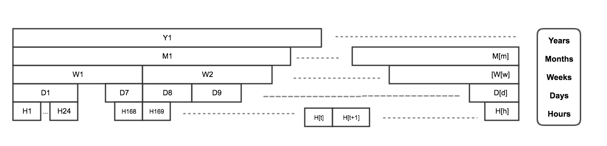
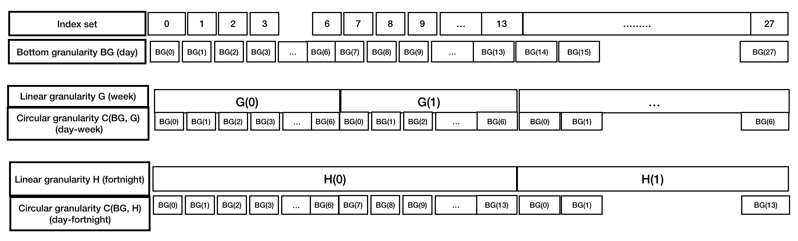
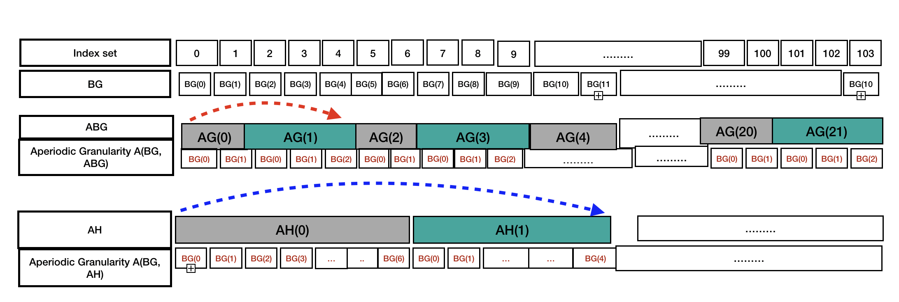

```{r initial, echo = FALSE, cache = FALSE, include = FALSE}
options("knitr.graphics.auto_pdf" = TRUE)
library(knitr)
library(tidyverse)
library(lubridate)
library(lvplot)
library(ggridges)
library(tsibble)
library(gravitas)
library(tsibble)
opts_chunk$set(
  echo = FALSE, warning = FALSE, message = FALSE, comment = "#>",
  fig.path = "figure/", fig.align = "center", fig.show = "hold",
  cache = FALSE, cache.path = "cache/",
  out.width = ifelse(is_html_output(), "100%", "\\textwidth")
)
knitr::opts_knit$set(root.dir = here::here())
```

```{r external, include = FALSE}
# read_chunk('scripts/main.R')
```

```{r load}

```

# Introduction

<!--temporal granularities and why should we care --> 

<!-- problem of analyzing data with such finer scales and classical ways to deal with it -->

Temporal data are available at various resolutions depending on the context. Social and economic data like GDP is often collected and reported at coarse temporal scales like monthly, quarterly or annually. With recent advancement in technology, more and more data are recorded at much finer temporal scales. Energy consumption is collected every half an hour, while energy supply is collected every minute and web search data might be recorded every second. As the frequency of data increases, the number of questions about the periodicity of the observed variable also increases. For example, data collected at an hourly scale can be analyzed using coarser temporal scales like days, months or quarters. This approach requires deconstructing time in various possible ways called time granularities[@aigner2011visualization].
It is important to be able to navigate through all of these temporal granularities to have multiple perspectives on the periodicity of the observed data. This idea aligns with the notion of EDA [@Tukey1977-jx] which emphasizes the use of multiple perspectives on data to help formulate hypotheses before proceeding to hypothesis testing. Visualizing probability distributions conditional on one or more granularities is a potentially useful approach for exploration. Analysts are expected to iteratively explore all possible choices of time granularities for comprehending possible periodicities in the data. But too many choices and a lack of a systematic approach to do so might become overwhelming. 


<!-- # existing ways and challenges -->

Calendar-based graphics[@wang2018calendar] are useful in visualizing patterns in the weekly and monthly structure well and are capable of checking the weekends or special days.  Any sub-daily resolution temporal data can also be displayed using this type of faceting [@Wickham2009-pk] with days of the week, month of the year and another sub-daily deconstruction of time. But calendar effects are not restricted to conventional day-of-week, month-of-year ways of deconstructing time. There can be several classes of time deconstructions, viz. based on the arrangement (linear vs. cyclic) or hierarchical order of the calendar. Linear time granularities respect the linear progression of time such as hours, days, weeks and months. One of the first attempts of characterizing these granularities occur in [@Bettini1998-ed]. The definitions and rules defined are inadequate to reflect periodicities in time. Hence, there is a need to define cyclic time granularities in a different approach, which can be useful in visualizing periodic behavior. Cyclic time granularities can be circular or aperiodic depending on if mappings between granularities are regular or irregular. Examples of circular can be hour of the day, day of the week and that of aperiodic granularities can be day of the month or public holidays. Time deconstructions can also be based on the hierarchical structure of time. For example, hours are nested within days, days within weeks, weeks within months, and so on. Hence, it is possible to construct single-order-up granularities like second of the minute or multiple-order-up granularities like second of the hour. lubridate [@G_Grolemund2011-vm] creates easy access and manipulation of common date-time objects. But most accessor functions are limited to single-order-up granularities.


<!--motivation --> 
   
The motivation for this work comes from the desire to provide methods to better understand large quantities of measurements on energy usage reported by smart meters in households across Australia, and indeed many parts of the world. Smart meters currently provide half-hourly use in kWh for each household, from the time that they were installed, some as early as 2012. Households are distributed geographically and have different demographic properties such as the existence of solar panels, central heating or air conditioning. The behavioral patterns in households vary substantially, for example, some families use a dryer for their clothes while others hang them on a line, and some households might consist of night owls, while others are morning larks. It is common to see aggregates [@2012-la],  of usage across households, total kWh used each half hour by state, for example, because energy companies need to understand maximum loads that they will have to plan ahead to accommodate. But studying overall energy use hides the distributions of usage at finer scales, and making it more difficult to find solutions to improve energy efficiency. We propose that the analysis of smart meter data can be benefited from systematically exploring energy consumption by visualizing the probability distributions across different deconstructions of time to find regular patterns/anomalies. However, the motivation came through the smart meter example, this is a problem which relates to any data that needs to be analyzed for different periodicities.

<!-- at finer or coarser scales can be benefited from the approach of Exploratory Data Analysis (EDA). EDA calls for utilizing visualization and transformation to explore data systematically. It is a process of generating hypothesis, testing them and consequently refining them through investigations. --> 

<!--existing closely related work and how ours relate --> 
 <!-- This paper utilizes the nestedness of time granularities to obtain multiple-order-up granularities from single-order-up ones. -->

<!--actions on multiple order up - usage --> 

<!-- Finally, visualizing data across single/multiple order-up granularities help us to understand periodicities, pattern and anomalies in the data. Because of the large volume of data available, using displays of probability distributions conditional on one or more granularities is a potentially useful approach. However, this approach can lead to a myriad of choices all of which are not useful. Analysts are expected to iteratively visualize these choices for exploring possible patterns in the data. But too many choices might leave him bewildered.  -->

<!-- challenges and how you are dealing wih it --> 
This work provides tools for systematically exploring bivariate granularities within the tidy workflow through the following:


<!-- Pairs of granularities are categorized as either a *harmony* or *clash*, where harmonies are pairs of granularities that aid exploratory data analysis, and clashes are pairs that are incompatible with each other for exploratory analysis. -->

  * Formal characterization of cyclic granularities
  
  * Facilitate manipulation of single and multiple order-up time granularities 

  * Checking feasibility of creating plots or drawing inferences from any two cyclic granularities
  
  * Recommend prospective probability distributions for exploring distributions of univariate dependent variable across pair of granularities
  
  <!-- Pairs of granularities can be categorized as either a *harmony* or *clash*, where harmonies are pairs of granularities that aid exploratory data analysis, and clashes are pairs that are incompatible with each other for exploratory analysis. -->

The remainder of the paper is organized as follows. Section \ref{sec:timegrandef} details the background of linear granularities in depth and introduces the characterization of circular and aperiodic time granularities. Section \ref{sec:synergy} discusses the effect in data structure due to how pairs of cyclic time granularities are related. Section \ref{sec:visualization} discusses the role of plot choices, synergy of time granularities and number of observations to construct an informative and trustworthy visualization. Section \ref{sec:application} discusses how systematic exploration can be carried out for a temporal and non-temporal case. Section \ref{sec:discussion} summarizes this paper and discusses possible future direction.

# Linear Time granularities {#sec:lineartime}

<!-- general calendar categorization -->
<!-- Often we partition time into months, weeks or days to relate it to data. Such discrete abstractions of time can be thought of as time granularities [@aigner2011visualization]. Examples of time abstractions may also include day-of-week, time-of-day, week-of-year, day-of-month, month-of-year, working day/non-working day, etc which are useful to represent different periodicities in the data. Classes of time abstractions may be based on arrangement or hierarchical order of time, discussed in further details in \autoref{sec:arrangement} and \autoref{sec:order}. -->

Often we partition time into months, weeks or days to relate it to data. Such discrete abstractions of time can be thought of as time granularities [@aigner2011visualization]. Time granularities are **linear** if they respect the linear progression of time. Examples include hours, days, weeks and months.

## Definitions and Relationships

<!-- Arrangement: Linear vs. Circular vs. aperiodic {#sec:arrangement} -->

<!-- The arrangement of the time domain can result in deconstructing time in linear, circular or aperiodic (nearly circular) ways.  -->

 There has been several attempts to provide the framework for formally characterizing time-granularities. One of the first attempts occur in [@Bettini1998-ed] with the help of the following definitions: 


<!-- <!-- Representation with tsibble -->
<!-- Suppose we have a tsibble with a time index in one column and keys and variables in other columns. A time domain, as defined by [@Bettini1998-ed], is essentially a mapping of row numbers (the index set) to the time index. A linear granularity is a mapping of row numbers to subsets of the time domain. For example, if the time index is days, then a linear granularity might be weeks, months or years. -->

<!-- <!-- What is calendar categorization --> 
<!-- What we need to add to this are additional categorizations of time that are not linear granularities and are useful to represent periodicity. Examples include day-of-week, time-of-day, week-of-year, day-of-month, month-of-year, working day/non-working day, etc. Many of these are circular, such as day-of-week, time-of-day. Some are nearly circular such as day-of-month. Some are irregular such as working day/non-working day. Let's call all of these "calendar categorizations". Anything that maps a time index to a categorical variable can be considered a **calendar categorization**.  -->

<!-- What is circular granularity and some examples -->
<!-- We specify the circular categorizations using modular arithmetic and call these **circular granularities**. The number of categories is essentially the periodicity of a circular time granularity. For example, suppose the time index is in minutes, and let $n_i$ be the number of categories created by the circular granularity $C_i$. Then the following categorizations can be computed. -->

<!-- In the following sections, we provide a formalism to all of these abstractions and identify their relationships and symbolic representations.  -->

<!-- ### Linear {#sec:linear-gran-def} -->

\newtheorem{timedom}{Definition}
\begin{timedom}\label{def:timedom}
A time domain is a pair $(T; \le)$ where $T$ is a non-empty set of time instants and $\le$ is a total order on $T$.
\end{timedom}

A time domain can be **discrete** (if there is unique predecessor and successor for every element except for the first and last one in the time domain), or it can be **dense** (if it is an infinite set). A time domain is assumed to be discrete for the purpose of our discussion.


\begin{timedom}\label{def:linear}
A linear granularity is a mapping $G$ from the integers (the index set) to subsets of the time domain such that:

  (C1) if $i < j$ and $G(i)$ and $G(j)$ are non-empty, then each element of $G(i)$ is less
than all elements of $G(j)$, and  
  (C2) if $i < k < j$ and $G(i)$ and $G(j)$ are non-empty, then $G(k)$ is non-empty.  
\end{timedom}

**Dicussion:** Each non-empty subset $G(i)$ is called a **granule**, where $i$ is one of the indexes and $G$ is a linear granularity. The first condition implies that the granules in a linear granularity are non-overlapping and their index order is same as time order.
\autoref{fig:linear-time} shows the implication of this condition. If we consider the chronon [@aigner2011visualization] as hourly, the time domain with T hours will have $\lfloor T/24\rfloor$ days, $\lfloor T/(24*7)\rfloor$ weeks and so on.


```{r linear-time,echo=FALSE,out.width = "100%",fig.cap="The time domain distributed as linear granularities"}

```


[@Bettini1998-ed] talks about the relationships of linear time granularities and structure of a calendar and also relates them to the notion of periodicity in time.

\begin{timedom}\label{def:finerthan}
A linear granularity G is finer than a  linear granularity H, denoted $G \preceq H$, if
for each index i, there exists an index j such that $G(i) \subset H(j)$.
\end{timedom}.

**Dicussion:**

\begin{timedom}\label{def:groupsinto}
A linear granularity G groups into a linear granularity H, denoted
$G \trianglelefteq H,$
if for each index j there exists a (possibly infinite) subset S of the integers such
that
\begin{equation}
H(j) = \bigcup_{i \in S}G(i)
\end{equation}
\end{timedom}

**Dicussion:** According to this definition, $G \trianglelefteq H,$ if each granule H (j) is the union of some
granules of G. For example, $Days \trianglelefteq Months$. However, this  relationship is not fully described until we associate it with periodicity. For example, $Days \trianglelefteq Months,$, since each month is a grouping of a number of days, however it is also a periodical grouping. If leap year is ignored, the periodicity of the grouping is 1 year, since each month would be defined as the grouping of the same number of days (31, 28, or 30, depending on the month) every year. Considering leap years and all their exceptions, the period becomes 400 years. 

\begin{timedom}\label{def:periodical}
A granularity H is periodical with respect to a granularity G if
(1) $G \trianglelefteq H,$, and
(2) there exist $R,P \epsilon Z+$, where R is less than the number of granules of H, such
that for all $i \epsilon Z$, if $H(i) = \bigcup_{j \in S}G(j)$ and $H (i + R) \neq \phi$ then
$H (i + R) = \bigcup_{j \in S} G(j + P)$.
\end{timedom}

A granularity H which is periodical with respect to G is specified by:
(i) the R sets of indexes of G, ${S_0,...,S_(R-1)}$ describing the granules of H within one period;
(ii) the value of P; 
(iii) the indexes of first and last granules in H, if their value is not infinite. 
Then, if ${S_0,...,S_{R-1}}$ are the sets of indexes of G describing
$H (0), . . . , H (R - 1)$, respectively, then the description of an arbitrary granule H (j) is given by: $\bigcup_{i \in S_j \mod R}G(P*\lfloor j/R \rfloor + i)$. 

**Dicussion:** This formula can be explained observing that H (j ) is either one of H (0), . . . , H (R - 1) or, for the periodicity of H, is one of these granules “shifted” ahead or behind on the time line of a finite number of periods. If $H (j ) \epsilon {H (0), . . . , H (R - 1)}$, then the formula ‘j mod R’ defines the index (among those in {0,...,R - 1}) of the granule that must be shifted to obtain H (j).The number of periods each granule of G composing H (j mod R) should be shifted is given by $\lfloor j/R \rfloor$.


Granularities can be periodical with respect to other granularities, except for a finite number of spans of time where they behave in an anomalous way [@Bettini2000-vy].

\begin{timedom}\label{def:quasi}
A granularity H is quasi-periodical with respect to a granularity G if
(1) $$G \trianglelefteq H,$$, and
(2) there exist a set of intervals E1,...,Ez (the granularity exceptions) and positive
integers R,P, where R is less than the minimum of the number of granules of H
between any 2 exceptions, such that for all $i \epsilon Z$, if $H(i) = \bigcup_{k \in [0,k]} G(j_r)$  and $H (i + R) \neq \phi$ and $i + R < min(E)$, where E is the closest existing exception after $H (i)^2$, then $H (i + R) = \bigcup_{k \in [0,k]} G(j_r + P )$.
\end{timedom}

**Dicussion:**
 
Intuitively, the definition requires that all granules of H within the span of time between two exceptions have the same periodical behavior, characterized by R and P.

\begin{timedom}\label{def:BG}
Bottom granularity - Given a granularity order relationship g-rel and a set of granularities having the same time domain, a granularity G in the set is a bottom granularity with respect to g-rel, if G g-rel H for each granularity H in the set. 
\end{timedom}

**Dicussion:** Given the set of all granularities defined over the time domain (Z; <), and the granularity relationship $\trianglelefteq$ (groups into), the granularity mapping each index into the corresponding instant (same integer number as the index) is a bottom granularity with respect to $\trianglelefteq$. 

<!-- Most practical problems seem to require only a granularity system containing a set of time granularities which are all periodical (or quasi-periodical) with respect to a basic granularity. The assumption is there should be one bottom granularity and all the other granularities are generated from the bottom granularity by calendar algebraic operations. -->

## Computation through Calendar Algebra

Linear time granularities are computed through an algebraic representation for time granularities, which is referred to as calendar algebra[@Ning2002-tf]. It is assumed that there exists a “bottom” granularity and Calendar algebra operations are designed to generate
new granularities from the bottom one or recursively, from those already generated.
Thus, the relationship between the operand(s) and the resulting granularities are encoded
in the operations.

The calendar algebra consists of two kinds of operations: grouping-oriented and
granule-oriented operations. The grouping-oriented operations combine certain granules of a granularity together to form the granules of the new granularity. Example can be to consider a calendar with only two linear granularities minute and hour and hour is generated by grouping every 60 minutes. The granule-oriented operations do not change the granules of a granularity, but rather make choices of which granules should remain in the new granularity. For example, one can choose to look at the granularity "Monday" and hence select only Mondays while looking at the linear granularity "day".

Some relevant grouping oriented operations are discussed, which will be used in Section \ref{sec:cyclic-gran-def} to define circular and aperiodic granularities.

- **The grouping operation** : Let G be a full-integer labeled granularity, and m a positive integer. The grouping operation $Group_m(G)$ generates a new granularity G, by partitioning the granules of G into m-granule groups and making each group a granule of the resulting granularity.
More precisely, $G = Group_m(G)$ is the full-integer labeled granularity such that for
each integer $i$, $G(i) = \bigcup\limits_{j = (i-1)m+1}^{im} G(j)$.  

**Example** : 

    - $minute = Group_{60}(second)$
    - $hour = Group_{60}(minute)$,
    - $day = Group_{24}(hour)$,
    - $week = Group_{7}(day)$,
  
where, second(1) would start a minute and likewise.

- **The altering-tick operation** : Let G1, G2 be full-integer labeled granularities, and $l$, $k$, $m$ integers, where G2 partitions G1, and $1 \leq l \leq m$. The altering-tick operation $Alter^{m}_{l,k} (G2, G1)$ generates a new full-integer labeled granularity by periodically expanding or shrinking granules of G1 in terms of granules of G2. The altering-tick operation modifies the granules of G1 so that the $l$th granule of each group has $|k|$ additional (or fewer when k < 0) granules of G2.  

**Example** :

  - pseudomonth = 
  $Alter^{12}_{11,-1}(day, Alter^{12}_{9,-1}(day, Alter^{12}_{6,-1}(day,   Alter^{12}_{4,-1)}(day, Alter^{12}_{(2,-3)}(day, Group_{31}(day))))))$,
                  where the granularity pseudomonth is generated by grouping 31 days, 
                  and then shrink April (4), June (6), September (9) and November (11)
                  by 1 day, and shrink February (2) by 3 days. [@Ning2002-tf]


# Cyclic Time granularities {#sec:circular-gran-def}

Periodicity is very common in all kinds of data. Time granularities which can accomodate periodicities can be constructed by relating two linear granularities. The mappings between linear granularities can be regular or irregular. For example, a regular mapping exists between minutes and hours, where 60 minutes always add up to 1 hour. On contrary, an irregular mapping exists between days and months, since one might can have days ranging from 28 to 31. Hence, time granularities can also be **circular** or **aperiodic** depending on if the mapping of the linear granularities is regular or irregular. Examples of circular time granularities include hour of the day, and day of the week, whereas examples for aperiodic time granularities can be day of the month or public holidays.

In a cyclic organization of time, the domain is composed of a set of recurring time values. Hence, any time value can be proceeded and succeeded by another time value (for e.g Monday comes before Wednesday but Monday also succeeds Wednesday). Intuitively, cyclic granularities are additional abstractions of time which are not linear and hence the index order of linear granularities needs to be manipulated so that it leads to repetitive categorization of time.

We propose a formalism of cyclic time granularities through the tsibble [@wang2019tsibble] framework of organizing temporal data. A time domain, as defined by Bettini, is essentially a mapping of the index set to the time index of a tsibble. A linear granularity is a mapping of the index set to subsets of the time domain. For example, if the time index is days, then a linear granularity might be weeks, months or years. Lining up with the the assumption in [@Bettini2000-vy] that all linear granularities can be generated from the bottom granularity by calendar algebraic operations, we assume that a bottom granularity exists and is represented by the index of the tsibble.

The mappings of two linear granularities forming a cyclic granularity can be regular or irregular. It will be regular if, for example, they are formed by grouping operation. Grouping operation would ensure that each granule of the resulting granularity consists of same number of granules of bottom granularity. However, if they are formed by the altering-tick operation, for example, granules of the resulting granularity is composed of different number of granules of bottom granularity. The relationship can still be periodic, depending on the choice of periods and hence these are also useful in exploring periodicities. However, the formalism would differ for circular (regular mapping) and aperiodic (irregular mapping) granularities.


## Circular {#sec:circular-gran-def}

\begin{timedom}\label{def:circular}
A circular granularity C(BG, G) relates a linear granularity G to the bottom granularity, if

\begin{equation} \label{eq:eq2}
C_{BG, G}(z) = BG(z\mod k(BG,G)) \forall z \in \mathbb{Z}^+,
BG(z) \neq \phi,
\end{equation}
where,  
z denotes the index set, 
BG denotes the index of the tsibble (bottom granularity), 
G be a linear granularity, periodic with respect to BG,     
k(BG,G) be the period length of the bottom granularity with respect to linear granularity G.  
\end{timedom}

**Discussion**: Example showing circular granularities relating two linear granularities each with bottom granularities are visually depicted in a series of slots in the \autoref{fig:circular-gran}. Each granule is represented by a box. The diagram also illustrates that the granules that overlap share elements from the underlying time domain. The first slot in the diagram shows the index set and the bottom granularity. The index of the tsibble considered is days. G and H are two linear granularities denoting days and weeks respectively. The period length of days with respect to weeks is 7, hence, $C_{G, BG}(z)$ represented by C(BG, G) is given by $BG(z\mod 7)$. The circular granularity C(BG, G) consists of repetitive pattern {BG(0), BG(1), BG(2), BG(3), BG(4), BG(5), BG(6)} which repeats itself after each period length. Similarly, C(BG, H) is given by $BG(z\mod 14)$ since the period length of days with respect to fortnight is 14. C(BG, H) also repeats the pattern ${BG(0), BG(1), \dots, BG(13)}$ in every period. Hence, circular granularities are represented as repetitive categorization of time in the diagram.

```{r circular-gran, echo=FALSE,out.width = "100%",fig.cap="Relating circular granularities and bottom linear granularity "}

```

All circular granularities can be expressed in terms of the bottom linear granularity with equation \autoref{eq:eq2}.

In general, any circular granularity relating two linear granularity, none of which are bottom granularity can be expressed as $C_{(G, H)}(z) = BG(\lfloor z/k(BG,G) \rfloor\mod k(G,H))$, where linear granularity H is periodic with respect to linear granularity G and k(G, H) represents the period length of G within H.

Table \ref{tab:definitions} shows representation of circular granularities relating two linear granularities. It is possible that none of these two linear granularities are bottom granularities. But the representation of the resultant circular granularity will be a function of the bottom granularity. For example, suppose the bottom granularity is minutes, and let $k_i$ is the period length of $C_i$.

\begin{table}[ht]
\begin{center}
\begin{tabular}{lr@{~}lr@{~}r}
\toprule
Minute-of-Hour: & $C_1(z)$ & $= z \mod 60$ & $k_1 =$&$60$ \\
Minute-of-Day: & $C_2(z)$ & $= z \mod 60*24$ & $k_2=$&$`r 60*24`$\\
Hour-of-Day: & $C_4(z)$ & $= \lfloor z/60\rfloor\mod 24$  & $k_3 =$&$24$ \\
Hour-of-Week: & $C_6(z)$ & $= \lfloor z/60\rfloor\mod 24*7$  & $k_4=$&$`r 24*7`$\\
Day-of-Week: & $C_7(z)$ & $= \lfloor z/24*60\rfloor \mod 7$ & $k_5=$&$7$\\
\bottomrule
\end{tabular}
\end{center}
\caption{Illustrative circular granularities with time index in minutes}
\label{tab:definitions}
\end{table}


## Quasi-circular {#sec:circular-gran-def}

An **Aperiodic granularity** can not be defined using modular arithmetic. The modulus for these type of calendar categorizations are not constant due to irregular mapping with bottom granularities. For example,\autoref{tab:aperiodic} shows some example of aperiodic granularities ($A_i$) and plausible choices of period lengths($k_i$). The coarse granularity is assumed as the period within which the finer granularity will repeat its behavior aperiodically.

\begin{table}[ht]
\begin{center}
\begin{tabular}{lr@{~}lr@{~}r}
\toprule

Day-of-Month: & $A_1(z)$ &  $k_1=31, 30, 29, 28$\\
Hour-of-Month: & $A_2(z)$ & $k_2=24*31, 24*30, 24*29, 24*28$\\
Day-of-Year: & $A_3(z)$ & $k_3=366, 365$\\
Week-of-Month: & $A_4(z)$ & $k_4=5, 4$\\ 
\bottomrule
\end{tabular}
\end{center}
\caption{Illustrative aperiodic circular granularities with potential period lengths}
\label{tab:aperiodic}
\end{table}


**Definition: Aperiodic granularity** An aperiodic granularity A(AG, BG) that relates linear granularities AG and bottom granularity BG, with AG being periodical with respect to BG, is given by

\begin{equation}\label{eq:eq3}
A_{BG, AG}(z) = BG(z - \sum_{w=0}^{k-1}\vert T_{w \mod R'} \vert), z \in T_k
\end{equation}
where,  
z denotes the index set (index of BG),
$R'$ denotes the number of granules of AG in each period of BG,  
$T_w$ are the sets of indices of BG describing $AG(w)$ such that $AG(w) = \bigcup_{z \in T_w}BG(z)$, and $T_w = 0$ for $w \epsilon Z_{<0}$  
$\vert T_w \vert$ is the cardinality of set $T_w$.


Since AG is periodical with respect to BG, from definition of "Groups periodically into" the following holds true:

- $BG \trianglelefteq AG,$
- $AG(w) = \bigcup_{z \in T_w \mod R}BG(P'*\lfloor w/R' \rfloor + z)$,  where P' denotes the period of the granularity BG.

**Discussion**: Example showing aperiodic granularities relating two linear granularities each with bottom granularities are visually depicted in a series of slots in \autoref{fig:aperiodic-gran}. Each granule is represented by a box. Similar to \autoref{fig:circular-gran}, the granules that overlap share elements from the underlying time domain and the first slot shows the index set and the bottom granularity. 
Two linear granularities AG and AH are considered, where $AG = Alter^{2}_{(1,-1)}(BG, Group_3(BG))$ and $AH = Alter^{2}_{(1,-2)}(BG, Group_7(BG))$. This implies that AG is made up by shrinking every 1st granule of Group_3(BG) by 1 granule and AH is made up of shrinking every 1st granule of Group_3(BG) by 2 granules. Number of granules of AG and AH in each period of BG is 2, but the number of granules of BG in each of those granules are different. A(BG, AG) and A(BG, AH) are repetitive categorization of time, similar to circular granularities, except that the number of granules of BG is not necessarily the same across different granules of AG or AH. For AG, R' = 2, P'= 5, $T_0$ = {0,1} and $T_1$ = {2, 3, 4}. For AH, R' = 2, P'= 12, $T_0$ = {0, 1, 2, 3, 4, 5, 6} and $T_1$ = {7, 8, 9, 10, 11}, then we will have \autoref{eq:eq4} and  \autoref{eq:eq5}.

\begin{equation} \label{eq:eq4}
\begin{split}
A(BG,AG)(8) & = BG(8 - \sum_{w=0}^{3-1}\vert T_{w \mod 2}\vert) , 8 \in T_{3} \\
  & = BG(8 - \sum_{w=0}^{2}\vert T_{w\mod 2}\vert) \\
  & = BG(8 - \sum_{w=0}^{2}\vert T_{w\mod 2}\vert) \\
  & = BG(8 - \vert T_{0 \mod 2}\vert - \vert T_{1 \mod 2}\vert - \vert T_{2 \mod 2}\vert) \\
  & = BG(8 - 2*\vert T_{0 \mod 2}\vert - \vert T_{1 \mod 2}\vert) \\
  & = BG(8 - 2*2 - 3) \\
  & = BG(1) \\
\end{split}
\end{equation}

\begin{equation} \label{eq:eq5}
\begin{split}
A(BG,AH)(10) & = BG(10 - \sum_{w=0}^{1-1}\vert T_{w \mod 2}\vert) ,  10 \in T_{1}  \\
  & = BG(10 - \sum_{w=0}^{0}\vert T_{w\mod 2}\vert) \\
  & = BG(10 - \vert T_{0 \mod 2}\vert) \\
  & = BG(10 - \vert T_{0}\vert) \\
  & = BG(10 - 7) \\
  & = BG(3) \\
\end{split}
\end{equation}

            


```{r aperiodic-gran, echo=FALSE,out.width = "100%",fig.cap="Relating circular granularities and bottom linear granularity "}

```

If we ignore leap years and all its exception, the periodicity of the grouping (days, months), P' = 365, R' = 12, since each month would be defined as the grouping of the same number of days (31, 28, or 30, depending on the month) every year. Considering leap years and all their exceptions, period is 400 years and hence $P' = (3*365 + 366)$, $R' = 12*400$.  \autoref{eq:eq3} can be useful to find the aperiodic granularity day-of-month in both of these cases, since the grouping is periodic is both cases. 

<!-- Then $f(x, y)$ can be  computed using modular arithmetic as follows: -->

<!-- $$f(x, y) = \lfloor z/c(z,x) \rfloor\mod c(x,y)$$ -->

<!-- The constant c(x,y) is for granularities for groups into periodically, for granualrities which group into each other in a quasi-periodic way, no such constants exist and no such close form solution can be obtained. -->


<!-- It is easy to note here that due to unequal length of some linear granularities like months or years, these formulae can not be used for computing week-of-month or day-of-year. Thus, we start with the definition of circular granularity and then move on to computing aperiodic granularities.  -->


<!-- Formal definition of circular granularity -->

<!-- **Definition: Equivalence class** Let $m \in N \backslash{0}$. For any $a \in Z$ (set of integers), $[a]$ is defined as the equivalence class to which a belongs if $[a]$ = {$b \in Z | a \equiv (b \mod m)$}. -->

<!-- The set of all equivalence classes of the integers for a modulus $m$ is called the ring of integers modulo $m$, denoted by $Z_m$. Thus $Z_m = \{[0], [1], ..., [m-1]\}$. However, we often write $Z_m = \{0, 1, ..., (m-1)\}$, which is the set of integers modulo $m$. -->

<!-- **Definition:** A **circular granularity** $C$, joining two linear granularity with a modular period m is defined to be a mapping from the integers $Z$ (Index Set) to $Z_m$, such that -->

<!-- $C(s) = (s\mod m)$ for $s \in Z$. -->

<!-- For example, suppose $C$ is a circular granularity denoting hour-of-day and we have hourly data for 100 hours. The modular period $m = 24$, since each day consists of 24 hours and $C$ is a mapping from ${1,2,\dots, 100}$ to ${0,1,2, \dots, 23}$ such that  $C(s)= s \mod 24$ for $s \in {1,2,\dots, 100}$. -->

<!-- **Definition:** A **cycle** is defined as the progression of each circular granularity with modular period m through {$1,2,\dots,(m-1),0$} once. -->

<!-- **Definition:** A **circular granule** represents an equivalence class inside each cycle. -->

<!-- ### Aperiodic {#aperiodic-gran-def} -->
<!-- Formal definition of aperiodic circular granularity -->


 <!-- Why we need single order up and multiple order up granularities -->
<!-- A time series which is characterized by being composed of repeating cycles. -->


<!-- Identifying repeating (periodic/aperiodic) patterns are necessary in revealing patterns and future trends of a temporal data. Often there is a need for periodicity detection to find whether and how frequent a periodic/aperiodic pattern is repeated within the series. -->


The linear granularities G, H, AG and AH considered in the definitions of circular and aperiodic granularities are all periodic with respect to the bottom granularity. The only difference is G, H have regular mapping, whereas, G1 and G2 have irregular mapping with respect to BG. It can be noted here that if a linear granularity AG is quasi-periodic with respect to BG, then \autoref{eq:eq3} can be modified as follows to account for exceptions $E = [e_{begin}, e_{end}]$ (by Definition \autoref{def:quasi})

\begin{equation}\label{eq6}
A_{BG, AG}(z) = BG(z - \sum_{w=0}^{k-1}\vert T_{w} \vert - \sum_{u=0}^{e_k}\vert E_{u} \vert)
\end{equation}

for $z \in T_k$ and $e_k$ is the number of exceptions in $\bigcup\limits_{w = 0}^{k} T_w$ and $E_{u} = [e_{begin}(u), e_{end}(u)]$.

# Acyclic time granularities {#sec:circular-gran-def}


<!-- To consider the exhaustive set of temporal regularities that might exist in the data, we can also define temporal granularities based on the hierarchical structure of a calendar. -->

# Computing cyclic time granularities {#sec:order}

The hierarchical structure of time creates a natural nested ordering which can produce **single-order-up** or **multiple-order-up** granularities. We shall use the notion of a hierarchy table and order to define them.

**Definition:  Order** of a linear granularity can be comprehended as the level of graininess associated with a linear granularity. If we consider two linear granularities G and H, such that G is finer than or groups into H (by Definitions \ref{def:finerthan}, \ref{def:groupsinto}), then H is of higher order than G.

**Notation:  Hierarchy table** Let $H_n: (G, C, k)$ be a hierarchy model containing n linear granularities. $G_{l}$ represents the linear granularity of order l and $k(l,m)$ represents the period length of $G_{l}$ with respect to $G_{m}$ and $C_{G(l),G(m)}$ represents the circular granularity that relates linear granularity of order l and m, $\forall l,m \in n, l<m$. 

In a hierarchy table, linear granularities are arranged from lowest to highest order of linear granularities. 

<!-- Thus the first linear granularity can either be the bottom granularity (finest possible) or the finest granularity within the set of linear granularities and the other granularities are subsequently more "coarse" than the earlier one. -->

We refer to granularities which are nested within multiple levels as **multiple-order-up** granularities and those concerning a single level as **single-order-up** granularities. Let us look at few calendars to see examples of single and multiple order-up granularities. 

<!-- If linear granularities are not provided or bottom granularity is not known, any circular granularities of hierarchy order m can be computed, provided the circular granularities till hierarchy order (m-1) are provided. -->

### Computation of multiple-order from single-order {#sec:multiplefromsingle}


\begin{equation} \label{eq7}
\begin{split}
C_{(G_l,G_m)}(z) & = C_{G_l,G_{l+1}}(z) + k(l, l+1)(C_{(G_(l+1),G_m)}(z)-1) \\  
  & =   C_{(G_l,G_{l+1}}(z) + k(l, l+1)[ C_{G_{l+1},G_{l+2}}(z) + k(l+1, l+2)( C_{G_{l+2}, G_m}(z) - 1) - 1] \\
  & =  C_{(G_l,G_{l+1}}(z) + k(l, l+1)(C_{G_{l+1},G_{l+2}}(z) - 1) + k(l, l+1)k(l+1, l+2)(C_{G_{l+2}, G_{m}} - 1)\\
  & =  C_{(G_l,G_{l+1}}(z) + k(l, l+1)(C_{G_{l+1},G_{l+2}}(z) - 1) + k(l, l+2)(C_{G_{l+2},G_{l+m}}(z) - 1)\\
  &\vdots\\
  & = \sum_{i=0}^{m - l - 1} k(l, l+i)(C_{G_{l+i},G_{l+i+1}}(z) - 1)\\
\end{split}
\end{equation}


<!-- some discussions on primary units of calendar -->
**Example:** So far we have used the Gregorian calendar as it is the most widely used calendar. But it is far from being the only one. All calendars fall under three types - solar, lunar or lunisolar/solilunar but the day is the basic unit of time underlying all calendars. Various calendars, however, use different conventions to structure days into larger units: weeks, months, years and cycle of years. The French revolutionary calendar divided each day into 10 "hours", each "hour" into 100 "minutes" and each "minute" into 100 "seconds". Nevertheless, for any calendar a hierarchy can be defined. For example, in Mayan calendar, one day was referred to as 1 kin and the calendar was structured as follows [@Reingold2001-kf]: 

 - 1 kin = 1 day
 - 1 uinal = 20 kin
 - 1 tun  = 18 uinal
 - 1 katun = 20 tun
 - 1 baktun = 20 katun

Thus, the hierarchy table for the Mayan calendar would look like the following:

|  G	        |C                 |k
|------------	|------------------|------------|
|  kin      	|kin-of-uinal      |  20        |
|  uinal    	|uinal-of-tun      |  18  	    |
|  tun      	|tun-of-katun      |  20	      |
|  katun    	|katun-of-baktun   |  20        |
|  baktun   	| 1                |	1         |

Examples of multiple-order-up  granularities can be kin-of-tun or kin-of-baktun whereas examples of single-order-up granularities may include kin-of-uinal, uinal-of-tun etc. 

Let us use the equation \ref{eq:eq3} to compute the multiple-order-up granularity uinal_katun for Mayan calendar, which is periodic and regular.

\begin{equation} \label{eq8}
\begin{split}
C(uinal, baktun) & = C(uinal, tun) + kuinal, tun)C(tun,katun) + C(uinal, katun)C(katun, baktun) \\
              & = \lfloor z/20\rfloor \mod 18  + 20*\lfloor z/20*18\rfloor \mod 20 + 20*18*20\lfloor z/20*18*20\rfloor \mod 20 \\
\end{split}
\end{equation}


### Computation of single-order from multiple-order {#sec:singlefrommultiple}


For a hierarchy table $H_n: (G, C, k)$ with $l_1, l_2, m_1, m_2 \in {1, 2, \dots, n}$ and $l_2<l_1$ and $m_2>m_1$, we have

\begin{equation} \label{eq9}
C_{G_{l1}, G_{m1}}(z) = C_{G_{l2}, G_{m2}}(\lfloor z/k(l_2,l_1) \rfloor\mod k(m_1, m_2))
\end{equation}


**Example:** Considering the same example of Mayan Calendar,  it is possible to compute the single-order-up granularity tun-of-katun  given the multiple-order-up granularity uinal-baktun using equation \ref{eq:eq5}

\begin{equation} \label{eq10}
\begin{split}
C(tun, katun) =  \lfloor C(uinal, baktun)(z)/18\rfloor \mod 20 \\
\end{split}
\end{equation}

In \autoref{sec:singlefrommultiple} and \autoref{sec:multiplefromsingle}, we assume that all single order granularities are circular.What happens when we have a mix of circular and aperiodic granularities.

Let us turn to Gregorian calendar for addressing this case. Suppose we have a hierarchy table using some linear granularties from Gregorian calendar. Since months consists of unequal number of days, any temporal unit which is higher in order than months will also have unequal number of days. This is an example of a hierarchy structure which has both circular and aperiodic single-order-up granularities. The single-order-up granularity day_month is aperiodic. Any single-order-up granularities which are formed by units below days are periodic. Similarly, all single-order-up granularities which are formed using units whose orders are higher than months are also periodic.


<!-- Hence, any calendar categorization which includes one linear granularity with orders at most as days and another one with orders at least as months will be aperiodic in nature. However, it is very much possible for a calendar categorization consisting of two linear granularities higher in order than month to be periodic.For example, the categorization month_quarter would be periodic since each quarter always consists of three months. -->

|  G	        |C/A               |k
|------------	|------------------|------------|
|  minute     |minute-of-hour    |  60        |
|  hour    	  |hour-of-day       |  24  	    |
|  day      	|day-of-month      | "aperiodic"|
|  month    	|month-of-year     |  12        |
|  year   	  | 1                |	1         |

There can be three scenarios for obtaining multiple-order-granularities here:
- granularities relating two linear granularities whose orders are less than day
- granularities relating two linear granularities whose orders are more than month
- granularities relating two linear granularities with order at most day and another with order at least month

The single order-up granularites resulting from the first two cases are periodic and has been handled in \autoref{sec:singlefrommultiple} and \autoref{sec:multiplefromsingle}. The calendar categorization resulting from the last case are aperiodic. Examples might include day of the quarter or hour of the month. Let us consider the computation of $A_{hour, month}$ given single order-up granularities $A_{hour, day} = 12$, $A_{day, month} = 20$ and $C_{month, year} = 9$.

\begin{equation} \label{eq11}
\begin{split}
A_{(hour, month)} & = (\sum_{w=0}^{9 - 1}(\vert T(w)\vert) +  20)/24 + 12 \\
                  & = (\sum_{w=0}^{C_{month, year} - 1}(\vert T(w)\vert) +  A_{day, month})*k(hour_day) + A_{hour, day} \\
                  & = (A{day_year} - 1)*k(hour_day) + A_{hour, day} \\
\end{split}
\end{equation}
where, $month(w) = \bigcup_{z \in T_w}day(z)$


Clearly, the computation of multiple order-up granularities become more involved with aperiodic mappings of linear granularities in the calendar structure. With one aperiodic granularity, we can write the following:

A_{P, Q)} & = (A{AG_Q} - 1)*k(P_AG) + A_{P, AG} {TO REVISE: many aperiodic granularties not to be included}

# Synergy of cyclic time granularities {#sec:synergy}


<!-- Let's take a specific example, where $C_1$ maps row numbers to Day-of-Month and $C_2$ maps row numbers to Week-of-Month. Here $C_1$ can take 31 values while $C_2$ can take 5 values. There will be $31\times 5=155$ sets $S_{ij}$ corresponding to the possible combinations of WOM and DOM. Many of these are empty. For example $S_{1,5}$, $S_{21,2}$, etc. In fact, most of these 155 sets will be empty, making the combination of $C_1$ and $C_2$ in a graph unhelpful. These are structurally empty sets in that it is impossible for them to have any observations. -->

<!-- Another example could be where $C_1$ maps row numbers to Day-of-Week and $C_2$ maps row numbers to Month-of-Year. Here $C_1$ can take 7 values while $C_2$ can take 12 values. So there are $12\times7=84$ sets $S_{ij}$ corresponding to the possible combinations of DOW and MOY. All of these are non-empty because every DOW can occur in every month. So graphics involving $C_1$ and $C_2$ are potentially useful. -->


<!-- What  is interaction and some examples why it is important to study interaction -->


<!-- \autoref{fig:allFig} (c) shows box plot of electricity consumption of Victoria from 2012 to 2014 across days of the year by the 1st, 15th, 29th and 31st days of the month. -->


<!-- Letter value plots convey detailed information about tails of the distribution and outliers are unexpected observations rather than extreme observations. M, F, E, D and C represents 50%, 25%, 12.5%, 6.25% and 3.13% of the tail area respectively. Some observations that can be made from these letter-value plots include a) Right tails for most days in January lying above the median is more extended than the left tails contrary to days in April which has longer left tails. b) Days in mid January and February are characterized by high variation in consumption level, but days in January have longer right tails. c) Last five days in December (Christmas holidays) shows low variation in consumption with longer left tails implying people typically consume less electricity. We can conclude that Month-of-Year and Day-of-Month are harmonies. -->


<!-- \autoref{fig:allFig} (c) shows box plot of electricity consumption of Victoria from 2012 to 2014 across days of the year by the 1st, 15th, 29th and 31st days of the month. The box plot is a a very compact distributional summary, displaying median, quartile boundaries, hinges, whiskers and outliers. All facets do not contain data across same x-axis levels leading to difficulty in comparison across facets. Hence, Day-of-Month and Day-of-Year are clashes. -->

<!-- Take another example \autoref{fig:allFig} (d) showing violin plot across days of the month faceted by week of the month. Violin plots are a combination of box plot and density plot. Here, the first week of the month correspond to certain days of the month which are different for different week of the month. These kinds of graphics can hinder our comprehension across different weeks of the month and can be categorized as a incompatible combination to plot. -->

<!-- In \autoref{fig:allFig} (e), variations across week of the year conditional on week of the month can be observed through a ridge plot. The y-axis represents week of the year and the x-axis represents electricity consumption. Ridge plots are density plots all aligned to the same horizontal scale and presented with a slight overlap. They are designed to bring out changes in distributions over time. The data is distributed unequally for different levels of weeks of the year for different facets, which hinders comparison across facets. So, Week-of-Month and Week-of-Year are clashes. -->

<!-- \autoref{fig:allFig} (f) shows decile plots of consumption across  day of the year and month of the year. Decile plots are useful in displaying distribution through deciles without much clutter. This plot, however, seem ineffective for comparison as levels of x-axis for which observed data is plotted are completely disjoint across facets. So Month-of-Year and Day-of-Year are clashes as well. -->


<!-- In \autoref{fig:allFig} (c), we have empty combinations when we plot observations with "Day-of-Month" and "Day-of-Year". Here, the 1st day of the month can never correspond to 2nd, 3rd or 4th day of the year. Hence,  "Day-of-Month" and "Day-of-Year" are clashes due to the way they map to calendar. -->

<!-- In \autoref{fig:allFig} (a), we will not have any empty combinations because every DoM can occur in all MoY. Here, mapping from days to months is irregular in the sense that one month can consist of 28, 29, 30 or 31 days. There is no denying that the 29th, 30th or 31st day of the month needs to be analysed with caution due to the irregular mapping, however, the first 28 days of the month will occur in all months of the year. -->

<!-- From the above examples, we can see that the choices of the circular granularities are harmonies while some are clashes. Also since some choices work and others don't, it must be the attributes of the circular granularities or their relationships which are in play in deciding if the resulting plot would be a good candidate for exploratory analysis. -->


Before exploring the behavior of a "dependent variable" across time granularities,
it is important to know how these granularities interact with each other. If two time granulaties of interest interact, the relationship between each of the interacting variables and the dependent variable will depend on the value of the other interacting variable. To define a general framework, we define harmony and clashes.

<!-- Harmonies are the pair of granularities that aid the process of exploratory analysis and clashes are pair that interact in non-compatible ways and hinder the process of exploration of the dependent variable. -->


<!-- When we plot some observations with two circular or aperiodic granularities used as aesthetics or facets, problems arise when we have empty combinations. It is important to check how these two granularities interact with each other, before we expect to gain insights by plotting them together.  -->

Suppose we have two cyclic granularities $C_1$ and $C_2$, such that $C_1$ maps index set to a set $\{A_1,A_2,A_3,\dots, A_n$\}, and $C_2$ maps index set to a set $\{B_1,B_2,B_3,\dots, B_m$\}.  That is, let $S_{ij}$ be the set of index set such that for all $s \in S_{ij}$, $C_1(s) = i$ and $C_2(s) = j$. Since, $C_1$ has n levels and $C_2$ has m levels there will be $nm$ such sets $S_{ij}$.Now, many situations can lead to any of these sets being empty. Let us discuss the following cases, where one or more of these sets can be empty.

Firstly, empty combinations can arise due to the structure of the calendar or hierarchy.
These are called "structurally" empty combinations. Let us take a specific example, where $C_1$ maps row numbers to Day-of-Month and $C_2$ maps row numbers to Week-of-Month. Here $C_1$ can take 31 values while $C_2$ can take 5 values. There will be $31\times 5=155$ sets $S_{ij}$ corresponding to the possible combinations of WOM and DOM. Many of these are empty. For example $S_{1,5}$, $S_{21,2}$, etc.This is also intuitive since the first day of the month can never correspond to fifth week of the month. These are structurally empty sets in that it is impossible for them to have any observations.

<!--  In fact, most of these 155 sets will be empty, making the combination of $C_1$ and $C_2$ in a graph unhelpful. -->

Secondly, empty combinations can turn up due to differences in event location or duration in a calendar. These are called "event-driven" empty combinations. Again, let us consider a specific example to illustrate this. Let $C_1$ be DOW and $C_2$ be WorkingDay/NonWorkingDay. Here $C_1$ can take 7 values while $C_2$ can take 2 values. So there are 14 sets $S_{ij}$ corresponding to the possible combinations of DOW and WD/NWD. While potentially all of these can be non-empty (it is possible to have a public holiday on any DOW), in practice many of these combinations will probably have very few observations. For example, there are few if any public holidays on Wednesdays or Thursdays in any given year in Melbourne. 

<!-- However, this is different from the first example because these are not structurally empty. Also, the graphic may still be useful if we want to look at whether the interaction of $C_1$ and $C_2$ affects the distribution we are plotting. -->

Thirdly, empty combinations can be a result of how granularities are constructed. Let $C_1$ maps row numbers to "Business days", which are days from Monday to Friday except holidays and $C_2$ is Day-of-Month. Then the weekends in Days-of-Month would not correspond to any Business days and would have missing observations due to the way the granularities are constructed. This is different from the structurally empty combinations because structure of the calendar does not lead to these missing combinations, but the construction of the granularity does. Hence, they are referred to as "build-based" empty combinations.


An example when there will be no empty combinations could be where $C_1$ maps row numbers to Day-of-Week and $C_2$ maps row numbers to Month-of-Year. Here $C_1$ can take 7 values while $C_2$ can take 12 values. So there are $12\times7=84$ sets $S_{ij}$ corresponding to the possible combinations of DOW and MOY. All of these are non-empty because every DOW can occur in every month.

Therefore, pair of circular/aperiodic granularities which lead to structurally, event-driven or build-based empty-combinations are referred to as to as **clashes**.
And the ones that do not lead to any missing combinations are called **harmonies**. 

<!-- as they promote the exploratory analysis through visualization. -->


```{r}
# grid.arrange(p1,p2,p3,p4,nrow = 2)

#
# x <- gridExtra::arrangeGrob (p5, p6, p1, p2, p3, p4,newpage = TRUE)
# grid::grid.draw(x)

#
# gridExtra::grid.arrange(
#   p1,
#   p2,
#   p3,
#   p4,
#   p5,
#   p6,
#   nrow = 3,
#   top = "Title of the page",
#   bottom = grid::textGrob(
#     "this footnote is right-justified",
#     gp = grid::gpar(fontface = 3, fontsize = 9),
#     hjust = 1,
#     x = 1
#   )
# )
# plot.new()
# mtext('Various probability distribution plot of electricity consumption data of Victoria from 2012 to 2014 (top left) Letter Value plot by DoM and MoY (top right) Decile Plot by HoD and DoW (middle left) Box plot by DoY and DoM (middle right) Violin plot of DoM and WoM (bottom left) Ridge plot by WoM and WoY (bottom right) Decile plot by DoY and MoY', side = 3, line = - 10, outer = TRUE)
```


<!-- More generally, if we have two circular granularities C1 and C2 which has [A, B, C, D] and [X, Y, Z] categories/levels. When C1 and C2 are used as aesthetics or facets, problems arise when we encounter empty combinations. Let $S_{i,j}$ be the set of combination of the levels of C1 and C2. In this example, we have 12 such sets $S_{i,j}$ because i can take 4 values and j can take 3 values.  -->
 


<!-- Thus, the common link that differentiates harmonies from clashes are: -->

<!--   a) There should not be any levels of the faceted variable which is empty for one or more levels of the factor plotted across x-axis. -->

<!--   b) There should not be any level of the factor plotted across x-axis which doesn't have values for all levels of factors plotted across facets. -->

# Data structure

  
# Visualization {#sec:visualization}

<!-- Why visualize -->
<!-- Analysts often want to fit their data to statistical models, either to test hypotheses or predict future values. However, improper choice of models can lead to wrong predictions. One important use of visualization is exploratory data analysis, which is gaining insight into how data is distributed to inform data transformation and modeling decisions. -->

<!-- When the data for entire population is available at our disposal, then there is no inference that is to be made for the unobserved population. We can just examine what is in front of us. -->


<!-- Include why distribution plot, why 2D, why faceting in introduction -->
<!-- Why distribution plot -->
<!-- Huge data difficult to summaries using one statistic-->


<!-- With huge amount of data being available, mean, median or any one summary statistic might not enough to understand a data set. Soon enough following questions become more interesting:   -->

<!--  - Are values clustered around mean/median or mostly around tails? In other words, what is the combined weight of tails relative to the rest of the distribution?  -->

<!--  - Does values rise very quickly between 25th percentile and median but not as quickly between median and 75th percentile? More generally, how the variation is the data set changes across different percentiles/deciles? -->

<!--   - Is the tail on the left hand side longer than that on the right side? Or are they equally balanced around mean/median? -->

<!-- This is when displaying a probability distribution becomes a potentially useful approach. -->
<!-- The entire distribution can be visualized or some contextual summary statistics can be visualized to emphasize certain properties of the distribution. These properties can throw light on central tendency, skewness, kurtosis, variation of the distribution and can also be useful in detecting extreme behavior or anomalies in the data set. -->


<!-- ## Distributions conditional on bivariate granularities -->

<!-- Why 2D -->

<!-- Graphical output devices are flat. If there are only two variables, a cartesian graph of one variable against the other can show the configuration of points. As soon as the data move to three variables, we need to infer multi-dimensional structure by a two-dimensional medium[Cleveland, elements of graphing data]. Any attempt to encode all these temporal granularities together to develop insights on periodicity might fail or become clumsy. Instead, the big problem can be broken down into smaller pieces by focusing on specific tasks per visual representation in a 2D space.   -->

<!-- Why facet-ing -->

<!-- `ggplot2` (Wickham, 2016) is an excellent tool that facilitates the process of mapping different variables to a 2D frame through grammar of graphics. One aspect of ggplot2 is faceting, inspired by Trellis plots (Cleveland, 1993). These are based on conditioning the values taken on by one or more of the variables in a data set. This means creating same plots using data subsets corresponding to each level of the conditioned variable. This is a powerful tool for exploratory data analysis as we can rapidly compare patterns in different parts of the data.  -->

<!-- What are we visualizing -->

<!-- We will see the distribution of the time series across bivariate temporal granularities through faceting approach with one temporal granularity plotted along the x-axis, the other one across facets and the dependent time series variable on the y-axis.  -->

<!-- A well designed visual representation can replace cognitive calculations with simple perpetual inferences and improve speed of comprehension and decision making. However, creating a visualisation requires a number of nuanced judgements. The challenge being given a data set, the number of visual encodings and hence the space of possible visual design is extremely huge.  -->

<!-- The grammar of graphics introduced a framework to incorporate underlying features for statistical graphics to construct them by relating data space to the graphic space [@Wilkinson1999-nk]. The layered grammar of graphics proposed by [@Wickham2009-pk], which is a modification over the former, allows us to produce graphics using the same structured thinking that is used to design analysis. Briefly, any graphics are made up of **Layers**, **Facet**,**Scale** and a  **coordinate system**. **Layers** are made up of **data**, **mapping**, **statistical transformation**, **geometric objects** and **position adjustments**. -->

Creating a visualisation requires a number of nuanced judgements. We exploit some features of layers and faceting [@Wilkinson1999-nk] and [@Wickham2009-pk] to come up with a recommendation system while visualizing the distribution of the "dependent" variable across bivariate temporal granularities. The general framework of visualizing the distribution invloves a faceting approach with one temporal granularity plotted along the x-axis, the other one across facet and the dependent time series variable on the y-axis. Different distribution plots might be appropriate depending on which features of the distrbution we are interested to look at, the levels of time granularities being plotted, how granularities interact and number of observations available. We will look at each of these aspects separately and analyze the effect of each on visualization.

While we accomplish that, we need to bear in mind that any customized species of visualization might be constructed by varying the set of mappings between data properties and visual attributes such as position, shape and color. We are trying to address problems where even with good aesthetic qualities and good data, the graph might be confusing or misleading because of how people process the information.


<!-- Now, due to the hierarchical arrangement of the granularities, there are certain granularities which when plotted together do not give us the layout to do exploration, for example, structurally empty combinations (clashes) are not recommended to plot together. The harmonies when plotted together can help exploration. But still the question remains that which distribution plot should be chosen to bring out the best of exploratory data analysis. This is a function of which features of the distribution we are interested to look at, how much display space is available to us and also if the number of observations are enough for that distribution plot. -->


## Choice of Plots


<!-- Common benefits and challenges of empirical and density based visualization -->

There are several ways to plot statistical distributions. The displayed probabilities in these plots are either computed using kernel density estimation methods or empirical statistical methods. The latter do not allow us to see the shape, skewness, nature of the tail or multi-modality with so much clarity as the former. However, they avoid much clutter, where some specific probabilities representing typical and extreme behavior are on focus. The probabilities displayed are based on actual data, which is aligned to principles that governed Tukey’s original boxplot. Density plots which uses a kernel density estimate to show the probability density function of the variable can show the entire distribution, unlike discretizing the distribution and showing only parts of it. They can be useful in spotting multimodality, however, they might become obscuring with too many categories and information on the entire distribution can add to cognitive load. Also, the probabilities in density plot are estimated through kernel density estimation and thus makes assumptions when selecting kernel or bandwidth. As a result, the plot shows smooth summaries based on the assumptions and not only on actual observations. The density based visualizations are subject to the same sample size restrictions and challenges that apply to any density estimation. In practice, the densities are estimated reasonably with at least 30 observations. Even with sample sizes of several hundred, however, choosing too large a value for bandwidth can cause the estimate to oversmooth the data.

We will discuss few conventional and recent ways to plot distributions using both of these methods.


### Empirical methods

Most commonly used techniques to display a distribution of data include the histogram (Karl Pearson), which shows the prevalence of values grouped into bins and the box-and-whisker plots [@Tukey1977-jx] which convey statistical features such as the median, quartile boundaries, hinges, whiskers and extreme outliers. The box plot is a compact distributional summary, displaying less detail than a histogram. Due to wide spread popularity and simplicity in implementation, a number of variations are proposed to the original one which provides alternate definitions of quantiles, whiskers, fences and outliers. Notched box plots [@Mcgill1978-hg] has box widths proportional to the number of points in the group and display confidence interval around medians aims to overcome some drawbacks of box plots.<!-- Challenge of boxplot --> The standard box plot and all of these variations are helpful to get an idea of the distribution at a glance. Moreover, for data less than 1000 observations, detailed estimates of tail behavior beyond the quartiles are not trustworthy. Also, the number of outliers is large for larger data set since number of outliers is proportional to the number of observations.

<!-- Description and lit review of letter-value plots -->
The letter-value box plot [@Hofmann2017-sg] was designed to adjust for number of outliers proportional to the data size and display more reliable estimates of tail. “outliers” in letter value plots are those observations beyond the most extreme letter value. The letter values are shown till the depths where the letter values are reliable estimates of their corresponding quantiles and hence might lead to a lot of letter values being shown and leading to overload of information in one plot.


<!-- Description and lit review of quantile plots -->

Quantile plots visually portray the quantiles of the distribution of sample data. Much like the quartiles divide the data set equally into four equal parts, extensions include dividing the data set even further. These plots are referred to as "quantile" plots. For example, number of quantiles would be 9 for a decile plot and 99 for percentile plot. It avoids much clutter and just enable us to focus on specific probabilities, typically representing typical and extreme behaviors. A large data set is required for the extreme percentiles to be estimated with any accuracy. These plots can display any quantiles instead of quartiles in a traditional boxplot. When reviewing a boxplot, an outlier is defined as a data point that is located outside the fences (“whiskers”) of the boxplot (e.g: outside 1.5 times the interquartile range above the upper quartile and below the lower quartile). However, outliers are open to interpretation and not shown in an quantile plot.

<!-- Description and lit review of density plots -->

<!-- The vase plot [@Benjamini1988-io, 1988] was a major revision from the concept of box plots where the width of box at each point is proportional to estimated density.  -->

### Kernel density estimation methods

Traditional ways to visualize densities include violin plots [@Hintze1998-zi]. The shape of the violin represents the density estimate of the variable. The more data points in a specific range, the larger the violin is for that range. Adding two density plots gives a symmetric plot which makes it easier to see the magnitude of the density and compare across categories, enabling easier detection of clusters or bumps within a distribution.


The summary plot [@Potter2010-qc, 2010] combines a minimal box plot with glyphs representing the first five moments (mean, standard deviation, skewness, kurtosis and tailings), and a sectioned density plot crossed with a violin plot (both color and width are mapped to estimated density), and an overlay of a reference distribution. This suffers from the same problem as boxplots or violin plot, as it is combination of those two.

<!-- Description and lit review of density plots -->
 A Ridge line plot (sometimes called Joy plot) shows the distribution of a numeric value for several groups. Distribution can be represented using histograms or density plots, all aligned to the same horizontal scale and presented with a slight overlap. A clear advantage over boxplots is that these plots allow us to see multimodality in the distribution. However, these plots can be obscuring when there is overlap of distribution for two or more categories of the y-axis. Also, if there are lot of categories, it is difficult to compare the height of the densities across categories.

<!-- Description and lit review of HDR plots -->
The highest density region (HDR) box plot proposed by [@Hyndman1996-ft] displays a probability density region that contains points of relatively highest density. The probabilities for which the summarization is required can be chosen based on the requirement. These regions do not need to be contiguous and help identify multi-modality.

Given a context, it is good to be conversant with the benefits and challenges while choosing a distribution plot. As a general rule, if we have too many categories, the quantile plots are useful for comparing patterns, whereas, other more involved methods of plotting are useful for studying anomalies, outlier or multimodal behavior.


### Effect of levels of temporal granularities

The levels of the two granularities plotted have an impact on the choice of plots since space and resolution might become a problem if the number of levels are too high. The criteria for different levels could be based on usual cognitive power while comparing across facets and display size available to us. Plot choices will also vary depending on which granularity is placed on the x-axis and which one across facets. 

Levels are categorized as very high/high/medium/low each for the facet variable and the x-axis variable. Default values for these levels are chosen based on levels of common temporal granularities like day of the month, day of a fortnight or day of a week. Any levels above 31 can be considered as very high, any levels between 14 to 31 can be taken as high and that between 7 to 14 can be taken as medium and below 7 as low. 31, 14 and 7 are the levels of days-of-month, days-of-fortnight and days-of week respectively.


 <!-- - If levels of both the granularities are low, then any statistical distribution plot might be chosen depending on which feature of the distribution one is interested to look at.  -->
 
The following principles are useful while choosing distribution plots given two temporal granularities.


  - If levels of both granularity plotted are low/medium, then any distribution plots might be chosen depending on which feature of the distribution needs focus.
 
 - If level of the granularity plotted across x-axis is more than medium, ridge plots should be avoided to escape overlap of categories.
 
  - If level of the granularity plotted across x-axis is more than or equal to high, quantile plots are preferred. 
  
  - If levels of any granularity plotted are more than medium, empirical based methods of distribution visualizing are preferred as they use less space by design than most density based methods.


<!-- Let us consider case by case and see which plots are better suitable in which scenarios. -->


<!--  Assumptions should be made to ensure display is not too cluttered by the space occupied by various kinds of distribution plots.  -->
<!-- Moreover, the recommendation system ensures that there are just enough observations before choosing a distribution plot. -->

<!-- Levels are categorized as very high/high/medium/low each for the facet variable and the x-axis variable. Default values for these levels are based on levels of common temporal granularities like day of the month, day of a fortnight or day of a week. For example, any levels above 31 is considered as very high, any levels between 14 to 31 are taken as high and that between 7 to 14 is taken as medium and below 7 is low. 31, 14 and 7 are the levels of days-of-month, days-of-fortnight and days-of week respectively. These default values are decided based on usual cognitive power while comparing across facets and display size available to us. Let us consider case by case and see which plots are better suitable in which scenarios. -->


<!-- Faceting creates small multiples of data each representing a different subset of the data. Small multiples are powerful for exploratory data analysis where we can rapidly compare patterns in different parts of the data and see whether they are the same or different. But space and resolution quickly become a problem if the number of levels of facet variables is too high. Also, Cleveland suggested that a graphic should display as much information as it can, with the lowest possible cognitive strain to the viewer. -->


## Effect of synergy of time granularities

In Section \ref{sec:synergy}, we discussed how pairs of granularities can have empty combinations either due to structure of calendar, event location or duration or due to the way they are built. In this section, we will see how these empty combinations affect the visualization when a dependent variable is plotted against these granularities.


For illustration, distribution of half-hourly electricity consumption of Victoria is plotted across different time granularities in each of the panel in
\autoref{fig:allFig}. \autoref{fig:allFig} (a) shows the letter value plot across days of the month faceted by months like January, March and December. \autoref{fig:allFig} (c) shows box plot  across days of the year by the 1st, 15th, 29th and 31st days of the month. \autoref{fig:allFig} (d) showing violin plot across days of the month faceted by week of the month. \autoref{fig:allFig} (e), variations across week of the year conditional on week of the month can be observed through a ridge plot and \autoref{fig:allFig} (f) shows decile plots across  day of the year and month of the year.


Clearly, in \autoref{fig:allFig}, we observe that some choices of time granularities work and others do not. In \autoref{fig:allFig} (c), there will be no observations for some combinations "Day-of-Month" and "Day-of-Year". In particular, the 1st day of the month can never correspond to 2nd, 3rd or 4th day of the year. On the contrary, for \autoref{fig:allFig} (a), we will not have any combinations with zero combinations because every "Day-of-Week" can occur in any "Month-of-Year". Thus the graphs that don't work are those where many of the combination sets are empty. In other words, if there are levels of time granularities plotted across x-axis which are not spanned by levels of the time granularities plotted across facets or vice versa, we will have empty sets leading to potential ineffective graphs. We hypothesize that the synergy of these  granularities are in play while deciding if the resulting plot would be a good candidate for exploratory analysis.

We redefine harmony and clashes as follows: harmonies are pairs of granularities that aid exploratory data analysis, and clashes are pairs that are incompatible with each other for exploratory analysis. As a result, we should avoid plotting clashes as they hinder the exploratory process by having missing combinations of time granularities in each panel.


```{r allFig, fig.height=5.5, out.width="50%", fig.align= 'left',echo=FALSE, eval=TRUE, warning=FALSE,message = FALSE, fig.cap="Various probability distribution plots of electricity consumption data of Victoria from 2012 to 2014. (a) Letter value plot by DoM and MoY, (b) Decile plot by HoD and DoW (c) Box plot by DoY and DoM, (d) Violin plot of DoM and WoM, (e) Ridge plot by WoM and WoY, (f) Decile plot by DoY and MoY. Only plots (a) and (b) show harmonised time variables.", fig.show = 'hold'}

# change all of these to gravitas function
library(gravitas)
library(tsibbledata)
library(dplyr)
library(ggplot2)

par(mfrow = c(3, 2))

VIC <- vic_elec

VIC %>% 
  create_gran("month_year") %>% 
  filter(month_year %in% c("Jan", "Mar", "July", "Dec")) %>% 
  prob_plot("month_year","day_week",
            response = "Demand",
            plot_type = "lv") + 
  ylab("Electricity Demand [KWh]") +
  ggtitle("(a) Letter value plot")


VIC %>% 
  create_gran("day_week") %>% 
  filter(day_week %in% c("Mon", "Tue", "Sat", "Sun")) %>% 
  prob_plot("day_week","hour_day",
            response = "Demand",
            plot_type = "quantile",
            symmetric = FALSE) + 
  ylab("Electricity Demand [KWh]") +
  ggtitle("(b) Decile plot")


VIC %>%
  create_gran("day_month") %>% 
  filter(day_month %in% c(1, 15, 29, 31)) %>%
  prob_plot("day_month",
                "day_year",
                response = "Demand",
                plot_type = "boxplot")+
  ylab("Electricity Demand [KWh]") +
  scale_x_discrete(breaks = seq(0, 366, 60)) + 
  theme(legend.position = "bottom", 
        strip.text = element_text(size = 7, margin = margin())) +
  ggtitle("(c) Box plot")


VIC %>%
    create_gran("week_month") %>% 
  filter(week_month %in% c(1, 2, 4)) %>%
   prob_plot("week_month",
                "day_month",
                response = "Demand",
                plot_type = "violin", alpha = 0.3) + ylab("") + 
  xlab("Days of the Month") + 
  theme(legend.position = "bottom", strip.text = element_text(size = 7, margin = margin())) + scale_x_discrete(breaks = seq(0, 31, 5)) + 
  scale_y_continuous(breaks = seq(2000, 9000, 2000)) +
  ggtitle("(d) Violin plot")


VIC %>%  create_gran("week_month") %>%
  create_gran("week_year") %>%
  filter(week_month%in% c(1, 2, 5), week_year %in% c(1:20)) %>% 
  prob_plot("week_year", 
            "week_month",
            response = "Demand",
            plot_type = "ridge")  + 
  xlab("Electricity Demand [KWh]") +
  ylab("Weeks of the Year") +
  scale_x_continuous(breaks = seq(2000, 10000, 3000)) + 
  theme(legend.position = "bottom", 
        strip.text = element_text(size = 7, margin = margin())) +
  ggtitle("(e) Ridge plot")


VIC %>%
  create_gran("month_year") %>% 
  filter(month_year %in% c("Jan", "Jul", "Nov")) %>% 
   prob_plot("month_year", 
            "day_year",
            response = "Demand",
            plot_type = "quantile",
            quantile_prob = seq(0.1, 0.9, 0.1),
            symmetric = FALSE) +
   #scale_x_discrete(breaks = seq(1, 336, 60)) + 
   ylab("") + 
   xlab("Day of the Year") + theme(legend.position = "none", 
                                   strip.text = element_text(size = 7, 
                                                             margin = margin())) +
  ggtitle("(f) Decile plot")
  
  
  

# VIC_moy_doy %>% ggplot(aes(x = yday, y = Value, col = as.factor(Quantile), group = yday)) + geom_line() + facet_wrap(~Indx_Month) + scale_x_continuous(breaks = seq(1, 336, 60)) + ylab("") + xlab("Day of the Year") + theme(legend.position = "none", strip.text = element_text(size = 7, margin = margin())) + ggtitle("(f) Decile plot")
```


## Effect of number of observations


Even with harmonies, visualizing probability distributions can be misleading either due to rarely occuring categories or unevenly distributed events.  


### Rarely occuring events

Suppose we have $T$ observations, and two cyclic granularities -  $C_1$ with $n$ categories and $C_2$ with $m$ categories. Each element of $C_1$ occurs approximately $T/n$ times while each element of $C_2$ occurs approximately $T/m$ times. There are no structurally empty combinations, and each combination will occur on average an equal number of times as $T\rightarrow\infty$, so the average number of observations per combination is $T/(mn)$. If we require at least $k$ observations to create a meaningful panel, then provided $T \ge mnk$, the visualization will be acceptable. The value of $k$ will depend on what type of visualization we are producing. For a decile plot, even $k=10$ may be acceptable, but for density estimates, we would need $k \ge 30$. Rarely occurring categories such as the 366th day of the year, or the 31st day of the month can suffer from such problem.


<!-- The above discussion shows that problems will occur when $n_1n_2 > T/k$, even without structurally empty combinations. -->


### Unevenly distributed events

Even when there are no rarely occuring events, number of observations might vary hugely within or across each panel. This might happen due to missing observations in the data or uneven locations of events in time domain. In such cases, the visualizations that use kernel density estimates should be used with caution as sample size would directly affect both the variance of the estimator and the confidence intervals. Measures such as Gini's coefficient may be used to see if sample sizes vary widely across panels.

# Applications {#sec:application}

## Smart meter data of Australia {#sec:smartmeter}

Smart meters provide large quantities of measurements on energy usage for households across Australia. One of the customer trial [@smart-meter] conducted as part of the Smart Grid Smart City (SGSC) project (2010-2014) in Newcastle, New South Wales and some parts of Sydney provides customer wise data on half-hourly energy usage and detailed information on appliance use, climate, retail and distributor product offers, and other related factors. It would be interesting to explore the energy consumption distribution for these customers and gain more insights on their energy behavior which are otherwise lost either due to aggregation or looking only at coarser temporal units. The idea here is to show how looking at the time across different granularities together can help identify different behavioral patterns and identify the extreme and regular households amongst these 50 households. 

<!-- typical and extreme behaviors of 50 households from that trial.  -->

<!-- , and indeed many parts of the world. Households are distributed geographically and have different demographic properties such as the existence of solar panels, central heating or air conditioning. The behavioral patterns in households vary substantially, for example, some families use a dryer for their clothes while others hang them on a line, and some households might consist of night owls, while others are morning larks.  -->

<!-- <!-- Existing approaches, why we need to drill down, or why we want to -- probability distributions --> 
<!-- It is common to see aggregates of usage across households, total kwh used each half-hour by state, for example, because energy companies need to understand maximum loads that they will have to plan ahead to accommodate. But studying overall energy use hides the distributions of usage at finer scales, and making it more difficult to find solutions to improve energy efficiency.  -->


<!-- We want to  look at the distribution of energy across coarser temporal granularities and then deep dive into finer temporal granularities. -->


<!-- In Figure \ref{fig:day-fortnight} and \ref{fig:day-fortnight-agg} , the smart meter data is filtered for two customers to illustrate what kinds of insights can be drawn for the energy behavior of these two customers. -->

In Figure \ref{fig:day-fortnight}, the smart meter data is filtered for two customers to illustrate what kinds of insights can be drawn for the energy behavior of these two customers. it can be seen that for most days of the fortnight, the second household has much less consumption than the first one. However, there is additional information that we can derive looking at the distribution. If we consider letter value F as a regular behavior and letter values beyond F as not-so-regular behavior, we can conclude that the regular behavior of the first household is more stable than the second household. However, the distribution of tail of the first household is more variable, observed through distinct letter values, implying that their not-so-regular behavior is quite extreme. This shows, how looking at the distribution of the dependent variable can throw more light on the energy behavior of the customers, which are lost using aggregate or summary statistics. 


<!-- # ```{r day-fortnight_agg, echo = FALSE} -->
<!-- # library(lvplot) -->
<!-- # library(ggplot2) -->
<!-- # library(dplyr) -->
<!-- # library(tibble) -->
<!-- # library(gravitas) -->
<!-- # library(tidyr) -->
<!-- # smart_meter10 %>%  -->
<!-- #   filter(customer_id %in% c(10006704, 10017936)) %>%  -->
<!-- #   create_gran("day_fortnight") %>% -->
<!-- #   as_tibble() %>%  -->
<!-- #   group_by(customer_id, day_fortnight) %>%  -->
<!-- #   summarise(median= log(median(general_supply_kwh)), -->
<!-- #             total = log(sum(general_supply_kwh))) %>%  -->
<!-- #   gather("daily_consumption", "value", - c(customer_id, day_fortnight)) %>%  -->
<!-- #   ggplot2::ggplot(aes( -->
<!-- #     x = as.factor(day_fortnight), -->
<!-- #     y = value,  -->
<!-- #     color = daily_consumption, -->
<!-- #     group = daily_consumption)) + -->
<!-- #   geom_line() + -->
<!-- #   xlab("day_fortnight") + -->
<!-- #   ylab("general_supply_kwh") +  -->
<!-- #   facet_wrap(~customer_id) +  -->
<!-- #   theme_bw()  -->

<!-- # smart_meter10 %>%  -->
<!-- #   filter(customer_id %in% c(10006704, 10017936)) %>%  -->
<!-- #   create_gran("day_fortnight") %>% -->
<!-- #   as_tibble() %>%  -->
<!-- #   group_by(customer_id, day_fortnight) %>%  -->
<!-- #   summarise(median_consumption= median(general_supply_kwh)) %>% -->
<!-- #   ggplot2::ggplot(aes( -->
<!-- #     x = as.factor(day_fortnight), -->
<!-- #     y = median_consumption, -->
<!-- #     color =  customer_id, -->
<!-- #     group = customer_id)) + -->
<!-- #   geom_line() + -->
<!-- #   xlab("day_fortnight") + -->
<!-- #   ylab("general_supply_kwh") +  -->
<!-- #   theme_bw()  -->
<!-- ``` -->


```{r day-fortnight, fig.cap="Letter value plot of two households across days of the fortnight. M, F, E, D and C represents the letter values of energy consumption. Regular behavior (within letter value F) is more variable for the 2nd household, whereas extreme behavior (beyond letter value F) is varying more for the first household."}
library(lvplot)
library(ggplot2)
library(dplyr)
library(tibble)
library(gravitas)
smart_meter10 %>%
  filter(customer_id %in% c(10006704, 10017936)) %>% 
  create_gran("day_fortnight") %>%
  ggplot2::ggplot(aes(
    x = as.factor(day_fortnight),
    y = general_supply_kwh)) +
  xlab("day_fortnight") +
  geom_lv(
    outlier.colour = "red",
    aes(fill = ..LV..),
    k = 5) +
  facet_wrap(~customer_id) + 
  scale_fill_lv() +
  theme_bw() +
  scale_y_sqrt() 
```


<!-- Figure \autoref{fig:my-hd} shows the overlay quantile plot of energy consumption of 50 households. The black line is the median, whereas the pink band covers 25th to 75th percentile, the orange band covers 10th to 90th percentile and the green band covers 1st to 99th percentile. Each facet represents a month and energy consumption across each hours of the day is shown inside each facet. It can be observed that the median is very close (and hence not distinctly visible) to the lower boundaries of all the other bands implying energy consumption for these households are extremely left skewed.75% of the households has distinct higher evening peaks compared to morning peaks, especially in the winter months. The top 5% households behave very differently than even the top 10% households in terms of total energy consumption across hours of the day.  -->


**gravitas** R package [@R-gravitas] is used to facilitate the systematic exploration here. While trying to explore the energy behavior of these customers systematically across cyclic time granularities, the first thing we should have at our disposal is to know which all cyclic time granularities we can look at exhaustively. If we consider conventional time deconstructions for a Gregorian calendar (second, minute, half-hour, hour, day, week, fortnight, month, quarter, semester, year), the following time granularities can be considered for this analysis. 


```{r}
library(tsibble)
interval(smart_meter10)
smart_meter10 %>% search_gran()
```


The interval of this tsibble is 30 minutes, and hence the temporal granularities range from half-hour to year. If these options are considered too many, the most coarse temporal unit can be set to be a “month”.


```{r}
smart_meter10 %>% 
  search_gran(highest_unit = "month")
```


Also, some intermediate temporal units that might not be pertinent to the analysis can be removed from the list of cyclic granularities we want to look at.

```{r search_gran_limit2}

smart_meter10 %>% search_gran(highest_unit = "month",
                              filter_out = c("hhour", "fortnight")
)
```

Now that we have the list of cyclic granularities to look at, we can visualize the distribution. From the search list, we found six cyclic granularities for which we would like to derive insights of energy behavior. The distribution of energy needs to be visualized across two cyclic granularities at a time. It is equivalent to taking 2 granularities from 6, which essentially is equivalent to visualizing 30 plots.However, harmony/clash pairs can identified among those 30 pairs, to determine feasibility of plotting any pairs together. We are left with 13 harmonies pair, each of which can be plotted together to look at the energy behavior from different perspectives.


<!-- # ```{r is_harmony, echo= TRUE} -->
<!-- # smart_meter10 %>%  -->
<!-- #   is_harmony(gran1 = "hour_day",  -->
<!-- #              gran2 = "day_week") -->
<!-- #  -->
<!-- # smart_meter10 %>% -->
<!-- #   is_harmony(gran1 = "hour_day",  -->
<!-- #              gran2 = "day_week",  -->
<!-- #              facet_h = 14) -->
<!-- #  -->
<!-- # smart_meter10 %>%  -->
<!-- #   is_harmony(gran1 = "day_month", -->
<!-- #              gran2 = "week_month") -->
<!-- # ``` -->


```{r harmony, echo=TRUE}
smart_meter10 %>% harmony(
  ugran = "month",
  filter_out = c("hhour", "fortnight")
)
smart_meter10 %>% gran_advice("wknd_wday", "hour_day")

```

In \autoref{fig:bothcust} we visualize the harmony pair (wknd_wday, hour_day) through a box plot. Boxplot of energy consumption is shown across wknd_wday (facet) and hour-day (x-axis) for the same two households. For the second household, outliers are less prominent implying their regular behavior is more stable. For the first household, energy behavior is not significantly different between weekdays and weekends. For the second household, median energy consumption for the early morning hours is extremely high for weekends compared to weekdays.

 For the second household, outliers are less prominent implying their regular behavior is more stable. For the first household, energy behavior is not significantly different between weekdays and weekends. For the second household, median energy consumption for the early morning hours is extremely high for weekends compared to weekdays.


```{r bothcust_notrun}
cust1 <- smart_meter10 %>% 
  filter(customer_id %in% c(10006704)) %>% 
  prob_plot("wknd_wday",
                            "hour_day",
                            response = "general_supply_kwh",
                            plot_type = "boxplot") +
  scale_y_sqrt() +
  ggtitle("Energy consumption distribution for customer id: 10006704")


cust2 <- smart_meter10 %>% 
  filter(customer_id %in% c(10017936))%>% 
  prob_plot("wknd_wday",
                            "hour_day",
                            response = "general_supply_kwh",
                            plot_type = "boxplot") +
  scale_y_sqrt() + 
  ggtitle("Energy consumption distribution for customer id: 10017936")
```

```{r bothcust, fig.cap = "Boxplot of energy consumption across hours of the day faceted by weekday/weekend for household 1 (customer id: 10006704) and household 2 (customer id: 10017936). Median behavior for the early morning hours of household 2 is extremely high for weekends compared to weekdays, not much differenc can be observed for household 1. "}
cust1
cust2
```

Now, we would like to see how these customers' behavior relate to the rest of the  50 households across these two measures -  

- if energy distribution is skewed towards extreme?

- if the weekend and weekday behavior are different for most of these households?


Figure \ref{fig:wknd-wday50} shows the quantile plot of energy consumption of 50 households. Similar quantiles for weekend and weekdays indicate that behaviors of most of these customers do not alter between weekdays and weekends.

Figure \ref{fig:my-hd} shows that the median is very close to the lower boundaries of all the other bands implying energy consumption for these households are left skewed. Moreover, only the pink band changes significantly in winter months (May - August). The median consumption or width of other bands doesn't vary much across seasons, implying extreme behavior or extreme customers does not vary across seasons much. Most of the behavioral changes occur in the quartiles, that too in peak hours of the day. It is to be noted here that the the level of quantiles increased too in winter months (obvious because of weather conditions), the interesting part is to notice that the relationship between bands other than quartile stayed same across seasons.

```{r wknd-wday50, fig.cap = "Quantile plot of energy consumption of 50 households across different hours of the day faceted by weekday and weekend. The quantiles are not different for weekdays and weekends implying either the behavior balances out among these customers or most of them do not behave differently for weekdays and weekends."}

smart_meter <- 
  read_rds("data/sm_cust50.rds")

smart_meter %>% 
  prob_plot("wknd_wday",
                            "hour_day",
                            response = "general_supply_kwh",
                            plot_type = "quantile",
            symmetric = FALSE, 
            quantile_prob = c(0.01, 0.1, 0.25, 0.5, 0.75, 0.9, 0.99)) +
  scale_y_sqrt()
```


<!-- # ```{r wknd-wday50_df} -->
<!-- # smart_meter10 %>%  -->
<!-- #   prob_plot("month_year", -->
<!-- #                             "day_fortnight", -->
<!-- #                             response = "general_supply_kwh", -->
<!-- #                             plot_type = "quantile", -->
<!-- #             symmetric = TRUE,  -->
<!-- #             quantile_prob = c(0.01, 0.1, 0.25, 0.5, 0.75, 0.9, 0.99)) + -->
<!-- #   scale_y_sqrt(breaks = c(0.1, 0.25, 0.5, 1:3)) -->
<!-- # ``` -->


```{r my-hd, fig.cap="Area quantile plots of energy consumption across hours of the day faceted by months of the year. The black line is the median, whereas the pink band covers 25th to 75th percentile, the orange band covers 10th to 90th percentile and the green band covers 1st to 99th percentile. The median and quartile consumption increase in winter months, but extreme behavior represented by higher bands mostly stay the same across seasons. "}

library(gravitas)
library(tsibble)

library(ggplot2)
smart_meter %>%
  prob_plot("month_year", "hour_day",
    response = "general_supply_kwh",
    plot_type = "quantile",
    quantile_prob = c(0.01, 0.05, 0.1, 0.25, 0.5, 0.75, 0.9, 0.95, 0.99),
    symmetric = TRUE) +
  ggtitle("") + scale_y_sqrt(breaks = c(0.01, 0.1, 0.5, 1:3))
```

<!-- Figure \ref{fig:dw-hd} shows that on morning peaks for Saturday and Sunday are higher and occurs in a later hour of the day compared to weekdays. This is true for both top 50% and 75% of the customers. Hence, this is indicative of the fact that at least 50% of the households in this subset has traditional work days (Mon-Fri) and weekends(Sat-Sun). All the percentiles peaks up in the morning hours and then drops in the afternoon, before again peaking up in the evening.  -->


<!-- ```{r dw-hd} -->

<!-- # Hourly usage across days of the week -->
<!-- sm_cust50 %>% -->
<!--   prob_plot("day_week",  -->
<!--            "hour_day", -->
<!--            "general_supply_kwh",  -->
<!--            plot_type = "quantile",  -->
<!--           quantile_prob = c(0.25, 0.5, 0.75), -->
<!--            response = "general_supply_kwh", overlay = FALSE) + -->
<!--   ggtitle("") -->

<!-- ``` -->


This case study shows systematic exploration of energy behavior starting with two households and comparing some of their features with all 50 households. First, it helps us to find the list of granularities to look at, then shrinks the number of possible visualizations by identifying harmonies and then explored harmony pairs to gain some insights on periodic behavior of the households. 

## T20 cricket data of Indian Premiere League {#sec:cricket}

The application is not only restricted to temporal data. We provide an example of cricket to illustrate how this can be generalized in other applications. The Indian Premier League (IPL) is a professional Twenty20 cricket league in India contested by eight teams representing eight different cities in India. With eight teams, each team plays each other twice in a home-and-away round-robin format in the league phase. In a Twenty20 game the two teams have a single innings each, which is restricted to a maximum of 20 overs. Hence, in this format of cricket, a match will consist of 2 innings, an innings will consist of 20 overs, an over will consist of 6 balls with some exceptions. 

The ball by ball data for IPL season 2008 to 2016 is fetched from [Kaggle](https://www.kaggle.com/josephgpinto/ipl-data-analysis/data).  The `cricket` data set in the `gravitas` package summarizes the ball-by-ball data cross overs and contains information for a sample of 214 matches spanning 9 seasons (2008 to 2016).


<!-- ```{r hierarchy, echo=FALSE} -->
<!-- hierarchy_model <- tibble::tibble(linear gran = c("ball", "over", "inning", "match"),  -->
<!--                                   convert_fct = c(6, 20, 2, 1)) -->
<!-- knitr::kable(hierarchy_model, caption = " A hierarchy table for T20 cricket") -->
<!-- ``` -->


Although there is no conventional time granularity in cricket, we can still represent the data set `cricket` through a `tsibble`, where each over, which represents an ordering from past to future, can form the index of the tsibble. The hierarchy table would look like the following:

```{r hierarchy2}
library(gravitas)
library(tibble)
hierarchy_model <- tibble::tibble(
  G = c("over", "inning", "match"),
  k = c(20, 2, 1))

knitr::kable(hierarchy_model, format = "markdown")

```

There are many interesting questions that can possibly be answered with such a data set, however, we will explore a few and understand how the proposed approach in the paper can help answer some of the questions.


<!-- Each team is given a two-and-a-half-minute "strategic timeout" during each innings; one must be taken by the bowling team between the ends of the 6th and 9th overs, and one by the batting team between the ends of the 13th and 16th overs. -->

<!-- Suppose, we are interested to see how the distribution of scores vary from the start to the end of the game. Let us brainstorm some of the questions that might help us comprehend that. -->

<!-- a) What is the most common pattern for batting and bowling teams across balls, overs, innings and matches? Which are the teams which are typical and which are exceptions? -->

<!-- How the scores per over vary across granularities/categorizations like innings of a match or matches of a season? Are these different for the winning teams in that season and the teams that couldn't qualify for the playoffs? -->

<!-- Is the outcome of the game dependent on who bats first? Do some teams have more chance to win if they are batting in the first innings? -->

<!-- We will look at the ball by ball data for all batting teams. Since we want a periodic world, where each over consists of 6 balls and each match consists of two innings, we shall filter out the matches or overs for which that is not true. Also, we look at runs per over as that would have more variability compared to runs per ball and it be easier to observe the strategies of the winning team through that.  -->

First, we look at the distribution of runs per over across over of the innings and seasons in \autoref{fig:seas-over-inning}. The distribution of runs per over has not significantly changed from 2008 to 2016. There is no clear pattern/trend that runs per over is increasing or decreasing across seasons. Hence, we work with subsets of seasons to answer some of the questions:

Q1: How run rates vary depending on if a team bats first or second?


Mumbai Indians(MI) and Chennai Super kings(CSK) are considered one of the best teams in IPL with multiple winning titles and always appearing in final 4 from 2010 to 2015. It would be interesting to take their example in order to dive deeper into the first question.

<!-- - Q1: How their run rates vary depending on if they bat first or 2nd? Is there a chance that they are more likely to win if they bat first? -->

<!-- - Q2: Which team is more consistent in their approach in terms of run rate across different overs of the innings? -->


```{r runs_per-over}
library(tsibble)

cricket_all <-  read_csv("data-raw/deliveries_all.csv")
matches_all <- read_csv("data-raw/matches_all.csv")

cricket_season <- cricket_all %>% left_join(matches_all, by = c("match_id" ="id"))
                                        
cricket_per_over <- cricket_season %>% 
  group_by(season, match_id, batting_team, bowling_team,  inning, over) %>%
  summarise(runs_per_over = sum(total_runs), run_rate = sum(total_runs)/length(total_runs)) 

cricket_tsibble_all <- cricket_per_over %>% 
  ungroup() %>% 
  mutate(data_index = row_number()) %>% 
  as_tsibble(index = data_index)
```


```{r seas-over-inning, fig.cap = "Quantile plot of runs per over across overs of different seasons. There is no pattern on increase or decrease of runs across overs for seasons."}
  cricket_tsibble_all %>% 
  prob_plot("over", 
            "season",
            hierarchy_model,
            response = "runs_per_over",
            plot_type = "quantile",
            quantile_prob = c(0.25, 0.5, 0.75), 
            symmetric = FALSE)  +
     theme( # remove the vertical grid lines
            panel.grid.major.x = element_blank() ,
            # explicitly set the horizontal lines (or they will disappear too)
            panel.grid.major.y = element_blank()) + scale_x_discrete(breaks = seq(2008, 2016, 3))
```


From Figure \ref{fig:cricex}, it can be observed that there is no clear upward shift in runs in the second innings as compared to the first innings. The variability of runs also increases as the teams approach towards the end of the innings, as observed through the longer and more distinct letter values.
  
```{r cricex, fig.cap= "Letter value plot of runs per over across overs of the inning faceted by innings of the match. No upward shift in runs in the second innings like that in the first implying teams are more vulnerable to score more in the first innings as they approach the end of the inning."}

library(tsibble)
cricket_tsibble <- cricket %>%
  mutate(data_index = row_number()) %>%
  as_tsibble(index = data_index)

cricket_tsibble %>%
  filter(batting_team %in% c("Mumbai Indians",
                             "Chennai Super Kings"))%>%
  prob_plot("inning", 
            "over",
  response = "runs_per_over",
  hierarchy_model,
  plot_type = "lv")  + ggtitle("")
```


Q2: Is run rate set to reduce in subsequent over if fielding/bowling is good in the previous over? Between fielding and bowling which penalizes runs in the subsequent over more?

For establishing that the fielder fielded well in a particular over, we can see how many catches and run outs were made in that particular over. If a batsman is bowled out, it does not necessarily signify good fielding. So we only include catches and run out as a measure of fielding. Difference in runs across over should be negative if good fielding has an impact on the runs scored in the subsequent overs. Let us see if this fact is true. Figure \ref{fig:field} shows the difference between run rate between two subsequent overs are negative when good fielding leads to one or two dismissals in an over, implying good fielding in one over has indeed an impact on runs scored in the subsequent overs.

```{r field, fig.cap = "Distribution of lagged run rate across overs of the innings and dismissals by catch and catch and bowled. This shows good fielding in one over leads to lower runs in the subsequent overs for at least 50 percentiles of times."}

cricket_fielding <- cricket_season %>% 
  mutate(fielding_proxy = if_else(dismissal_kind %in% c("caught", "caught and bowled"),1,0)) %>% 
  group_by(season, match_id, batting_team, bowling_team,  inning, over) %>%
  summarise(runs_per_over = sum(total_runs),
            run_rate = sum(total_runs)/length(total_runs),
            fielding_wckts = sum(fielding_proxy)) %>%
            mutate(diff_run_rate = c(0,diff(run_rate)))

cricket_tsibble_fld <- cricket_fielding %>% 
  ungroup() %>% 
  mutate(data_index = row_number()) %>% 
  as_tsibble(index = data_index)

cricket_tsibble_fld %>% gran_obs("over", "fielding_wckts")


cricket_tsibble_fld %>% 
  filter(fielding_wckts %in% c(0,1)) %>% 
  prob_plot( "fielding_wckts","over",
                               hierarchy_model,
                               response = "diff_run_rate",
                               plot_type = "quantile",
                               quantile_prob = c(0.1, 0.25, 0.5, 0.75, 0.9),
           overlay = TRUE)  + ggtitle("")

```


<!-- Q2: Among good fielding and bowling - which affect the runs of the subsequent overs more? -->


Q3: Is runs set to reduce in the next over for dot balls in this over?

A dot ball is a delivery bowled without any runs scored off it. The number of dot balls is reflective of the quality of bowling in the game. Run rate of an over should ideally decrease if the number of dot balls increase. However, what is the effect of dot balls on runs scored in the subsequent over. Will players  batsman likely to go for big shots because they couldn't score good runs in the previous over? Or they should play consistently and avoid scoring high? From figure \ref{fig:exdot} shows the quantile plot of runs across overs for none, one or two dot balls per over in the facets. Each of the quantiles decrease across facets. With two dot balls per over, at least 50% of the times, run rates decrease in the subsequent over as observed through the negative values for 10th, 25th and 50th percentile quantiles.

```{r crickread, ech0=FALSE}
cricket_tsibble <- gravitas::cricket %>%
  mutate(data_index = row_number()) %>%
  as_tsibble(index = data_index)
```


```{r exdot, fig.cap="10th, 20th, 30th, 40th and 50th quantiles of runs per over are drawn  across overs of the innings with no (facet 1), one (facet 2) and two (facet 3) dot balls per over. For all three cases, difference in runs between subsequent overs decrease.", fig.pos="htb"}

library(gravitas)
library(tsibble)


cricket_bowling <- cricket_season %>% 
  mutate(dot_ball_proxy = if_else(total_runs==0,1,0),
         wicket_proxy = if_else(is.na(dismissal_kind),0,1)) %>% 
  group_by(season, match_id, batting_team, bowling_team,  inning, over) %>%
  summarise(dot_balls = sum(dot_ball_proxy),
            wickets = sum(wicket_proxy), 
            total_runs = sum(total_runs)) %>%
            mutate(diff_run_rate = c(0,diff(total_runs)))


cricket_tsibble_bow <- cricket_bowling %>% 
  ungroup() %>% 
  mutate(data_index = row_number()) %>% 
  as_tsibble(index = data_index)


cricket_tsibble_bow %>%
  filter(dot_balls %in% c(0, 1, 2)) %>%
  prob_plot("dot_balls",
            "over",
            hierarchy_model,
            response = "diff_run_rate",
            plot_type = "quantile",
            quantile_prob = c(0.1, 0.2, 0.3, 0.4, 0.5),
            symmetric = FALSE)  + ggtitle("")

```


# Discussion {#sec:discussion}


# Acknowledgements {-}


# Bibliography

<!-- # ```{r write-bib} -->
<!-- # write_bib(c("ggplot2", "tidyverse", "sugrrants", "geofacet", "shiny", "wanderer4melb"), 'packages.bib') -->
<!-- # ``` -->


<!-- library(gravitas) -->
<!-- library(tsibble) -->


<!--  cricket_bowling <- cricket_season %>% -->
<!--    mutate(dot_ball_proxy = if_else(total_runs==0,1,0), -->
<!--           wicket_proxy = if_else(is.na(dismissal_kind),0,1)) %>% -->
<!--   group_by(season, match_id, batting_team, bowling_team,  inning, over) %>% -->
<!--    summarise(dot_balls = if_else(sum(dot_ball_proxy)>0, "yes","no"), -->
<!--              wickets = if_else(sum(wicket_proxy)>0, "yes","no"),  -->
<!--             total_runs = sum(total_runs)) %>% -->
<!--             mutate(diff_run_rate = c(0,diff(total_runs))) -->
<!--   -->
<!--   -->
<!--  cricket_tsibble_bow <- cricket_bowling %>%  -->
<!--    ungroup() %>%  -->
<!--    mutate(data_index = row_number()) %>%  -->
<!--    as_tsibble(index = data_index) -->

<!-- cricket_tsibble_bow %>% gran_obs("over", "dot_balls") -->

<!-- # cricket_tsibble_bow %>%  -->
<!-- #   #filter(dot_balls %in% c(0, 1, 2))%>%  -->
<!-- #   prob_plot("dot_balls", -->
<!-- #             "over", -->
<!-- #             hierarchy_model, -->
<!-- #             response = "diff_run_rate", -->
<!-- #             plot_type = "quantile", -->
<!-- #             quantile_prob = c(0.1, 0.25, 0.5, 0.75, 0.9), -->
<!-- #             symmetric = FALSE) -->

<!-- cricket_tsibble_bow %>% gran_obs("over", "wickets") -->


<!-- cricket_tsibble_bow %>%  -->
<!--   #filter(wickets %in% c(0, 1))%>%  -->
<!--   gather("proxies", "yes_no", -c(season, -->
<!--                                      match_id, -->
<!--                                      batting_team, -->
<!--                                      bowling_team, -->
<!--                                      inning,     -->
<!--                                      over, -->
<!--                                      diff_run_rate, -->
<!--                                      data_index)) %>%  -->
<!--   filter(yes_no %in% c("no")) %>%  -->
<!--   prob_plot("proxies", -->
<!--             "over", -->
<!--             hierarchy_model, -->
<!--             response = "diff_run_rate", -->
<!--             plot_type = "boxplot", -->
<!--             symmetric = FALSE, -->
<!--             quantile_prob = c(0.1, 0.25, 0.5, 0.75, 0.9))+ ggtitle("") -->
<!-- ``` -->


<!-- ```{r proxies-yes} -->
<!-- cricket_tsibble_bow %>%  -->
<!--   #filter(wickets %in% c(0, 1))%>%  -->
<!--   gather("proxies", "yes_no", -c(season, -->
<!--                                      match_id, -->
<!--                                      batting_team, -->
<!--                                      bowling_team, -->
<!--                                      inning,     -->
<!--                                      over, -->
<!--                                      diff_run_rate, -->
<!--                                      data_index)) %>%  -->
<!--   filter(yes_no %in% c("yes")) %>%  -->
<!--   prob_plot("proxies", -->
<!--             "over", -->
<!--             hierarchy_model, -->
<!--             response = "diff_run_rate", -->
<!--             plot_type = "lv", -->
<!--             symmetric = FALSE, -->
<!--             quantile_prob = c(0.1, 0.25, 0.5, 0.75, 0.9))+ ggtitle("") -->

<!-- ``` -->

<!-- ```{r exwicketplot, echo=FALSE} -->
<!-- #  -->
<!-- # cricket_tsibble %>%  -->
<!-- #   filter(dot_balls %in% c(0, 1, 2)) %>% -->
<!-- #   mutate(lag_dot = lag(dot_balls)) %>%  -->
<!-- #   filter(lag_dot %in% c(0, 1, 2)) %>% -->
<!-- #   prob_plot("lag_dot", -->
<!-- #             "over", -->
<!-- #             hierarchy_model, -->
<!-- #             response = "runs_per_over", -->
<!-- #             plot_type = "quantile", -->
<!-- #             quantile_prob = c(0.1, 0.25, 0.5, 0.75, 0.9)) -->


<!-- cricket_tsibble %>%  -->
<!--   filter(wicket %in% c(0, 1)) %>% -->
<!--   mutate(lag_wicket = lag(wicket)) %>%  -->
<!--   filter(lag_wicket %in% c(0, 1)) %>% -->
<!--   prob_plot("lag_wicket", -->
<!--             "over", -->
<!--             hierarchy_model, -->
<!--             response = "runs_per_over", -->
<!--             plot_type = "quantile", -->
<!--             quantile_prob = c(0.1, 0.25, 0.5, 0.75, 0.9)) -->

<!-- ``` -->


<!-- ```{r violin, fig.cap= "Violin and box plots of run rate across innings of the match and matches won or lost for Mumbai Indians(top) and Chennai Super Kings(bottom).The violins for CSK has long right tails in 2nd innings for cases when they lost or won. MI has long right tail only when they won the match."} -->

<!-- matches_select <- matches %>% select(id, toss_winner, winner, win_by_runs) -->


<!-- cricket_winner <- cricket_tsibble_all %>% -->
<!--   left_join(matches_select, by = c("match_id" = "id")) -->


<!-- MI_winner <- cricket_winner %>% -->
<!--              filter(batting_team ==  "Mumbai Indians" | bowling_team == "Mumbai Indians", -->
<!--                     season %in% c(2013, 2015)) %>% -->
<!--              mutate(win = if_else(winner == "Mumbai Indians", 1, 0)) -->

<!-- MI_winner %>% -->
<!--   gran_obs("win", "inning", hierarchy_model) -->


<!-- CSK_winner <- cricket_winner %>% -->
<!--              filter(batting_team ==  "Chennai Super Kings"| bowling_team == "Chennai Super Kings", -->
<!--                     season %in% c(2013, 2015)) %>% -->
<!--              mutate(win = if_else(winner == "Chennai Super Kings", 1, 0)) -->

<!-- CSK_winner %>% -->
<!--   gran_obs("win", "inning", hierarchy_model) -->


<!--  MI_winner %>% -->
<!--             prob_plot( "win","inning", -->
<!--                                 hierarchy_model, -->
<!--                                 response = "run_rate", -->
<!--                                 plot_type = "violin", -->
<!--                                 quantile_prob = c(0.1, 0.25, 0.5, 0.75, 0.9), -->
<!--                      overlay = FALSE) + ggtitle("") + -->
<!--     geom_boxplot(width = 0.1, color = "blue") -->

<!--  CSK_winner %>% filter(inning %in% c(1,2)) %>% -->
<!--            prob_plot( "win","inning", -->
<!--                                hierarchy_model, -->
<!--                                response = "run_rate", -->
<!--                                plot_type = "violin", -->
<!--                                quantile_prob = c(0.1, 0.25, 0.5, 0.75, 0.9), -->
<!--                     overlay = FALSE) + ggtitle("") + -->
<!--    geom_boxplot(width = 0.1, color = "blue") -->
<!-- ``` -->


<!-- ```{r} -->
<!-- cricket_winner %>% as_tibble() %>% -->
<!--              filter(batting_team ==  "Mumbai Indians" | bowling_team == "Mumbai Indians", -->
<!--                     winner!= "Mumbai Indians", -->
<!--                     win_by_runs!=0, -->
<!--                     season %in% c(2013, 2015)) %>% select(win_by_runs) %>% summary() -->


<!-- cricket_winner %>% as_tibble() %>% -->
<!--              filter(batting_team ==  "Chennai Super Kings", -->
<!--                     winner!= "Chennai Super Kings", -->
<!--                     win_by_runs!=0, -->
<!--                     inning ==2, -->
<!--                     season %in% c(2013, 2015)) %>% select(win_by_runs) %>% summary() -->
<!-- ``` -->


<!-- For MI, cases when they lost, distribution of run rates not very different depending on if they bat first or second. However, cases when they won, distribution of run rate is very skewed when they bat in the 2nd innings implying winning by short margins.  -->

<!-- Figure \ref{fig:violin} shows that for CSK, irrespective of the fact they won or lost, distribution of run rate in case they are batting in the 2nd innings is always skewed on the right side, implying that they always manage to give a good fight to win even if they are losing. Run rate can go up to 6 runs per over depending on the situation. For MI, this is not true. When they won, their run rates in the 2nd innings went up to 6 and led to their win, but stayed within 4 whenever they lost. This implies CSK is more of a fighter than MI when it comes to defending in the 2nd innings. However, we can delve deeper and try to see which overs are the most volatile for CSK and if it is different to that of MI? -->


<!-- In Figure \ref{fig:lv}, we can observe the letter value plot describing the distribution of run rate per over across over of the innings and innings of the match. It can be observed that for both innings, the run rate for Mumbai Indians rise faster across overs of the innings. There is an upward shift of the distribution in the second part of the innings (after 10th over) and more variability (longer and distinct letter values) as well. -->
<!-- CSK has been more uniform in their approach maintaining consistent scores per over. Since CSK's last over in the 2nd innings really get volatile, after a consistent performance in the other overs - this behavior is exhibited as an outlier in Figure \ref{fig:violin}. -->


<!-- whereas MI's scores increase as they proceed with the game notwithstanding if they bat first or second. CSK's run rate distribution is extremely right tailed in the 2nd innings, but not in the first. .   --> -->


<!-- ```{r 2013_15_MI} -->
<!--  cricket_tsibble_all %>%  -->
<!--   filter(season %in% c(2013, 2015), batting_team=="Mumbai Indians") %>%  -->
<!--            prob_plot("inning", "over", -->
<!--                                hierarchy_model, -->
<!--                                response = "run_rate", -->
<!--                                plot_type = "quantile", -->
<!--                                quantile_prob = c(0.1, 0.25, 0.5, 0.75, 0.9) -->


<!--   )  + #scale_y_discrete(breaks= seq(1, 25,1)) + -->
<!--     theme( # remove the vertical grid lines -->
<!--            panel.grid.major.x = element_blank() , -->
<!--            # explicitly set the horizontal lines (or they will disappear too) -->
<!--            panel.grid.major.y = element_line( size=.1, color="white" )  -->
<!--     ) -->
<!--  cricket_tsibble_all %>%  -->
<!--   filter(season %in% c(2013, 2015), batting_team=="Chennai Super Kings") %>%  -->
<!--            prob_plot("inning", "over", -->
<!--                                hierarchy_model, -->
<!--                                response = "run_rate", -->
<!--                                plot_type = "quantile", -->
<!--                                quantile_prob = c(0.1, 0.25, 0.5, 0.75, 0.9) -->


<!--   )  + #scale_y_discrete(breaks= seq(1, 25,1)) + -->
<!--     theme( # remove the vertical grid lines -->
<!--            panel.grid.major.x = element_blank() , -->
<!--            # explicitly set the horizontal lines (or they will disappear too) -->
<!--            panel.grid.major.y = element_line( size=.1, color="white" )  -->
<!--     ) -->

<!-- ``` -->

<!-- r lv, fig.cap = "Letter value plot of run rate across overs of an inning and innings of the match for (top) Mumbai Indians and (bottom) Chennai Super Kings."} -->
<!-- #  -->
<!-- #  -->
<!-- #  -->
<!-- # MI <- cricket_tsibble_all %>% -->
<!-- #   filter(season %in% c(2010:2015), batting_team=="Mumbai Indians") -->
<!-- #  -->
<!-- #  -->
<!-- # CSK <- cricket_tsibble_all %>% -->
<!-- #   filter(season %in% c(2010:2015), -->
<!-- #          batting_team=="Kolkata Knight Riders", -->
<!-- #          inning %in% c(1,2)) -->
<!-- #  -->
<!-- #  -->
<!-- #  MI %>% -->
<!-- #    gran_obs("inning", "over", hierarchy_model) %>% -->
<!-- #    knitr::kable(format = "markdown", caption = "Cross tabulation of Innings and Overs for Mumbai Indians: 2010-2015") -->
<!-- #  -->
<!-- #  CSK %>% -->
<!-- #    gran_obs("inning", "over", hierarchy_model) %>% -->
<!-- #    knitr::kable(format = "markdown", caption = "Cross tabulation of Innings and Overs for Mumbai Indians: 2010-2015") -->
<!-- #  -->
<!-- # MI %>% -->
<!-- #   prob_plot("inning", "over", -->
<!-- #                                hierarchy_model, -->
<!-- #                                response = "run_rate", -->
<!-- #                                plot_type = "lv", -->
<!-- #                                quantile_prob = c(0.1, 0.25, 0.5, 0.75, 0.9))  + ggtitle("") -->
<!-- #  -->
<!-- #  -->
<!-- # CSK %>% -->
<!-- #   prob_plot("inning", "over", -->
<!-- #                                hierarchy_model, -->
<!-- #                                response = "run_rate", -->
<!-- #                                plot_type = "lv", -->
<!-- #                                quantile_prob = c(0.1, 0.25, 0.5, 0.75, 0.9)) + ggtitle("") -->
<!-- #  -->
<!-- # cricket_tsibble_all %>% distinct(batting_team) -->


<!-- # ```{r dot, fig.cap="Distribution of run rate across overs of the innings and number of dot balls in an over."} -->
<!-- #  -->
<!-- # cricket_dot <- cricket_season %>%  -->
<!-- #   mutate(wicket = if_else(is.na(dismissal_kind),0,1), -->
<!-- #          dot_balls = if_else(total_runs==0,1, 0) -->
<!-- #          ) %>%  -->
<!-- #   group_by(season, match_id, batting_team, bowling_team,  inning, over) %>% -->
<!-- #   summarise(runs_per_over = sum(total_runs), run_rate = sum(total_runs)/length(total_runs), -->
<!-- #             wicket = sum(wicket), -->
<!-- #             dot_balls = sum(dot_balls))  -->
<!-- #  -->
<!-- #  -->
<!-- #  -->
<!-- # cricket_tsibble_dot <- cricket_dot %>%  -->
<!-- #   ungroup() %>%  -->
<!-- #   mutate(data_index = row_number()) %>%  -->
<!-- #   as_tsibble(index = data_index) -->
<!-- #  -->
<!-- # #cricket_tsibble_dot %>% gran_obs("over", "fielding_wckts") -->
<!-- #  -->
<!-- # cricket_tsibble_dot  %>%  -->
<!-- #   filter(dot_balls %in% c(1,2,3,4)) %>%  -->
<!-- #   mutate(lag_dot_ball = lag(dot_balls)) -->
<!-- #   prob_plot("over","dot_balls", -->
<!-- #                                hierarchy_model, -->
<!-- #                                response = "run_rate", -->
<!-- #                                plot_type = "quantile", -->
<!-- #                                quantile_prob = c(0.1, 0.25, 0.5, 0.75, 0.9), -->
<!-- #            overlay = FALSE)  + ggtitle("") -->
<!-- # ``` -->
<!-- #  -->
<!-- #  -->


<!--   cricket_tsibble %>% prob_plot("inning_match", "over_inning", -->
<!--                                hierarchy_model, -->
<!--                                response = "runs_per_over", -->
<!--                                plot_type = "quantile", -->
<!--                                quantile_prob = c(0.1, 0.25, 0.5, 0.75, 0.9)) + -->
<!--     theme( # remove the vertical grid lines -->
<!--            panel.grid.major.x = element_blank() , -->
<!--            # explicitly set the horizontal lines (or they will disappear too) -->
<!--            panel.grid.major.y = element_line( size=.1, color="black" )  -->
<!--     ) 


<!--   cricket_tsibble %>% -->
<!--     filter(batting_team == "Chennai Super Kings") %>%  -->
<!--     prob_plot("inning_match", "over_inning", -->
<!--                                hierarchy_model, -->
<!--                                response = "runs_per_over", -->
<!--                                plot_type = "quantile", -->
<!--                                quantile_prob = c(0.1, 0.25, 0.5, 0.75, 0.9) -->
<!--   ) -->


<!--     cricket_tsibble %>% -->
<!--     filter(batting_team == "Kolkata Knight Riders") %>%  -->
<!--     prob_plot("inning_match", "over_inning", -->
<!--                                hierarchy_model, -->
<!--                                response = "runs_per_over", -->
<!--                                plot_type = "quantile", -->
<!--                                quantile_prob = c(0.1, 0.25, 0.5, 0.75, 0.9) -->
<!--   ) -->


<!-- ```{r runs_per-over} -->

<!-- # all season per over runs -->
<!-- cricket_per_over_all <- cricket_all_seas %>%  -->
<!--   group_by(season, match_id, batting_team,inning, over) %>% -->
<!--   summarise(runs_per_over = sum(total_runs))  -->

<!-- # all season per over runs tsibble -->
<!-- cricket_tsibble_all <- cricket_per_over_all %>%  -->
<!--   ungroup() %>%  -->
<!--   mutate(data_index = row_number()) %>%  -->
<!--   as_tsibble(index = data_index) -->


<!--   cricket_tsibble_all %>% prob_plot("inning_match", "over_inning", -->
<!--                                hierarchy_model, -->
<!--                                response = "runs_per_over", -->
<!--                                plot_type = "quantile", -->
<!--                                quantile_prob = c(0.1, 0.25, 0.5, 0.75, 0.9) -->


<!--   ) -->


<!--   cricket_tsibble_all %>% prob_plot("inning_match", "season", -->
<!--                                hierarchy_model, -->
<!--                                response = "runs_per_over", -->
<!--                                plot_type = "quantile", -->
<!--                                quantile_prob = c(0.1, 0.25, 0.5, 0.75, 0.9) -->


<!--   )   -->


<!--   cricket_tsibble_all %>% prob_plot("season", "over_inning", -->
<!--                                hierarchy_model, -->
<!--                                response = "runs_per_over", -->
<!--                                plot_type = "quantile", -->
<!--                                quantile_prob = c(0.1, 0.25, 0.5, 0.75, 0.9) -->


<!--   )  +  -->

<!--   cricket_tsibble %>% -->
<!--     filter(batting_team == "Chennai Super Kings") %>%  -->
<!--     prob_plot("inning_match", "over_inning", -->
<!--                                hierarchy_model, -->
<!--                                response = "runs_per_over", -->
<!--                                plot_type = "quantile", -->
<!--                                quantile_prob = c(0.1, 0.25, 0.5, 0.75, 0.9) -->
<!--   ) -->


<!--     cricket_tsibble %>% -->
<!--     filter(batting_team == "Kolkata Knight Riders") %>%  -->
<!--     prob_plot("inning_match", "over_inning", -->
<!--                                hierarchy_model, -->
<!--                                response = "runs_per_over", -->
<!--                                plot_type = "quantile", -->
<!--                                quantile_prob = c(0.1, 0.25, 0.5, 0.75, 0.9) -->
<!--   ) -->


<!-- {r read_data, echo=FALSE} -->

<!-- cricket_tsibble <- cricketdata %>% -->
<!--   mutate(data_index = row_number()) %>% -->
<!--   as_tsibble(index = data_index) -->

<!-- # cricket_tsibble %>% dynamic_create_gran( -->
<!-- #   "ball_over", -->
<!-- #   hierarchy_model -->
<!-- # ) -->

<!-- #over_inning    ball_over -->
<!-- cricket_tsibble %>% granplot("over_inning", "ball_over", -->
<!--   hierarchy_model, -->
<!--   response = "total_runs", -->
<!--   plot_type = "quantile", -->
<!--   quantile_prob = c(0.1, 0.25, 0.5, 0.75, 0.9) -->


<!-- ) -->

<!-- #inning_match   ball_over -->

<!-- cricket_tsibble %>% granplot("inning_match", "ball_over", -->
<!--   hierarchy_model, -->
<!--   response = "total_runs", -->
<!--    plot_type = "quantile", -->
<!--   quantile_prob = c(0.1, 0.25, 0.5, 0.75, 0.9) -->
<!-- ) -->

<!-- # inning_match   ball_inning -->
<!-- #interesting plot -->
<!-- cricket_tsibble %>% granplot("inning_match", "ball_inning", -->
<!--   hierarchy_model, -->
<!--   response = "total_runs", -->
<!--    plot_type = "quantile", -->
<!--   quantile_prob = c(0.1, 0.25, 0.5, 0.75, 0.9))+ -->
<!--   scale_x_discrete(breaks = seq(1,120,5)) -->


<!-- # ball_over      over_inning -->

<!-- cricket_tsibble %>% granplot("ball_over", "over_inning", -->
<!--   hierarchy_model, -->
<!--   response = "total_runs", -->
<!--   plot_type = "quantile", -->
<!--   quantile_prob = c(0.1, 0.25, 0.5, 0.75, 0.9)) -->


<!-- # inning_match   over_inning -->

<!-- cricket_tsibble %>% granplot("inning_match", "over_inning", -->
<!--   hierarchy_model, -->
<!--   response = "total_runs" -->
<!-- ) -->

<!-- # ball_over      over_match -->

<!-- cricket_tsibble %>% granplot("ball_over", "over_match", -->
<!--   hierarchy_model, -->
<!--   response = "total_runs" -->
<!-- ) -->

<!-- # ball_over      inning_match -->

<!-- cricket_tsibble %>% granplot("ball_over", "inning_match", -->
<!--   hierarchy_model, -->
<!--   response = "total_runs" -->
<!-- ) + scale_color_brewer(type = "div", palette = "Dark2") -->


<!-- cricket_tsibble %>% -->
<!--   granplot( -->
<!--     gran1 = "inning_match", -->
<!--     gran2 = "over_inning", -->
<!--     hierarchy_model, -->
<!--     response = "total_runs", -->
<!--     plot_type = "quantile" -->
<!--   ) -->


<!-- ```{r read_data_all_seas, echo=FALSE} -->

<!-- load("/Users/sgup0008/Documents/paper-gravitas/data/cricket_all_seas.rda") -->

<!-- cricket_tsibble_all <- cricket_all_seas %>% -->
<!--   filter(season %in% c(2012:2015)) %>%  -->
<!--   mutate(data_index = row_number()) %>% -->
<!--   as_tsibble(index = data_index) -->

<!-- # cricket_tsibble %>% dynamic_create_gran( -->
<!-- #   "ball_over", -->
<!-- #   hierarchy_model -->
<!-- # ) -->

<!-- #over_inning    ball_over  -->
<!-- cricket_tsibble_all %>% granplot("over_inning", "ball_over", -->
<!--   hierarchy_model, -->
<!--   response = "total_runs", -->
<!--   plot_type = "quantile", -->
<!--   quantile_prob = c(0.1, 0.25, 0.5, 0.75, 0.9) -->


<!-- ) -->

<!-- #inning_match   ball_over  -->

<!-- cricket_tsibble_all %>% granplot("inning_match", "ball_over", -->
<!--   hierarchy_model, -->
<!--   response = "total_runs", -->
<!--    plot_type = "quantile", -->
<!--   quantile_prob = c(0.1, 0.25, 0.5, 0.75, 0.9) -->
<!-- ) -->

<!-- # inning_match   ball_inning  -->
<!-- #interesting plot -->
<!-- cricket_tsibble_all %>% granplot("inning_match", "ball_inning", -->
<!--   hierarchy_model, -->
<!--   response = "total_runs", -->
<!--    plot_type = "quantile", -->
<!--   quantile_prob = c(0.1, 0.25, 0.5, 0.75, 0.9))+ -->
<!--   scale_x_discrete(breaks = seq(1,120,5)) -->


<!-- # ball_over      over_inning   -->

<!-- cricket_tsibble_all %>% granplot("ball_over", "over_inning", -->
<!--   hierarchy_model, -->
<!--   response = "total_runs", -->
<!--   plot_type = "quantile", -->
<!--   quantile_prob = c(0.1, 0.25, 0.5, 0.75, 0.9)) -->


<!-- # inning_match   over_inning   -->

<!-- cricket_tsibble_all %>% granplot("inning_match", "over_inning", -->
<!--   hierarchy_model, -->
<!--   response = "total_runs" -->
<!-- ) -->

<!-- # ball_over      over_match   -->

<!-- cricket_tsibble_all %>% granplot("ball_over", "over_match", -->
<!--   hierarchy_model, -->
<!--   response = "total_runs" -->
<!-- ) -->

<!-- # ball_over      inning_match   -->

<!-- cricket_tsibble_all %>% granplot("ball_over", "inning_match", -->
<!--   hierarchy_model, -->
<!--   response = "total_runs" -->
<!-- ) + scale_color_brewer(type = "div", palette = "Dark2") -->


<!-- cricket_tsibble_all %>% -->
<!--   granplot( -->
<!--     gran1 = "inning_match", -->
<!--     gran2 = "over_inning", -->
<!--     hierarchy_model, -->
<!--     response = "total_runs", -->
<!--     plot_type = "quantile" -->
<!--   ) -->

```{r write-bib, eval = FALSE}
write_bib(c("dplyr", "tidyr", "tsibble", "magrittr","rlang", "gravitas"), file = "rpkgs.bib")
```

